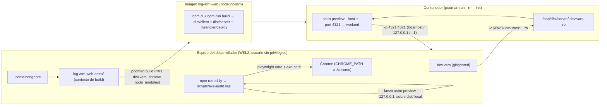

# Design: chore-local-container-podman

Rutas relativas a la raíz del repo git (`/home/kapridoo/projects/log-atm-web-astro/`). La app
vive en `log-atm-web-astro/`; `memory/`, `.gitattributes`, `docker-compose.yml` y
`fix-wsl2-port.bat` viven en la raíz del repo.

Precedencia de insumos: `clarifications.md § Iteración 1 — Respuestas` prevalece sobre
`proposal.md` donde difieren (perfil editado en este cambio; README sin datos «a confirmar»).

## Decisiones Técnicas

### D1: Contenedor de un stage que ejecuta workerd vía `astro preview`

**Contexto**: el contenedor actual sirve `dist/client` con nginx (sin API, soft-404). La spec
`[[container-production-parity]]` exige páginas es/en/pt, API de contacto y 404 reales, en
`localhost` y `127.0.0.1`, sin privilegios de administrador.
**Decisión**: `log-atm-web-astro/Containerfile` de un solo stage sobre
`docker.io/library/node:22-slim` (Debian/glibc: `workerd` no publica binario musl): `npm ci`,
`COPY . .`, `npm run build` y `CMD` en forma exec que invoca el binario local de Astro:
`/app/node_modules/.bin/astro preview --host :: --port 4321`. Podman rootless; el proceso corre
como root del espacio de nombres de usuario del contenedor (que mapea al usuario sin
privilegios del equipo). Decisión de arquitectura en `[[0009-local-container-podman-workerd]]`.
**Justificación**: es el único camino verificado de extremo a extremo en exploración (200 en
`/`, `/en/`, `/pt/`; 400 JSON en `POST /api/contacto`; 404 real; la 404 por idioma de
`[[0007-not-found-page-on-demand-single]]` se renderiza en el Worker y el contenedor la
reproduce). `--host ::` es imprescindible: en WSL2 `localhost` resuelve a `::1` y con
`0.0.0.0` no responde. El build ocurre una vez al construir la imagen y el servidor arranca
después, así que el 500 tras rebuild de `astro preview` no puede ocurrir en el contenedor.
**Alternativas descartadas**:
- `wrangler dev --config dist/server/wrangler.json`: `wrangler` es dependencia transitiva
  (peer del adapter), es un segundo comando distinto de `npm run preview` y no aporta un
  comportamiento observable distinto (KISS, un solo camino).
- Multi-stage con poda de devDependencies: `astro preview` carga `astro.config.mjs` y sus
  integraciones (Tailwind, React, sitemap), así que el runtime necesita casi todo el árbol;
  ganancia incierta y complejidad extra (YAGNI). La imagen de ~866 MB se acepta
  (`clarifications.md`, nota d).
- `USER node` con `COPY --chown`: Podman rootless ya aísla del equipo; añadir un usuario
  interno obliga a gestionar permisos de `.wrangler/` y `dist/` sin requisito que lo pida (YAGNI).
- `CMD ["npm", "run", "preview", ...]`: intercala `npm` como proceso intermedio entre la señal
  y el servidor; la invocación directa del binario deja un único proceso.

---

### D2: Secretos por montaje de solo lectura en `/app/dist/server/.dev.vars`

**Contexto**: `[[container-secrets-isolation]]` exige que la credencial nunca entre en la
imagen, que llegue solo al ejecutar, en modo solo lectura, y que la ejecución sin archivo
falle de forma visible. Exploración demostró que `--env-file` no crea bindings y que el
adapter busca `.dev.vars` junto al config redirigido `dist/server/wrangler.json`.
**Decisión** (decisión abierta 2 de sdd-spec):
- Ruta de montaje dentro del contenedor: `/app/dist/server/.dev.vars`, con opción `:ro`.
- Forma de `container:run` (script npm, `log-atm-web-astro/package.json`):
  `podman run --rm --init -p 4321:4321 -v "$PWD/.dev.vars:/app/dist/server/.dev.vars:ro" log-atm-web`
  - `"$PWD"`: npm ejecuta todo script con el directorio del `package.json` como directorio de
    trabajo, aunque se invoque desde un subdirectorio, así que `$PWD` es siempre la ruta
    absoluta de `log-atm-web-astro/` (criterio «ubicación absoluta» de
    `[[container-build-run-commands]]`). No se usa `$INIT_CWD`, que apunta al directorio de
    invocación.
  - Sin `.dev.vars`, Podman rechaza el bind mount de un origen inexistente con un error
    `statfs … no such file or directory` y código de salida distinto de cero, antes de crear
    el contenedor: falla visible y ningún sitio queda en ejecución (requisito SHOULD
    satisfecho por la herramienta, sin script envoltorio).
  - `--rm`: cada ejecución parte de cero y una reconstrucción posterior se ejecuta igual sin
    limpiar contenedores previos.
  - `--init`: Podman inyecta `catatonit` como PID 1 y reenvía `Ctrl+C` al servidor; Node como
    PID 1 ignora `SIGINT` por defecto.
- `log-atm-web-astro/.containerignore` excluye: `node_modules`, `dist`, `.astro`, `.wrangler`,
  `chrome`, `.git`, `.env`, `.env.*`, `.dev.vars`, `.dev.vars.*` y re-incluye
  `!.dev.vars.example`. `.env*` se excluye porque `.gitignore` lo trata como archivo de
  credenciales locales (requisito «todo archivo de credenciales locales»).
**Justificación**: único mecanismo verificado que crea bindings sin convertir todo el entorno
del proceso en bindings; mantiene la intención del brief (el secreto nunca entra en la imagen)
con el ajuste aceptado en `clarifications.md` P7.
**Alternativas descartadas**:
- `--env-file .dev.vars` + `-e CLOUDFLARE_INCLUDE_PROCESS_ENV=true`: expone `HOME`,
  `NODE_VERSION`, etc. como bindings y Podman no procesa comillas en `--env-file`.
- Montaje en `/app/.dev.vars`: verificado que no funciona (el adapter no lo busca ahí).
- Script envoltorio que comprueba `.dev.vars` antes de `podman run`: duplica la comprobación
  que Podman ya hace con un error visible (KISS).

---

### D3: Comandos npm del contenedor

**Contexto**: `[[container-build-run-commands]]` pide un comando por paso y un único camino.
**Decisión**: dos scripts en `log-atm-web-astro/package.json`:
- `"container:build": "podman build -t log-atm-web -f Containerfile ."`
- `"container:run"`: el de D2.
Sin `podman-compose`, sin script `deploy`, sin variantes.
**Justificación**: un solo servicio; el flujo cabe en dos líneas del README.
**Alternativas descartadas**: compose (servicio único, KISS); script que encadene build y run
(oculta el paso caro de ~2 min y el usuario a menudo solo re-ejecuta).

---

### D4: Retiro del camino Docker + nginx y del script de portproxy

**Contexto**: `[[static-server-container-removal]]`.
**Decisión**: eliminar `log-atm-web-astro/Dockerfile`, `log-atm-web-astro/nginx.conf`,
`log-atm-web-astro/default.conf`, `docker-compose.yml` y `fix-wsl2-port.bat` (raíz). El
acceso desde Windows a `localhost:4321` lo cubre `localhostForwarding` de WSL2; el acceso desde
la LAN o un móvil se documenta con `networkingMode=mirrored` en `.wslconfig` (`clarifications.md` P6).
**Alcance de la búsqueda de referencias** (criterio «ningún archivo referencia lo retirado»):
el árbol versionado del repo **excluyendo** `memory/` y `.sdd/`. `memory/` es el vault SDD:
`observations.md` es append-only y las specs de este mismo cambio declaran esos paths en su
`scope`; reescribirlos falsearía el registro histórico. El escenario de la spec acota la
búsqueda a «documentación y scripts», que coincide con este alcance.
**Alternativas descartadas**: conservar `fix-wsl2-port.bat` parametrizando la distro (no
demostrado necesario con Podman rootless; nadie lo referencia — YAGNI).

---

### D5: Type-check como comando propio con declaración ambient local de `cloudflare:workers`

**Contexto**: `[[type-check-zero-errors]]` y `[[type-check-build-independence]]`. `astro check`
reporta 4 errores; `npm i -D typescript` resuelve 7.x, fuera del peer `^5 || ^6` de
`@astrojs/check@0.9.10`. Decisión de política en `[[0011-type-check-separate-from-build]]`.
**Decisión**:
- devDependencies `@astrojs/check@^0.9.10` y `typescript@^6.0.3`; script `"check": "astro check"`.
  `build` permanece `astro build`.
- Corrección en origen de cada error:
  1. TS2307 `cloudflare:workers` (`src/lib/mailer.ts:2`): archivo nuevo
     `src/types/cloudflare-workers.d.ts`, **script ambient** (sin `import`/`export` de nivel
     superior) con `declare module 'cloudflare:workers' { export const env: Record<string, unknown>; }`.
     No va en `src/types/globals.d.ts`: ese archivo es un módulo (`export {}`) y allí
     `declare module` sería una augmentación de un módulo inexistente, no una declaración.
     `mailer.ts` ya convierte con `as unknown as MailEnv`; su código no cambia.
  2. TS2353 `platformProxy` (`astro.config.mjs:51`): eliminar la línea
     `platformProxy: { enabled: true },`. La opción no existe en `Options` del adapter v13; el
     adapter la reenvía a `@cloudflare/vite-plugin`, que la ignora, así que retirarla no altera
     el build.
  3. TS7031 `logger` (`astro.config.mjs:21`): anotar `i18nValidator` con JSDoc
     `/** @returns {import('astro').AstroIntegration} */`, que tipa el hook completo
     (`logger` incluido) en vez de anotar un parámetro suelto.
  4. TS2322 (`src/scripts/gsap-ind-directory.ts:45`): declarar `let timer: number | null = null;`,
     coherente con `window.setInterval` (script de navegador).
- Comentarios con datos obsoletos que tocan esos mismos archivos: el JSDoc de
  `resolveMailEnv` en `mailer.ts` («En dev con platformProxy lee `.dev.vars`») pasa a nombrar
  el plugin de Vite de Cloudflare, que lee `.dev.vars` en `astro dev`.
**Justificación**: la declaración local es la única opción medida que no empeora la base
(`wrangler types` choca con `lib.dom`: 11 errores; `--include-runtime=false` no declara el
módulo). Ninguna corrección usa `@ts-ignore`, `@ts-expect-error` ni exclusiones.
**Alternativas descartadas**: `wrangler types` y `@cloudflare/workers-types` (globales del
runtime en conflicto con el DOM); `astro check && astro build` en `build` (puede detener el
despliegue de Workers Builds, cuyo comando de build no está verificado — `clarifications.md`
residual 3); `typescript@latest` (7.x rompe el peer).

---

### D6: Auditoría a11y con `playwright-core` + `axe-core` contra un `astro preview` propio

**Contexto**: specs `[[a11y-audit-real-browser-coverage]]`, `[[a11y-audit-final-state-evaluation]]`,
`[[a11y-audit-browser-portability]]`. Decisión abierta 3 de sdd-spec: navegador por defecto y
cómo se sirve el sitio compilado sin depender del quirk de `astro preview`. Hecho determinante:
por `[[0007-not-found-page-on-demand-single]]` la 404 es `prerender = false` — `dist/client`
**no contiene** ninguna página de «no encontrado»; solo el Worker la renderiza. Un servidor
estático de `dist/client` no puede auditar las 404 que la spec exige. Decisión de arquitectura
en `[[0010-a11y-audit-real-browser-workerd-server]]`.
**Decisión**: `log-atm-web-astro/scripts/axe-audit.mjs` reescrito; script `"a11y": "node scripts/axe-audit.mjs"`;
devDependencies `playwright-core@^1.63.0` y `axe-core@^4.14.0`. Se elimina el uso de `jsdom`.
1. **Precondición de build**: si falta `dist/client/index.html` o `.wrangler/deploy/config.json`
   (ambos los escribe `npm run build` y `astro preview` los exige) → mensaje «Compilá el sitio
   primero: npm run build» y exit 2.
2. **Navegador** (orden único, sin más fuentes):
   a. `CHROME_PATH` si está definida; si apunta a un archivo inexistente → error y exit 2.
   b. Si no está definida: `chrome/*/chrome-linux64/chrome` bajo `log-atm-web-astro/` (layout
      que crea `npx @puppeteer/browsers install chrome@stable`, el mismo del `chrome/` local
      gitignored); si hay varios, el de versión mayor (orden numérico por segmentos).
   c. Ninguno → mensaje que nombra `CHROME_PATH` y el comando de instalación anterior, exit 2.
3. **Servidor**: el script lanza su propio `astro preview --host 127.0.0.1 --port <libre>`
   (`node_modules/.bin/astro`, `cwd` = raíz de la app, `detached: true`), con un puerto libre
   obtenido de `net` (`listen(0)`). Espera a que `GET /` responda 200 (sondeo cada 250 ms,
   límite 30 s); si el proceso termina antes o vence el plazo, imprime la salida capturada del
   servidor y sale con exit 2. Al terminar (éxito, error o `SIGINT`) mata el grupo de procesos
   (`process.kill(-pid, 'SIGTERM')`) para no dejar `workerd` huérfano. Al ser un proceso
   nuevo lanzado después del build, el quirk (build con el preview ya activo) no puede darse.
4. **Lista de URLs derivada del contenido compilado**:
   - Páginas: todo `*.html` bajo `dist/client`, mapeado a URL quitando el sufijo `index.html`
     (`en/servicios/index.html` → `/en/servicios/`). Hoy: 18 páginas (6 × es/en/pt).
   - «No encontrado»: prefijos de idioma tomados de los `<link rel="alternate" hreflang="…">`
     de `dist/client/index.html` (se omite `x-default`; se usa el pathname del `href`), unidos
     con `/`. Para cada prefijo, la URL `{prefijo}__a11y-404__/`. Hoy: `/`, `/en/`, `/pt/` → 3.
   - Estado HTTP esperado: 200 en páginas, 404 en las sondas; un estado distinto se informa
     como hallazgo (exit 1).
5. **Contextos**: dos `browser.newContext`, ambos con `reducedMotion: 'reduce'`:
   escritorio `viewport 1280×800`; móvil `viewport 390×844`, `isMobile: true`, `hasTouch: true`.
   Cada URL se audita en ambos (hoy 21 × 2 = 42 auditorías).
6. **Auditoría por página**: `page.goto(url, { waitUntil: 'load' })`,
   `page.addScriptTag({ path: <axe-core/axe.min.js resuelto con createRequire> })`,
   `axe.run(document, { runOnly: { type: 'tag', values: ['wcag2a','wcag2aa','wcag21a','wcag21aa','wcag22aa'] }, resultTypes: ['violations'] })`.
7. **Informe y salida**: una línea por nodo violado con `[escritorio|móvil] <url> <rule-id>
   (<impact>) <help> → <selector>`; resumen final con auditorías realizadas, páginas, sondas
   404 y total de violaciones. Exit 0 sin violaciones ni estados inesperados; exit 1 con al
   menos uno; exit 2 en errores de precondición o entorno.
**Justificación**: navegador real (contraste calculado sobre estilos finales); el servidor es
el mismo runtime de producción, de modo que la 404 auditada es la que ve el visitante;
`reducedMotion: 'reduce'` evalúa el estado final (exploración: 3 falsos positivos de contraste
sin él, 0 con él); la lista se deriva del build, así que una página nueva entra sin tocar el
script. Etiquetas WCAG 2.x A/AA: el estándar del proyecto es WCAG AA; `best-practice` queda
fuera porque no es un criterio de conformidad y haría fallar el comando por reglas no normativas.
**Alternativas descartadas**:
- Servidor estático propio (`node:http`) o `python3 -m http.server` sobre `dist/client`: no
  puede renderizar la 404 bajo demanda (ADR-0007); además `http.server` devuelve un 404
  genérico, no la página del sitio.
- Auditar contra el contenedor o un `astro preview` ya en ejecución (URL por variable): depende
  de un proceso externo que puede estar en el estado del quirk y abre un segundo camino.
- Lista fija de rutas: incumple «página nueva entra sin modificar la herramienta».
- Lista desde el sitemap: omite páginas `noindex`; el recorrido de archivos cubre todo el build.
- Detección de Chrome del sistema (`channel: 'chrome'`) o `npx playwright install`: agrega una
  tercera fuente o una descarga de navegador al flujo; la propuesta fija `CHROME_PATH` + Chrome
  provisto por el usuario.
- `@axe-core/playwright`: dependencia extra para lo que resuelven `addScriptTag` + `axe.run`.

---

### D7: Documentación de despliegue y del contenedor (README)

**Contexto**: `[[readme-deployment-and-local-container]]`, `[[readme-project-accuracy]]`.
**Decisión**: `log-atm-web-astro/README.md` con esta forma:
- *Sobre el proyecto*: el sitio se prerenderiza con Astro y lo sirve Cloudflare Workers, que
  ejecuta además la API de formularios y la 404 por idioma.
- *Stack técnico*: `Framework | Astro 6 (versión exacta en package.json)`; fila `Iconos` →
  Lucide (`@iconify-json/lucide`) con el componente local `Icon.astro`; fila `Imágenes` →
  Sharp (sin Potrace); fila `Runtime` → Cloudflare Workers (`@astrojs/cloudflare`); fila
  `Despliegue` → «Cloudflare Workers (producción) · Podman (local, opcional)».
  La versión de Astro se declara por su mayor (`6`), igual que React 19 o Motion 12 en la
  misma tabla, y remite a `package.json` como fuente única: el patch cambia con cada
  `npm update` y una cifra exacta duplicada se desfasa (SSOT). Criterio verificable: el mayor
  del README coincide con el mayor del rango de `astro` en `package.json`.
- *Comandos*: tabla con `dev`, `build`, `preview`, `check`, `a11y`, `validate-i18n`,
  `check-i18n-links`, `measure:images`, `container:build`, `container:run`, cada uno con su
  finalidad.
- *Verificaciones*: `npm run check` (tipos, separado del build); `npm run a11y` (requiere
  build previo y un Chrome: `CHROME_PATH` o `./chrome` vía `npx @puppeteer/browsers install
  chrome@stable`; audita todas las páginas y las 404 en escritorio y móvil con movimiento
  reducido porque el contraste relevante es el del estado final, no el de la animación de
  entrada); `measure:images`; `check-i18n-links`.
- *Vista previa local*: `npm run preview` responde 500 si se recompila con la vista previa
  activa; se reinicia, o se usa el contenedor, que compila antes de arrancar el servidor.
- *Contenedor local (Podman, opcional)*: requisito Podman rootless; `cp .dev.vars.example
  .dev.vars` (sin el archivo la ejecución falla); `npm run container:build`; `npm run
  container:run`; abrir `http://localhost:4321`; la credencial se monta en solo lectura al
  ejecutar y nunca entra en la imagen; imagen de ~866 MB, aceptable para uso local opcional;
  WSL2: desde Windows basta `localhost:4321`, y para la LAN o un móvil se activa
  `networkingMode=mirrored` en `.wslconfig`.
- *Despliegue*: Cloudflare Workers mediante la integración git de Workers Builds: cada push
  dispara un build y `main` es producción; `SMTP_PASS` vive como Secret del Worker y las vars
  no secretas en `wrangler.toml`. Sin comando de build, comando de deploy, directorio raíz,
  nombre del Worker ni versión de Node (residuales del MR, `clarifications.md § Para el MR`).
- *Estructura*: sin `Dockerfile`/`nginx.conf`; con `Containerfile`, `.containerignore`,
  `wrangler.toml`.
- Restricciones de texto: ni «Docker», ni «nginx», ni `docker compose`, ni «TODO»/«a confirmar».
**Alternativas descartadas**: marcar los datos del dashboard como «a confirmar» (rechazado por
el usuario en `clarifications.md`); versión exacta `6.3.1` (duplicado que se desfasa).

---

### D8: Menciones a Cloudflare Pages

**Contexto**: `[[deployment-target-references]]`.
**Decisión**:
- `astro.config.mjs:14`: «(p. ej. el build alojado de Cloudflare Workers Builds)».
- `.dev.vars.example:2-3`: copiar a `.dev.vars` antes de `astro dev` o `npm run container:run`;
  «En Cloudflare Workers (producción) estas variables se configuran en el dashboard del Worker».
Criterio de verificación: `grep -rn "Cloudflare Pages"` sobre `log-atm-web-astro/` (sin
`node_modules`, `dist`) y la raíz del repo (sin `memory/`, `.sdd/`) → 0 resultados.

---

### D9: Perfil del proyecto editado en este cambio por `sdd-apply`

**Contexto**: decisión abierta 1 de sdd-spec. `proposal.md` decía que `sdd-init` actualizaría
`memory/_profile.md` en el próximo cambio; `clarifications.md` (nota b) lo trae a este cambio,
y la spec `[[profile-verification-commands]]` declara `scope: memory/_profile.md` con
`assigned_agent: sdd-apply`. Prevalece la aclaración.
**Decisión**: `sdd-apply` edita `memory/_profile.md` del worktree en este cambio, en
`## Build & Deploy`:
- `Deploy Target`: Cloudflare Workers mediante Workers Builds (integración git).
- `Container`: `Containerfile` (Podman rootless, `node:22-slim`, `astro preview` con workerd),
  comandos `npm run container:build` / `npm run container:run`; sin Docker ni nginx.
- `Type-check`: `npm run check` (`astro check`), separado de `npm run build`.
- `Verification Commands` (línea nueva, la que consulta `sdd-verify`): `npm run check`,
  `npm run a11y` (requiere `npm run build` y Chrome vía `CHROME_PATH` o `./chrome`),
  `npm run validate-i18n`, `npm run check-i18n-links`.
- `CI`: sin integración continua; las verificaciones las ejecuta quien desarrolla y `sdd-verify`.
- `updated:` del frontmatter a la fecha de la edición.
**Justificación**: `sdd-init` preserva el contenido editado a mano al regenerar el perfil
(`profile-upsert.sh`), así que la edición manual no se pierde en el próximo cambio; dejarla
para después haría que el `sdd-verify` de este mismo cambio no ejecute `check` ni `a11y`.
**Alternativas descartadas**: diferir a `sdd-init` del próximo cambio (contradice la nota b).

---

### D10: `.gitattributes` con `merge=union` solo para `memory/observations.md`

**Contexto**: `[[observations-log-merge]]`.
**Decisión**: `.gitattributes` en la raíz del repo con un comentario en español y la línea
`memory/observations.md merge=union`. Ningún otro patrón.
**Justificación**: driver nativo de git, versionado, sin configuración por equipo; el resto del
vault no es append-only y debe seguir conflictuando (exploración §6).
**Alternativas descartadas**: patrón `memory/**` (mezclaría specs y ADRs en silencio).

---

## Arquitectura



Secuencia de `npm run a11y`:

```mermaid
sequenceDiagram
  participant S as axe-audit.mjs
  participant FS as dist/client
  participant P as astro preview (workerd)
  participant B as Chrome (playwright-core)
  S->>FS: ¿index.html y .wrangler/deploy/config.json? (no → exit 2)
  S->>S: resolver navegador (CHROME_PATH → ./chrome → exit 2)
  S->>FS: recorrer *.html + prefijos hreflang de index.html
  S->>P: spawn en puerto libre (grupo de procesos propio)
  loop sondeo hasta 200 o 30 s
    S->>P: GET /
  end
  loop por contexto (escritorio, móvil; reducedMotion=reduce)
    loop por URL (páginas → 200, sondas 404 → 404)
      S->>B: goto + addScriptTag(axe) + axe.run(WCAG A/AA)
      B-->>S: violaciones
    end
  end
  S->>P: SIGTERM al grupo
  S-->>S: informe + exit 0 | 1 | 2
```

## Output Expected

Crear:
- `log-atm-web-astro/Containerfile` — imagen de un stage: `node:22-slim`, `npm ci`, build, `astro preview --host :: --port 4321` (D1).
- `log-atm-web-astro/.containerignore` — exclusiones del contexto de build (D2).
- `log-atm-web-astro/src/types/cloudflare-workers.d.ts` — declaración ambient de `cloudflare:workers` (D5).
- `.gitattributes` (raíz del repo) — `memory/observations.md merge=union` (D10).

Modificar:
- `log-atm-web-astro/package.json` y `log-atm-web-astro/package-lock.json` — scripts `check`, `a11y`, `container:build`, `container:run`; devDependencies `@astrojs/check@^0.9.10`, `typescript@^6.0.3`, `playwright-core@^1.63.0`, `axe-core@^4.14.0`. `build` no cambia.
- `log-atm-web-astro/astro.config.mjs` — quitar `platformProxy`, JSDoc `AstroIntegration` en `i18nValidator`, comentario de la línea 14 (D5, D8).
- `log-atm-web-astro/src/scripts/gsap-ind-directory.ts` — `timer: number | null` (D5).
- `log-atm-web-astro/src/lib/mailer.ts` — solo el JSDoc de `resolveMailEnv` (D5).
- `log-atm-web-astro/scripts/axe-audit.mjs` — reescritura completa (D6).
- `log-atm-web-astro/README.md` — D7.
- `log-atm-web-astro/.dev.vars.example` — comentarios de las líneas 2-3 (D8).
- `memory/_profile.md` — `## Build & Deploy` (D9).
- `memory/observations.md` — solo agregado al final.

Eliminar:
- `log-atm-web-astro/Dockerfile`, `log-atm-web-astro/nginx.conf`, `log-atm-web-astro/default.conf`.
- `docker-compose.yml`, `fix-wsl2-port.bat` (raíz del repo).

Sin cambios: `wrangler.toml`, `tsconfig.json`, `src/types/globals.d.ts`, script `build`.

## Contratos de Componentes

### Scripts npm (`log-atm-web-astro/package.json`)

| Script | Valor exacto |
|---|---|
| `check` | `astro check` |
| `a11y` | `node scripts/axe-audit.mjs` |
| `container:build` | `podman build -t log-atm-web -f Containerfile .` |
| `container:run` | `podman run --rm --init -p 4321:4321 -v "$PWD/.dev.vars:/app/dist/server/.dev.vars:ro" log-atm-web` |

(En JSON, las comillas dobles internas de `container:run` se escapan como `\"`.)

### `Containerfile`

```
FROM docker.io/library/node:22-slim
WORKDIR /app
COPY package.json package-lock.json ./
RUN npm ci
COPY . .
RUN npm run build
EXPOSE 4321
CMD ["/app/node_modules/.bin/astro", "preview", "--host", "::", "--port", "4321"]
```
Comentarios en español que expliquen: Debian/glibc por `workerd`; secretos montados en
ejecución en `/app/dist/server/.dev.vars` (nunca copiados); `--host ::` por `localhost` → `::1`.

### `src/types/cloudflare-workers.d.ts`

Archivo sin `import`/`export` de nivel superior; un único bloque
`declare module 'cloudflare:workers' { export const env: Record<string, unknown>; }` con
comentario en español: se declara solo lo que el código usa; ampliar si se importa algo más
del módulo (`wrangler types` choca con `lib.dom`, ver ADR-0011).

### `scripts/axe-audit.mjs` (CLI)

| Aspecto | Contrato |
|---|---|
| Entrada | `CHROME_PATH` (opcional); build previo en `dist/` y `.wrangler/deploy/config.json` |
| Navegador | `CHROME_PATH` → `chrome/*/chrome-linux64/chrome` (versión mayor) → error |
| Servidor | `astro preview` propio en `127.0.0.1:<puerto libre>`, grupo de procesos terminado al salir |
| URLs | `*.html` de `dist/client` (esperan 200) + `{prefijo}__a11y-404__/` por prefijo hreflang de `index.html` y `/` (esperan 404) |
| Contextos | escritorio 1280×800; móvil 390×844 `isMobile` `hasTouch`; ambos `reducedMotion: 'reduce'` |
| Reglas | `runOnly` tags `wcag2a`, `wcag2aa`, `wcag21a`, `wcag21aa`, `wcag22aa` |
| Salida | línea por nodo: `[viewport] url rule-id (impact) help → selector`; resumen con totales |
| Exit | `0` sin hallazgos · `1` violaciones o estado HTTP inesperado · `2` precondición/entorno |

Comentario de cabecera en español con el motivo del movimiento reducido (estado final de la
página, relevante para el contraste) — requisito de documentación de
`[[a11y-audit-final-state-evaluation]]` junto con el README.

## Estrategia de Testing

No hay framework de tests en el proyecto; la verificación es por ejecución de comandos con
evidencia. Toda prueba que muta código o crea credenciales falsas corre en una copia aislada
bajo el directorio de temporales del despacho (`git archive`), nunca en el worktree.

**Contenedor** (`[[container-production-parity]]`, `[[container-secrets-isolation]]`, `[[container-build-run-commands]]`):
1. `podman info --format '{{.Host.Security.Rootless}}'` → `true`; `npm run container:build` OK.
2. En la copia aislada: `.dev.vars` falso con `SMTP_HOST=127.0.0.1`, `SMTP_PORT=1`,
   `SMTP_PASS=FAKE_SECRET_<aleatorio>`; build de la imagen con ese archivo presente.
3. Barrido de secretos: `podman history --no-trunc`, `podman inspect` y
   `podman run --rm --entrypoint grep  -rl FAKE_SECRET_<aleatorio> / --exclude-dir=proc --exclude-dir=sys --exclude-dir=dev`
   → 0 coincidencias en los tres.
4. `npm run container:run` (desde un subdirectorio, p. ej. `src/`, para probar la ruta
   absoluta): `curl` a `127.0.0.1:4321` y `localhost:4321` → `/`, `/en/`, `/pt/` 200;
   `/no-existe`, `/en/no-existe`, `/pt/no-existe` 404 con la página de «no encontrado» (no la
   portada); `POST /api/contacto` con cuerpo inválido → 400 `application/json`; `POST` válido →
   el log muestra intento de conexión a `127.0.0.1:1` y no `Missing env var: SMTP_PASS`
   (prueba de que los bindings vienen del archivo montado).
5. Sin `.dev.vars`: `npm run container:run` → exit ≠ 0 con error de `statfs`; `podman ps -a`
   sin contenedor creado.
6. Reconstrucción tras un cambio trivial + nueva ejecución → 200 con el cambio visible.
7. Limpieza: sin contenedores, imágenes de prueba ni puertos abiertos al terminar.

**Retiro** (`[[static-server-container-removal]]`, `[[deployment-target-references]]`):
`git ls-files` sin los 5 archivos; `grep -rnIE "Dockerfile|nginx|default\.conf|docker-compose|docker compose|fix-wsl2-port|Cloudflare Pages"`
sobre el repo excluyendo `memory/`, `.sdd/`, `node_modules/`, `dist/` → 0 resultados.

**README** (`[[readme-deployment-and-local-container]]`, `[[readme-project-accuracy]]`):
`grep -niE "docker|nginx|TODO|a confirmar|potrace|astro-icon"` sobre `README.md` → 0; lectura
de cada criterio; mayor de Astro del README = mayor del rango en `package.json`.

**Type-check** (`[[type-check-zero-errors]]`, `[[type-check-build-independence]]`):
`npm ci` desde cero sin `invalid`/peer warnings (`npm ls typescript @astrojs/check`);
`npm run check` → `0 errors`; `grep -rn "@ts-ignore\|@ts-expect-error\|@ts-nocheck"` sin nuevas
apariciones y `tsconfig.json` sin cambios; en la copia aislada, error deliberado (asignar
`string` a `number`) → `npm run check` exit ≠ 0 y `npm run build` exit 0; build del worktree
idéntico en páginas y API tras quitar `platformProxy`.

**Auditoría a11y** (las tres specs `a11y-audit/*`):
1. `npm run build` y luego `CHROME_PATH=/home/kapridoo/projects/log-atm-web-astro/log-atm-web-astro/chrome/linux-148.0.7778.167/chrome-linux64/chrome npm run a11y`
   (el worktree no tiene `chrome/`) → resumen con 21 URLs × 2 tamaños = 42 auditorías; exit 0,
   o la lista de violaciones existentes (ver Riesgos).
2. Portadas es/en/pt → 0 violaciones `color-contrast`.
3. Copia aislada: texto de bajo contraste inyectado en una página → exit 1 con página,
   tamaño y selector; página nueva agregada → aparece en el resumen sin tocar el script.
4. Sin navegador (`CHROME_PATH` inexistente y sin `./chrome`) → exit 2 con mensaje que nombra
   `CHROME_PATH`; sin `dist/` → exit 2 con «npm run build».
5. Tras terminar: ningún proceso `workerd`/`astro preview` huérfano (`pgrep`).

**Fusión** (`[[observations-log-merge]]`): `git check-attr merge memory/observations.md` →
`union`; `git check-attr merge memory/_profile.md` → `unspecified`; repo de prueba en el
directorio de temporales: dos ramas que agregan al final de `memory/observations.md` → merge
sin conflicto con ambas entradas; dos ramas que editan la misma línea de una spec → conflicto.

**Perfil** (`[[profile-verification-commands]]`): lectura de `## Build & Deploy` contra los
cuatro criterios.

## Riesgos

- La auditoría pasa de 8 páginas de escritorio (exploración) a 21 URLs × 2 tamaños: puede
  hallar violaciones nuevas (móvil, `/cotizar/` wizard, 404). La spec no exige 0 global — solo
  0 de contraste en las portadas —; si aparecen, `sdd-apply` no corrige el sitio en este
  cambio: las lista como deuda en `observations.md` y el MR lo declara (el brief admite
  «lista las violaciones existentes»).
- `playwright-core@1.63` con Chrome 148 provisto por el usuario: compatibilidad por CDP
  verificada en exploración con 1.60–1.64; una versión de Chrome muy distante puede fallar.
- El criterio «ningún archivo referencia lo retirado» se verifica fuera de `memory/` y `.sdd/`
  (D4); una lectura literal sobre todo el repo es imposible porque las specs de este cambio
  declaran esos paths.
- La versión de Astro del README por mayor (D7) es una interpretación SSOT del criterio
  «coincide con la del proyecto».
- Podman sobre un origen de bind inexistente: comportamiento documentado de Podman (error
  `statfs`); `sdd-apply` lo confirma en el paso 5 de la estrategia.
