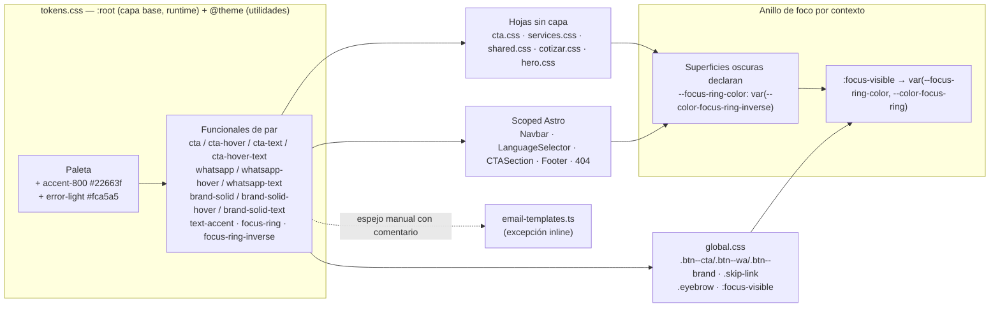

# Design: fix-color-contrast-sitewide

Rutas relativas a la raíz del worktree; el proyecto vive en `log-atm-web-astro/`. Ratios calculados con la fórmula WCAG 2.x sobre los hex de `tokens.css` (script fuera del repo, en el directorio de temporales). Comportamiento de capas de Tailwind v4: `tech-context.md`.

## Decisiones Técnicas

### D1: Pares texto/fondo como tokens funcionales en `tokens.css`

**Contexto**: `contrast-token-single-source` exige que cada par validado viva una vez en la fuente de tokens y que un cambio de token se propague a todos sus consumidores. El comentario de cabecera de `tokens.css` ya fija la regla «usar tokens funcionales en componentes».
**Decisión**: cada par que este cambio valida se expresa como tokens funcionales con nombre de rol (fondo, hover, texto), declarados en `:root` (capa `base`, autoridad en runtime) y en `@theme` (registro de utilidades, valor literal como el resto del bloque). Los selectores consumen el token funcional, nunca el tono de paleta, salvo las convenciones ya establecidas del proyecto (texto secundario sobre oscuro = `primary-200`, ver D8).
**Justificación**: un punto de cambio por par (SSOT); el nombre de rol documenta el par; sigue la convención declarada en el archivo.
**Alternativas descartadas**: consumir tonos de paleta directo en cada selector (dispersa el par en ~12 archivos, viola SSOT); un token por sección para el caso `#efedeb` (descartado en la propuesta: dispersa el par).

### D2: CTA verde con texto oscuro y hover con margen

**Contexto**: decisión de marca del usuario: fondo `#3EB978` sin cambio y texto azul marino; la spec pide hover ≥ 5:1. Con texto `primary-900` sobre el hover actual (`accent-600`) el ratio es 4.507, en el límite.
**Decisión**: `--color-cta-text` pasa a `primary-900` (6.44:1); nuevo `--color-cta-hover-text` = `primary-950`, que sobre `--color-cta-hover` (`accent-600`, sin cambio) da 5.10:1. Todo elemento sobre el verde de marca consume el par: `.btn--cta`, `.svc-card__tag--cta`, `.form-submit`, `.error-page__cta`, `.btn-primary-lg`, `.mode-tile--active .mode-tile__check`, `.quote-success__seal` y el punto `.office-card__pin::after`. Los que no cambian el fondo en hover (`.form-submit`, `.btn-primary-lg`) quedan en 6.44:1 en todos los estados.
**Justificación**: conserva el verde de marca, cumple ≥ 5:1 en hover con un solo token nuevo y no cambia el feedback visual del hover (el fondo se sigue oscureciendo).
**Alternativas descartadas**: hover sin cambio de fondo (pierde el feedback de hover que hoy tiene el sitio); texto `primary-900` también en hover (4.507:1, sin margen, incumple el SHOULD ≥ 5:1); texto blanco sobre `accent-700` (descartado por el usuario: cambia el verde de marca).

### D3: WhatsApp con tokens propios y fondo sólido en `.channel--wa`

**Contexto**: `.btn--wa` y `.channel--wa` usan hex literales; `--color-whatsapp*` existen pero no tienen consumidores y `--color-whatsapp` (#128C7E) no coincide con el verde visible (#25D366). El degradado de `.channel--wa` termina en #128C7E, donde el texto oscuro da 4.22:1.
**Decisión**: `--color-whatsapp` = `#25D366`, `--color-whatsapp-hover` = `#1da851` (sin cambio), nuevo `--color-whatsapp-text` = `#111b21` (8.80:1 en reposo, 5.63:1 en hover). `.btn--wa` y `.channel--wa` consumen los tokens; `.channel--wa` pasa a fondo sólido `--color-whatsapp` y sus hijos (`.channel__name`, `.channel__value`, `.channel__arrow`, `.channel__icon`) toman `--color-whatsapp-text`. `--color-whatsapp-hover-dark` queda sin cambios (fuera de alcance).
**Justificación**: elimina los hex duplicados y el desfase token/visible; el fondo sólido es la única forma de que todo el bloque cumpla con texto oscuro.
**Alternativas descartadas**: degradado con extremo aclarado (sigue siendo un par variable por zona y exige un segundo verde sin uso en la marca); texto blanco sobre `#075E54` (descartado por el usuario).

### D4: Botones azul de marca con un par sólido propio

**Contexto**: `.btn--brand`, `.skip-link`, `.cta-final__btn` y el override `.cta-final .btn--cta` usan blanco sobre `primary-500` (4.38:1). `--color-brand` (`primary-500`) también es el color de los enlaces y de varios acentos; cambiarlo sería un rediseño de paleta (fuera de alcance).
**Decisión**: nuevos tokens `--color-brand-solid` = `primary-600` (6.08:1 con blanco), `--color-brand-solid-hover` = `primary-700` (8.52:1) y `--color-brand-solid-text` = `--color-text-inverse`. Los cuatro selectores consumen este par. El override `.cta-final .btn--cta` (sin capa) fija fondo **y** texto del par, por lo que gana a `.btn--cta` y a `.btn--cta:hover` (capa `components`) en todos los estados y nunca muestra texto oscuro sobre azul. `--color-brand-hover` (`primary-600`) se queda sin consumidores tras la migración de `cta.css:18,189` y se elimina de `:root`.
**Justificación**: un par explícito para «superficie azul sólida con texto claro»; no altera `--color-brand` en enlaces; no deja un token huérfano creado por este cambio.
**Alternativas descartadas**: consumir `--color-brand-hover` como fondo en reposo (el nombre contradice el uso); redefinir `--color-brand` a `primary-600` (cambia enlaces, nav y acentos en todo el sitio).

### D5: Un tono `accent-800` y el token funcional `--color-text-accent`

**Contexto**: `.eyebrow`, `.quote-step__num`, `.contact-form-card__pill`, `.quote-summary__sla` usan `accent-600`/`accent-700`; `accent-700` sobre `#efedeb` da 4.4993:1 (falla estricto). La exploración no listó `.quote-success__step-n` (`accent-600` sobre `neutral-50`, 3.33:1, estado de éxito del asistente), que la spec `sitewide-contrast-verification` cubre («mensajes de éxito»).
**Decisión**: paleta `--color-accent-800` = `#22663f` y token funcional `--color-text-accent` = `accent-800`. Ratios: 6.91 blanco, 6.46 `neutral-50`, 5.92 `neutral-100`, 5.80 `accent-300`. Consumidores: `.eyebrow`, `.quote-step__num`, `.contact-form-card__pill`, `.quote-summary__sla` y `.quote-success__step-n`. Las variantes oscuras (`.eyebrow--light`, `.process-strip .eyebrow`, `.ind-directory-section .eyebrow`) no cambian: ya sobrescriben el color.
**Justificación**: un único tono oscuro de acento (AC de `accent-text-contrast`) con margen ≥ 5.8:1 en los cuatro fondos.
**Alternativas descartadas**: `accent-700` (4.4993 sobre `#efedeb`); texto `primary-900` en pill/SLA (pierde el carácter verde que pide el SHOULD).

### D6: Anillo de foco por contexto de superficie

**Contexto**: el anillo global `accent-500` mide 2.33:1 sobre `neutral-50`. Ningún color cubre a la vez blanco y las superficies `primary-700/800` del sitio (p. ej. `primary-500`: 4.38 sobre blanco pero 2.84 sobre `primary-800` y 1.95 sobre `primary-700`), lo que confirma el requisito de dos colores.
**Decisión**: tokens `--color-focus-ring` = `primary-600` (6.08 blanco, 5.68 `neutral-50`, 5.20 `neutral-100`, 5.49 `primary-50`) y `--color-focus-ring-inverse` = `accent-400` (10.38 `primary-950`, 9.17 `primary-900`, 7.10 `primary-800`, 4.86 `primary-700`, 9.37 `neutral-950`). La regla global usa `outline: 3px solid var(--focus-ring-color, var(--color-focus-ring))`. Cada superficie oscura con controles enfocables declara `--focus-ring-color: var(--color-focus-ring-inverse)` en la misma regla que define su fondo: `.hero-b`, `.page-hero` (`shared.css`), `.quote-hero`, `.cta-final`, `.ind-directory-section` y `.footer`. Los overrides que fijan otro color de anillo se retiran para heredar el contexto: `.error-page__cta:focus-visible` y `.cta-final__channel:focus-visible`. `.why__video-toggle:focus-visible` (blanco sobre oscuro) se mantiene.
**Justificación**: el dato «esta superficie es oscura» vive junto a su fondo (SSOT); una isla clara dentro de una superficie oscura puede restablecer la variable; las chips oscuras sobre fondo claro (`.svc-filter--active`, `.chip-multi--active`) conservan el anillo claro, correcto porque el anillo se dibuja sobre el fondo adyacente. Decisión registrada en ADR-0008.
**Alternativas descartadas**: lista de selectores oscuros centralizada en `global.css` (separa el dato del fondo que lo define y deriva al agregar secciones); clase utilitaria `.surface-dark` en el markup (toca el HTML de 6 componentes); un único color (no cumple 3:1 en ambos extremos).

### D7: Retiro de `outline: none` sin indicador equivalente

**Decisión**:
- `.lang-selector__option`: se quita `outline: none` de la regla compartida hover/foco; la opción enfocada muestra el anillo global con `outline-offset: -3px` (anillo interior, no se superpone a la opción vecina; `primary-600` sobre `primary-50` = 5.49:1).
- `.form-field input/select/textarea:focus`: se quitan `outline: none` y la sombra al 15 %; el borde pasa a `--color-focus-ring` (4.54:1 contra el borde sin foco `neutral-200`) y el anillo global hace el resto.
- `.cta-final__input:focus`: se quita `outline: none`; el borde pasa a `--color-focus-ring-inverse` (mismo `accent-400` de hoy) y el anillo inverso del contexto `.cta-final` se suma.
**Justificación**: un solo mecanismo de foco en todo el sitio, compatible con modos de color forzado (el `box-shadow` desaparece en forced-colors; el `outline` no).
**Alternativas descartadas**: mantener `outline: none` con un `box-shadow` sólido (invisible en forced-colors y duplica el anillo por componente).

### D8: Correcciones puntuales con tokens existentes

| Selector | Cambio | Ratio resultante |
|---|---|---|
| `.nav__link:hover`, `:focus-visible`, `.is-active` | color `--color-brand-dark` | 7.30 sobre `#efedeb` |
| `.nav__link.is-active` | además subrayado 2px (`text-underline-offset: 0.3em`): señal no cromática de página actual | — |
| `.nav-drawer__link:hover`, `:focus-visible` | color `--color-brand-dark` | 7.70 sobre `primary-50` |
| `.svc-filter:hover` → `.svc-filter:not(.svc-filter--active):hover` | el hover ya no pisa al filtro activo | 16.08 (blanco sobre `primary-900`) |
| `.quote-summary__row .v.empty` | color `--color-text-muted` (itálica y peso 400 se mantienen como señal de pendiente) | 5.44 sobre blanco |
| `.error-page__code` | color `--color-brand` | 4.10 sobre `neutral-50`; tamaño `clamp(6rem, 15vw, 10rem)` = mínimo 96px, peso 900: texto grande en todo breakpoint (umbral 3:1) |
| `.quote-summary__title` | color `--color-text-inverse` | 16.08 sobre `primary-900` |
| `.ind-directory__name` | color `--color-text-inverse` | sobre la zona inferior del overlay (92 % oscuro) |
| `.cta-final__hint` | color `--color-primary-200` (convención de etiquetas de `.cta-final`) | 9.28 sobre el vidrio |
| `.cta-final__status[data-kind=error]` | color nuevo `--color-error-light` = `#fca5a5` (par de `--color-success-light`, familia 300) | 8.49 sobre el vidrio |
| `.cta-final__status[data-kind=success]` | color `--color-accent-400` (retira el hex `#2d9b6f`, que da 4.62 sin margen sobre el vidrio) | 9.18 |
| `.ind-directory__item-num` | color `--color-primary-200` (hover/activo sigue en `accent-300`) | 9.27 sobre `primary-900` |
| `.howwork-card__step` | color `--color-brand-dark` | 7.55 sobre la pill blanca 94 % |
| `.page-hero__breadcrumb a` | se retira `opacity: 0.7` (texto `primary-100` sólido; hover `accent-400` sin cambio) | 9.66 sobre `primary-800` |

Las dos únicas cabeceras sobre fondo oscuro sin color explícito son `.quote-summary__title` y `.ind-directory__name` (auditoría de todos los `h1–h6` con clase del markup de `src/pages` y `src/components`: el resto ya declara color claro o está sobre fondo claro).

### D9: Contador del directorio de industrias sobre una pastilla oscura

**Contexto**: `.ind-directory__counter` está en la zona superior del overlay (10–20 % de oscurecimiento) sobre fotos variables; `.total` al 55 % da ~2.0:1. Con blanco al 100 % el resultado sigue dependiendo de la foto.
**Decisión**: `.ind-directory__counter` recibe una pastilla de fondo `color-mix(in srgb, var(--color-primary-950) 65%, transparent)` con `backdrop-filter: blur(6px)`, padding y `border-radius: var(--radius-pill)` (mismo lenguaje que `.ind-directory__tag`). `.sep` y `.total` heredan el blanco del contador (se retiran sus `rgba` 0.4/0.55). Peor caso, foto blanca pura: blanco sobre la pastilla = 5.65:1.
**Justificación**: único arreglo con garantía determinista sobre cualquier foto; el contador se jerarquiza por tamaño (2.5rem vs 0.85rem), no por transparencia.
**Alternativas descartadas**: reforzar el degradado superior del overlay (oscurece toda la foto y sigue sin garantía); solo blanco al 100 % (depende de la foto).

### D10: Excepción de hex inline en plantillas de correo

**Decisión**: en `src/lib/email-templates.ts`, el par del botón WhatsApp vive en una constante local junto a `btnStyle` (`background:#25D366;color:#111b21;`), con comentario que nombra `--color-whatsapp` y `--color-whatsapp-text` como origen; las dos ramas (líneas 283 y 295) la consumen. La excepción se declara en `DESIGN.md` y en ADR-0008. La condición de aparición y el enlace `wa.me` no cambian.
**Justificación**: los clientes de correo exigen estilos inline y no leen `tokens.css`; la constante deja un único lugar del par dentro del archivo (DRY).

---

## Arquitectura

Cascada relevante (ver `tech-context.md`): `:root` de `tokens.css` está en `@layer base` y gana al `:root` que emite `@theme` (`@layer theme`). Las hojas de `styles/pages`, `styles/sections` y los `<style>` scoped no tienen capa y ganan a `@layer base/components` en todo estado; por eso los overrides sin capa (`.cta-final .btn--cta`, `.process-strip .eyebrow`, `.ind-directory-section .eyebrow`) siguen ganando, y las cabeceras sobre oscuro se corrigen con una regla sin capa en su propia hoja.

## Output Expected

- `log-atm-web-astro/src/styles/tokens.css` — en `:root` y `@theme`: `--color-accent-800`, `--color-error-light`, `--color-cta-text` (→ `primary-900`), `--color-cta-hover-text`, `--color-whatsapp` (→ `#25D366`), `--color-whatsapp-text`, `--color-brand-solid`, `--color-brand-solid-hover`, `--color-brand-solid-text`, `--color-text-accent`, `--color-focus-ring`, `--color-focus-ring-inverse`; en `@theme` además `--color-cta-hover` y `--color-cta-text`, hoy ausentes. Se elimina `--color-brand-hover` de `:root`.
- `log-atm-web-astro/src/styles/global.css` — `.skip-link` (par brand-solid); `:focus-visible` con `var(--focus-ring-color, var(--color-focus-ring))`; `.btn--cta` (+ hover con `--color-cta-hover`/`--color-cta-hover-text`); `.btn--brand` (+ hover); `.btn--wa` (+ hover) sin hex; `.eyebrow` con `--color-text-accent`.
- `log-atm-web-astro/src/styles/sections/cta.css` — `.cta-final` declara `--focus-ring-color`; `.cta-final .btn--cta` y su hover con el par brand-solid (fondo + texto); `.cta-final__btn` y su hover con el par brand-solid; `.cta-final__input:focus` sin `outline: none`, borde `--color-focus-ring-inverse`.
- `log-atm-web-astro/src/styles/sections/services.css` — `.svc-card__tag--cta` con `--color-cta`/`--color-cta-text`.
- `log-atm-web-astro/src/styles/sections/hero.css` — `.hero-b` declara `--focus-ring-color`.
- `log-atm-web-astro/src/styles/pages/shared.css` — `.ind-directory-section` y `.page-hero` declaran `--focus-ring-color`; `.ind-directory__counter` (pastilla D9), `.sep`/`.total` heredan; `.ind-directory__name` e `.ind-directory__item-num` (D8); `.page-hero__breadcrumb a` sin opacidad; `.svc-filter:not(.svc-filter--active):hover`; `.howwork-card__step`; `.contact-form-card__pill` con `--color-text-accent`; `.form-field *:focus` (D7); `.form-submit` con `--color-cta-text`; `.channel--wa` y descendientes (D3); `.office-card__pin::after` con `--color-cta-text`.
- `log-atm-web-astro/src/styles/pages/cotizar.css` — `.quote-hero` declara `--focus-ring-color`; `.quote-step__num`, `.quote-summary__sla` y `.quote-success__step-n` con `--color-text-accent`; `.mode-tile--active .mode-tile__check`, `.btn-primary-lg` y `.quote-success__seal` con el par CTA; `.quote-summary__title` con `--color-text-inverse`; `.v.empty` con `--color-text-muted`.
- `log-atm-web-astro/src/components/ui/Navbar.astro` — estados de `.nav__link` y `.nav-drawer__link` (D8), subrayado de `.is-active`.
- `log-atm-web-astro/src/components/ui/LanguageSelector.astro` — retiro de `outline: none` y `outline-offset: -3px` en `.lang-selector__option:focus-visible`.
- `log-atm-web-astro/src/components/ui/Footer.astro` — `.footer` declara `--focus-ring-color`.
- `log-atm-web-astro/src/components/sections/CTASection.astro` — `.cta-final__hint`, `.cta-final__status[data-kind=error|success]` (D8); se elimina `.cta-final__channel:focus-visible`.
- `log-atm-web-astro/src/pages/404.astro` — `.error-page__code` con `--color-brand`; `.error-page__cta` (+ hover) con el par CTA; se elimina `.error-page__cta:focus-visible`.
- `log-atm-web-astro/src/lib/email-templates.ts` — constante del par WhatsApp con comentario de tokens de origen, consumida en las dos ramas (D10).
- `log-atm-web-astro/DESIGN.md` — paleta (`accent-800`, `error-light`), bloque de tokens funcionales actualizado, «Pares de contraste validados» con los ratios reales de este diseño, botones CTA/WhatsApp/brand, anillo de foco por contexto y la excepción de correo.

No se crean archivos ni rutas nuevas.

## Contratos de Componentes

### Tokens funcionales (valores de `:root`; `@theme` repite el hex resuelto)

| Token | Valor | Par validado |
|---|---|---|
| `--color-cta` | `accent-500` (sin cambio) | — |
| `--color-cta-hover` | `accent-600` (sin cambio) | — |
| `--color-cta-text` | `primary-900` | sobre `--color-cta`: 6.44 |
| `--color-cta-hover-text` | `primary-950` | sobre `--color-cta-hover`: 5.10 |
| `--color-whatsapp` | `#25D366` | — |
| `--color-whatsapp-hover` | `#1da851` (sin cambio) | — |
| `--color-whatsapp-text` | `#111b21` | 8.80 / 5.63 hover |
| `--color-brand-solid` | `primary-600` | — |
| `--color-brand-solid-hover` | `primary-700` (`--color-brand-dark`) | — |
| `--color-brand-solid-text` | `--color-text-inverse` | 6.08 / 8.52 hover |
| `--color-text-accent` | `accent-800` | 6.91 blanco · 6.46 `neutral-50` · 5.92 `neutral-100` · 5.80 `accent-300` |
| `--color-focus-ring` | `primary-600` | ≥ 5.20 en superficies claras |
| `--color-focus-ring-inverse` | `accent-400` | ≥ 4.86 en superficies oscuras (`primary-700` a `primary-950`, `neutral-950`) |
| `--color-accent-800` (paleta) | `#22663f` | — |
| `--color-error-light` (semántico) | `#fca5a5` | 8.49 sobre el vidrio de `.cta-final` |

### Variable de contexto (no es token; no lleva valor de color propio)

- `--focus-ring-color`: la declaran solo superficies oscuras con controles enfocables, siempre con el valor `var(--color-focus-ring-inverse)`. Una superficie oscura nueva con controles enfocables la declara junto a su `background` (ADR-0008).

## Estrategia de Testing

El proyecto no tiene suite de tests ni dependencias de axe/puppeteer; los scripts de verificación viven fuera del repo, en el directorio de temporales de cada fase.

1. **Build**: `npm run build` sin errores (valida la sintaxis de `tokens.css`, incluido `@theme`).
2. **Estático (diff contra `main`)**:
   - Ninguna línea agregada con `#[0-9a-fA-F]{3,8}` fuera de `src/styles/tokens.css` y `src/lib/email-templates.ts`.
   - Cada token nuevo aparece en `:root` y en `@theme`; `--color-brand-hover` no aparece en `src/`.
   - Cada `outline: none` restante en `src/` está acompañado de un indicador alternativo (esperado: ninguno en los selectores de D7).
   - Script de ratios sobre los hex de `tokens.css`: todos los pares de la tabla de contratos cumplen su umbral.
3. **axe-core en Chrome real** (entorno de la exploración: `astro preview`, Chrome 148): regla `color-contrast` sobre las 21 URL × desktop (1440×900) y móvil (390×844), tras scroll completo: 0 `violations`.
4. **Pasada interactiva** con y sin `prefers-reduced-motion: reduce`: hover, `:focus-visible` por teclado y `:active` sobre botones, enlaces, filtros, chips y campos; drawer móvil abierto; `/cotizar/` con pasos y estado de éxito expuestos (incluye `.quote-success__step-n`) y `.cta-final__status` forzado a `error` y `success`. Para el foco se mide el ratio del anillo contra el fondo adyacente en superficies claras y oscuras.
5. **Muestreo de píxeles y revisión visual**: `/industrias/` (nombre de industria y contador con la pastilla, en todas las diapositivas), `/contacto/` (`.channel--wa`), breadcrumbs de heroes internos y `/xx-nope/` (tamaño computado de `.error-page__code` en 390 px y 1440 px).
6. **CTA final**: barrido de `/`, `/servicios/`, `/industrias/`, `/nosotros/` en es/en/pt confirmando fondo azul con texto claro en reposo y hover.
7. **Correo**: renderizar `buildContactoEmail` con y sin teléfono y comprobar el par `#111b21`/`#25D366` y la ausencia del botón sin teléfono.

## Riesgos y hallazgos del diseño

- **Fuera del alcance de las specs, en el canal de correo**: el botón «Responder por email» usa `#ffffff` sobre `#4A7BB5` (4.38:1) y el texto SLA `#898580` sobre blanco (~3.6:1) en `email-templates.ts:280,290,301`. No hay spec que los cubra; quedan registrados como candidato de deuda en `observations.md`.
- **Pin de oficina**: el pin verde sobre el mapa placeholder (`primary-100/200`) mide 1.4–1.9:1; es decorativo (sin rol ni información) y la spec solo exige el punto sobre el verde. Sin cambio.
- **Duplicación `:root`/`@theme`**: deuda preexistente; los tokens nuevos se declaran en ambos bloques porque la spec exige su disponibilidad en Tailwind. El valor de runtime es el de `:root`.
- **Contador del directorio**: la pastilla agrega un elemento visual no presente hoy; entra en la tabla antes/después del PR.
