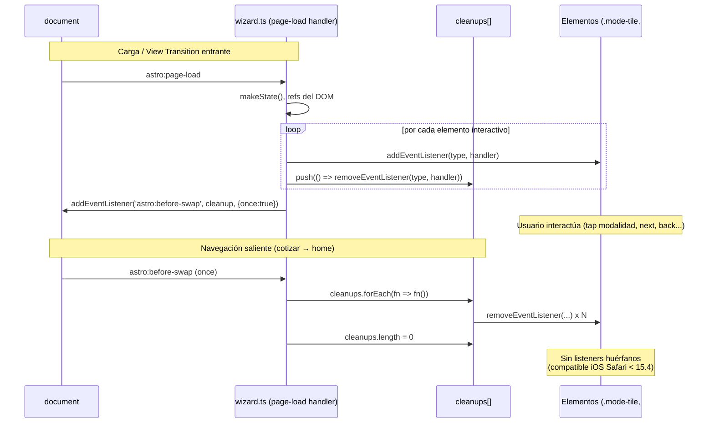

# Design — fix-cotizar-mobile-wizard-stepper

## Resumen ejecutivo

Fix de dos regresiones mobile (iPhone Safari) en `/cotizar`, atacando causas raíz confirmadas en código real:

1. **Bug stepper (B1.1)** — Solo CSS. El media query del PR#19 es `@media (max-width: 480px)` y, aunque aplica en iPhone 14/15 (393–430px), NO toca `padding`/`gap` de `.stepper__step` ni oculta `.stepper__label`. Se reemplaza el breakpoint por `@media (max-width: 640px)` y se le añaden las reglas que faltaban: ocultar `.stepper__label`, comprimir `padding`/`gap` del step, y un guard rail `overflow-x: clip` en el track.

2. **Bug modalidad (B2.1 + B2.2)** — CSS + JS.
   - **B2.1 (touch-action)**: añadir `touch-action: manipulation` + `-webkit-tap-highlight-color: transparent` a los 4 elementos tappables (`.mode-tile`, `.stepper__step`, `#btn-next`, `#btn-back`).
   - **B2.2 (AbortSignal)**: el grep CONFIRMA el patrón `{ signal: controller.signal }` (wizard.ts:111) usado en la mayoría de listeners. Por tanto D3 **NO es no-op**: se refactoriza a cleanup manual compatible con iOS Safari < 15.4 (registro sin `signal` + `removeEventListener` en `astro:before-swap`).

Sin rediseño del wizard. Sin nuevas dependencias. El markup de `cotizar.astro` NO requiere cambios (ya tiene las clases y los `<button>` correctos).

---

## Hallazgos de código (estado actual)

### Stepper CSS actual
- `src/styles/pages/cotizar.css:57-61` — `.stepper__track { display: grid; grid-template-columns: repeat(4, 1fr); gap: 0; position: relative; }`
- `src/styles/pages/cotizar.css:62-70` — `.stepper__step { padding: 1.25rem 1rem; display: flex; align-items: center; gap: 0.85rem; ... cursor: pointer; ... }` → 32px de padding horizontal + 13.6px de gap por step (causa raíz del overflow).
- `src/styles/pages/cotizar.css:80-89` — `.stepper__bullet { width: 30px; height: 30px; ... }`
- `src/styles/pages/cotizar.css:91-95` — `.stepper__label { font-family: var(--font-mono); font-size: 0.65rem; text-transform: uppercase; letter-spacing: 0.08em; ... }` → texto "PASO 01" (~55-65px) que impide compactar.
- `src/styles/pages/cotizar.css:96-101` — `.stepper__name { ... white-space: nowrap; overflow: hidden; text-overflow: ellipsis; }`
- `src/styles/pages/cotizar.css:102-104` — `@media (max-width: 720px) { .stepper__name { display: none; } }` (ya oculta el nombre largo).

### Media query actual (PR#19)
`src/styles/pages/cotizar.css:389-410` — `@media (max-width: 480px)`:
```css
@media (max-width: 480px) {
  .stepper__track { grid-template-columns: repeat(4, minmax(0, 1fr)); gap: var(--space-1, 0.25rem); }
  .stepper__bullet { width: 28px; height: 28px; font-size: 0.875rem; }
  .stepper__name { display: none; }
  .quote-card { padding: var(--space-3, 1rem); }
  .mode-tile { min-height: 44px; min-width: 44px; }
  #btn-next { min-height: 44px; min-width: 44px; }
  #btn-back { min-height: 44px; min-width: 44px; }
  .quote-layout { overflow-x: hidden; }
}
```
**Insuficiencias confirmadas**: (a) breakpoint 480px sin margen sobre iPhone 15 Plus (430px); (b) NO oculta `.stepper__label`; (c) NO comprime `padding`/`gap` del `.stepper__step`; (d) `overflow-x: hidden` está en `.quote-layout`, que es un contenedor HERMANO del `.stepper` (el stepper está fuera de `.quote-layout` en el DOM — confirmado en `cotizar.astro:68-95` vs `:97-98`), por lo que NO protege al stepper.

### mode-tile binding (wizard.ts)
- `wizard.ts:224-234` — `.mode-tile` listeners: `btn.addEventListener('click', () => {...}, sig)` → **usa `sig`** (se limpia en before-swap).
- Markup: `cotizar.astro:108-125` — los tiles son `<button class="mode-tile" type="button" data-mode data-mode-name>` (no `<input>`/`<label>`). Selección 100% por JS.
- `.stepper__step` listeners: `wizard.ts:382-389` → `el.addEventListener('click', () => {...}, sig)` → **usa `sig`**.
- `#btn-next` listener: `wizard.ts:371-379` → `btnNext?.addEventListener('click', () => {...}, sig)` → **usa `sig`**.
- `#btn-back` listener: `wizard.ts:303-308` → `btnBack?.addEventListener('click', () => {...}, sig)` → **usa `sig`**.

### AbortSignal grep result (resuelve D3)
**CONFIRMADO PRESENTE.** El patrón existe y es transversal:
- `wizard.ts:108-109` — `const controller = new AbortController();`
- `wizard.ts:110` — `document.addEventListener('astro:before-swap', () => controller.abort(), { once: true });`
- `wizard.ts:111` — `const sig = { signal: controller.signal };`
- `sig` se pasa como tercer argumento en **~22 listeners** (líneas 225, 233, 237-239, 243, 251, 255, 262, 268, 288, 291-293, 296-300, 303, 308, 371, 379, 383, 388).

Implicación: en iOS Safari < 15.4 (sin soporte de `AbortSignal` en `addEventListener`), el tercer argumento `{ signal }` es un objeto de opciones desconocido → el listener se interpreta sin capturas válidas o se ignora silenciosamente, dejando `.mode-tile`, `#btn-next` y resto de controles **sin handler**. Esto explica directamente "modalidad no seleccionable + Siguiente no avanza" para esa cohorte. → **D3 SE APLICA (no es no-op).**

> Matiz: la causa más probable y de mayor alcance del Bug 2 en iOS 16+ es la ausencia de `touch-action` (delay 300ms). El refactor de AbortSignal cubre la cola de versiones < 15.4. Ambos fixes son complementarios y de bajo riesgo.

---

## Decisiones técnicas

### D-1 | wizard-responsive-mobile-v2 (Bug stepper)

**Decisión**:
1. **Reemplazar** el breakpoint `@media (max-width: 480px)` por `@media (max-width: 640px)` (D1 aprobado). Reemplazar, no duplicar, para evitar dos reglas mobile solapadas en cascada (KISS).
2. Dentro del media query 640px, **añadir** las reglas que faltaban:
   - `.stepper__label { display: none; }` — oculta "PASO 01" (libera ~55-65px/step) → satisface Scenario 3 y el criterio "etiquetas no visibles en ≤640px".
   - `.stepper__step { padding: 0.5rem 0.25rem; gap: 0.25rem; justify-content: center; }` — comprime el step. `justify-content: center` centra el bullet (ahora único contenido visible) → satisface "paso activo identificable".
   - `.stepper__track { overflow-x: clip; }` — guard rail directo sobre el contenedor del stepper (no sobre `.quote-layout`, que es hermano y no lo cubre) → satisface el MUST de `overflow-x: clip`.
3. **Conservar** las reglas ya correctas del bloque PR#19 (ahora bajo 640px): `grid-template-columns: repeat(4, minmax(0,1fr))`, `.stepper__bullet 28px`, `.stepper__name display:none`, `.quote-card` padding, los `min-height/min-width: 44px` de los tappables, y `.quote-layout { overflow-x: hidden }`.

**Snippet CSS propuesto** (reemplaza el bloque `:389-410`):
```css
/* ── Breakpoint mobile — wizard (cubre todos los iPhones modernos en portrait) ── */
@media (max-width: 640px) {
  .stepper__track {
    grid-template-columns: repeat(4, minmax(0, 1fr));
    gap: var(--space-1, 0.25rem);
    overflow-x: clip; /* guard rail: bloquea desbordamiento residual del stepper */
  }
  /* Modo compacto: solo bullets numerados, sin etiquetas de texto */
  .stepper__step {
    padding: 0.5rem 0.25rem;
    gap: 0.25rem;
    justify-content: center;
  }
  .stepper__label { display: none; }
  .stepper__name  { display: none; }
  .stepper__bullet {
    width: 28px;
    height: 28px;
    font-size: 0.875rem;
  }
  .quote-card { padding: var(--space-3, 1rem); }

  /* Touch targets mínimos 44px (WCAG 2.2 AA) */
  .mode-tile { min-height: 44px; min-width: 44px; }
  #btn-next  { min-height: 44px; min-width: 44px; }
  #btn-back  { min-height: 44px; min-width: 44px; }

  /* Evitar scroll horizontal en el layout del wizard */
  .quote-layout { overflow-x: hidden; }
}
```

**Cálculo de validación** (viewport 393px / iPhone 14, `.container` padding-inline ≈ 19.65px/lado → ~353px útiles): por step = ~4px padding + 28px bullet = ~32px de contenido; 4 steps + 3 gaps de 4px = ~140px ≪ 353px. Sin overflow. (Antes: ~556px requeridos.)

**Archivos**: `log-atm-web-astro/src/styles/pages/cotizar.css` (reemplazar bloque líneas 389-410).

**Alternativas descartadas**:
- Mantener `≤480px` (Opción B proposal): sin margen sobre iPhone 15 Plus 430px; descartada por D1.
- Stepper vertical/acordeón (Opción B exploration A4): viola el SHALL "layout horizontal en línea"; mayor riesgo de regresión.
- `overflow-x: auto` con scroll (Opción C): UX inferior; el MUST pide compactación, no scroll.

### D-2 | wizard-modality-tap-ios (Bug modalidad)

**Decisión touch-action (B2.1)**:
Añadir a las reglas BASE (fuera de cualquier media query, para cubrir todos los táctiles) de `.mode-tile`, `.stepper__step`, `#btn-next`, `#btn-back`:
```css
touch-action: manipulation;
-webkit-tap-highlight-color: transparent;
```
- `.mode-tile` → ampliar regla base `:150-161`.
- `.stepper__step` → ampliar regla base `:62-70`.
- `#btn-next` / `#btn-back` → no hay selector por ID en base (usan `.btn-ghost` / `.btn-primary-lg`). Añadir una regla nueva agrupada por ID para no acoplar a otros usos de esas clases (SRP):
```css
/* Respuesta táctil inmediata en iOS Safari (sin delay 300ms ni highlight nativo) */
#btn-next,
#btn-back {
  touch-action: manipulation;
  -webkit-tap-highlight-color: transparent;
}
```

**Snippet CSS concreto**:
```css
/* En .stepper__step (regla base, añadir 2 props) */
.stepper__step {
  padding: 1.25rem 1rem;
  display: flex; align-items: center; gap: 0.85rem;
  border-right: 1px solid var(--color-border);
  background: var(--color-surface);
  cursor: pointer;
  transition: background 0.18s;
  position: relative;
  touch-action: manipulation;            /* nuevo */
  -webkit-tap-highlight-color: transparent; /* nuevo */
}

/* En .mode-tile (regla base, añadir 2 props) */
.mode-tile {
  /* ...props existentes... */
  text-align: left;
  touch-action: manipulation;            /* nuevo */
  -webkit-tap-highlight-color: transparent; /* nuevo */
}

/* Regla nueva para los botones de navegación */
#btn-next,
#btn-back {
  touch-action: manipulation;
  -webkit-tap-highlight-color: transparent;
}
```
Justificación de ubicación BASE (no dentro de `@media`): el delay de tap iOS y el highlight afectan a todos los táctiles, no solo a ≤640px (ej. iPad portrait 768-1024px). Coherente con el MUST "todos los elementos tappables DEBEN tener touch-action".

**Decisión AbortSignal (B2.2) — D3 CONFIRMADO presente → SE APLICA refactor a cleanup manual**:

Refactor en `wizard.ts` para registrar listeners SIN `{ signal }` y limpiarlos manualmente en `astro:before-swap`, manteniendo compatibilidad iOS Safari < 15.4. Patrón propuesto (mínimo, preserva la estructura actual):

1. Reemplazar `const sig = { signal: controller.signal };` por un registro acumulado:
```ts
// Cleanup manual de listeners — compatible con iOS Safari < 15.4
// (AbortSignal en addEventListener no soportado en esas versiones).
type Cleanup = () => void;
const cleanups: Cleanup[] = [];

/** Registra un listener y memoriza su removeEventListener para before-swap. */
function on<E extends Event>(
  target: EventTarget | null | undefined,
  type: string,
  handler: (ev: E) => void,
): void {
  if (!target) return;
  const h = handler as EventListener;
  target.addEventListener(type, h);
  cleanups.push(() => target.removeEventListener(type, h));
}

document.addEventListener(
  'astro:before-swap',
  () => { cleanups.forEach((fn) => fn()); cleanups.length = 0; },
  { once: true },
);
```
2. Sustituir cada `el.addEventListener(type, fn, sig)` por `on(el, type, fn)`. (~22 sitios; el `?.` previo de los `$('#...')?.addEventListener` se absorbe en el guard `if (!target) return` de `on`.)
3. Eliminar `AbortController` (`:108-109`) y la línea `astro:before-swap → controller.abort()` original (`:110`), reemplazada por el cleanup loop.

Riesgo de leak (R4): mitigado porque `on()` empareja 1:1 add↔remove y `cleanups.length = 0` evita doble-cleanup. El handler `astro:before-swap` se registra con `{ once: true }` (este SÍ es seguro: es un listener interno de Astro, no parte del flujo táctil del usuario; pero `{ once: true }` está soportado desde iOS Safari 10, no es AbortSignal).

> **Nota de scope**: el refactor toca solo el mecanismo de cleanup; NO cambia la lógica de selección, render ni transición del wizard. Bajo riesgo funcional, alto valor de compatibilidad.

**Archivos**:
- `log-atm-web-astro/src/styles/pages/cotizar.css` (touch-action en base + nuevo bloque `#btn-next, #btn-back`).
- `log-atm-web-astro/src/scripts/wizard.ts` (refactor AbortController → cleanup manual: líneas 108-111 + ~22 call sites de `addEventListener(..., sig)`).

**Alternativas descartadas**:
- Detección de soporte vía `try/catch` (exploration A2): más código y rama condicional; el cleanup manual incondicional es más simple y siempre correcto (KISS).
- Polyfill global de AbortSignal: side-effects globales, aumenta bundle; descartado en proposal (Opción B).
- No tocar AbortSignal (Opción C proposal): deja el bug en producción para iOS < 15.4; descartado por D3.

---

## ADRs

- **¿Algún ADR existente (0001-0004) cubre esto?** No. Cubren image optimization (0001), i18n routing (0002), i18n key validation (0003) y folio server-side (0004). Ninguno toca responsive CSS, touch-action ni cleanup de listeners.
- **¿Crear ADR nuevo?** **NO.** Son fixes de CSS responsive y de compatibilidad táctil iOS, no decisiones arquitectónicas reusables que ameriten registro formal. El patrón de cleanup manual de listeners es local al wizard y no establece una convención de proyecto (los demás scripts no se evaluaron). Decisión conservadora: documentar en este `design.md` es suficiente. Si en el futuro surge un segundo script con la misma necesidad, reconsiderar un ADR "listeners iOS-safe" (potencial 0005).

---

## Output Expected

**Modificar**:
- `log-atm-web-astro/src/styles/pages/cotizar.css`
  - Reemplazar bloque `@media (max-width: 480px)` (líneas 389-410) por el bloque `@media (max-width: 640px)` de D-1 (con `.stepper__label{display:none}`, `padding/gap` comprimidos, `overflow-x: clip` en track).
  - Añadir `touch-action: manipulation; -webkit-tap-highlight-color: transparent;` a `.stepper__step` (base, :62-70) y `.mode-tile` (base, :150-161).
  - Añadir regla nueva `#btn-next, #btn-back { touch-action: manipulation; -webkit-tap-highlight-color: transparent; }`.
- `log-atm-web-astro/src/scripts/wizard.ts`
  - Refactor AbortController/`sig` → helper `on()` + array `cleanups` + cleanup en `astro:before-swap` (D3 confirmado presente).
  - Reemplazar ~22 `addEventListener(..., sig)` por `on(...)`.

**NO modificar**:
- `log-atm-web-astro/src/pages/cotizar.astro` — el markup ya tiene `.stepper__step` con `data-step`, `.mode-tile` como `<button>`, y `#btn-next`/`#btn-back`. No requiere nueva clase ni data-attr.
- `log-atm-web-astro/src/scripts/gsap-stepper.ts` — fuera de scope; el contrato `window.__stepper*` no cambia.

**Crear**:
- Ninguno (sin ADR nuevo).

---

## Verify reforzado (preflight para sdd-apply y sdd-verify)

D2 aprobado: sin nueva dependencia (NO añadir Playwright). Verify reforzado obligatorio:

1. **Build estático**:
   - `npm run build` debe pasar (`[build] Complete!`).
   - `npm run typecheck` (o `astro check` / `tsc --noEmit` según `package.json`) debe pasar — crítico tras tocar `wizard.ts`.
2. **Inspección del CSS producido en el bundle**:
   - Confirmar que `@media (max-width: 640px)` existe en `dist/client/_astro/cotizar.*.css`.
   - Confirmar que la regla `.stepper__label { display: none }` está dentro de ese media query.
   - Confirmar que NO queda `@media (max-width: 480px)` residual del stepper.
   - Confirmar `touch-action:manipulation` presente para `.mode-tile`, `.stepper__step`, `#btn-next`, `#btn-back` en el bundle CSS.
3. **Inspección del JS producido**:
   - Confirmar que el bundle de `wizard.ts` ya NO contiene `{ signal:` / `AbortController` (o que el cleanup manual está presente: `removeEventListener`).
4. **`astro preview` + inspección manual del HTML**:
   - `npm run preview`, abrir `/cotizar`, inspeccionar HTML servido.
5. **Smoke headless best-effort** (NO añadir dep):
   - Si `npx playwright` global o un chromium del sistema está disponible, emular iPhone (ej. `--window-size`/device emulation ~393px width) y verificar: (a) no hay scroll horizontal en el stepper; (b) tap en `.mode-tile` la marca activa y habilita `#btn-next`. Si no hay browser headless disponible, documentar como "no ejecutado, pendiente validación usuario".
6. **Validación FINAL en iPhone real (responsabilidad del usuario — D2)**:
   - El pipeline PUEDE preparar el PR/MR, pero el archive NO debe darse por cerrado en runtime real sin la confirmación del usuario en iPhone físico (iOS 16+): stepper compacto sin overflow + tap inmediato en modalidad + avance a paso 02.

---

## Diagrama — flujo de cleanup de listeners (refactor AbortSignal → manual)


