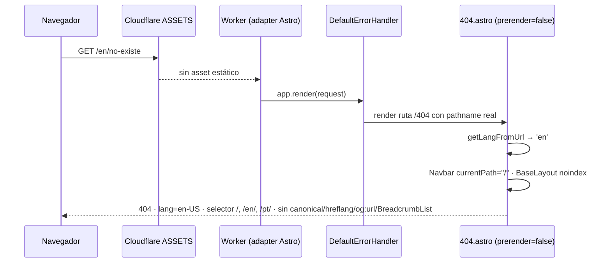

# Design: fix-i18n-links-and-404

Rutas `src/...` y `scripts/...` relativas a `log-atm-web-astro/`. Doc de librerías: [[tech-context]].

## Decisiones Técnicas

### D1: Localizar cada href interno en su consumidor con `buildLocaleUrl`

**Contexto**: `SERVICES[].href` (`'/servicios'`, `'/cotizar'`, `null`) es agnóstico de idioma y se renderiza crudo en `ServicesSection.astro:52` y `servicios.astro:83`. Hay además 8 hrefs literales: CTAs `/contacto` (`servicios.astro:124`, `industrias.astro:141`), migaja «Inicio» `href="/"` (`servicios.astro:45`, `industrias.astro:43`, `contacto.astro:28`, `nosotros.astro:35`, `cotizar.astro:57`) y «volver al inicio» (`cotizar.astro:342`).
**Decisión**: cada página/sección resuelve sus hrefs con el helper existente `buildLocaleUrl(currentLang, path)` (`src/i18n/utils.ts`), con el `currentLang` que ya calcula:
- `ServicesSection.astro`: `href = s.href ? buildLocaleUrl(currentLang, s.href) : null` dentro del `map`.
- `servicios.astro`, `industrias.astro`, `contacto.astro`, `nosotros.astro`, `cotizar.astro`: constantes de frontmatter `homeHref = buildLocaleUrl(currentLang, '/')` y, donde aplique, `contactHref = buildLocaleUrl(currentLang, '/contacto')`, usadas en el markup en lugar de los literales.
`constants.ts` no cambia: los datos quedan agnósticos de idioma.
**Justificación**: patrón ya vigente en Navbar, Footer, Hero, CTASection, IndustriesSection y en `servicesHref` de la propia `ServicesSection` (consistencia). `buildLocaleUrl` normaliza la barra final, lo que elimina el 307 actual de `/servicios` → `/servicios/` (cumple el SHOULD «un solo paso» de [[i18n-internal-links-keep-language]]).
**Alternativas descartadas**:
- Localizar en `constants.ts` (href por idioma o función en los datos): mezcla datos con presentación y la reestructura de `SERVICES` pertenece al brief 07.
- Helper/componente compartido (`<LocalizedLink>`, `<Breadcrumb>`): abstracción nueva para un llamado de una línea a un helper que ya existe; YAGNI. Las cinco migajas comparten markup, pero extraer un componente excede el fix y no reduce el riesgo de regresión, que cubre el barrido (D5).

---

### D2: Una única 404, renderizada bajo demanda; se elimina `src/pages/[lang]/404.astro`

**Contexto**: la 404 prerenderizada se sirve desde `ASSETS` (`/404.html`) para cualquier ruta inexistente, sin locale. `[lang]/404.astro` solo genera `en/404/` y `pt/404/`, que responden 200 y nunca se usan como página de error.
**Decisión**: `export const prerender = false` en `src/pages/404.astro`; el locale sale de `getLangFromUrl(Astro.url)`, que bajo demanda conserva el path real. Se elimina `src/pages/[lang]/404.astro` y, con él, la prop `lang` de `404.astro` (sin delegador, siempre sería `undefined`). La página sigue pasando `lang={currentLang}` y `noindex={true}` a `BaseLayout`. Decisión registrada en [[0007-not-found-page-on-demand-single]], que acota [[0002-i18n-routing-pages-lang-folder]] para la página de error.
**Justificación**: validada en workerd por `sdd-explore` (variante B): `/en/no-existe` → 404 `en-US`, `/pt/x/y/z` → 404 `pt-BR`, `/no-existe` → 404 `es-CL`, `/en/404/` → 404; rutas existentes y `/api/*` sin cambios. Una sola definición (SHOULD de [[i18n-not-found-localized]], SSOT). No agrega middleware, `_redirects` ni configuración de Workers.
**Alternativas descartadas**:
- Conservar `[lang]/404.astro` (variante A): `/en/404/` sigue respondiendo 200 (incumple el AC) y queda una ruta sin uso.
- `not_found_handling = "404-page"`: Workers Static Assets busca `404.html` por directorio de la ruta; no resuelve rutas profundas arbitrarias sin generar un archivo por prefijo y profundidad.
- Middleware que reescriba según locale: no intercepta la 404 prerenderizada que el adapter sirve desde `ASSETS`; con la 404 bajo demanda es innecesario.
- Entrypoint propio con `prerenderedErrorPageFetch` por locale: código de infraestructura nuevo para un problema que resuelve una línea de frontmatter.

---

### D3: `Navbar` acepta `currentPath` opcional; la 404 pasa `"/"`

**Contexto**: bajo demanda, `Navbar` deriva `cleanPath` de `Astro.url.pathname` = URL inexistente. El selector ofrecería `/no-existe/`, `/en/no-existe/`, `/pt/no-existe/` (tres 404) y, bajo `/en/servicios/x`, el ítem «Servicios» quedaría con `aria-current="page"`. `LanguageSelector.astro` está en el PR #33 y no se edita.
**Decisión**: `Navbar.astro` declara `interface Props { currentPath?: string }` y calcula `cleanPath = stripLocaleFromPath(Astro.props.currentPath ?? Astro.url.pathname)`. `cleanPath` alimenta el estado activo de los ítems y las dos instancias de `LanguageSelector` (desktop y mobile) como hoy. `404.astro` usa `<Navbar currentPath="/" />`. `currentLang` sigue saliendo de `getLangFromUrl(Astro.url)`, por lo que el selector marca el idioma activo.
**Justificación**: con `cleanPath = '/'` el selector emite `buildLocaleUrl(lang, '/')` = `/`, `/en/`, `/pt/` (homes) y ningún ítem queda activo. Las páginas existentes no pasan la prop: su comportamiento es idéntico. Nombre alineado con la prop homónima de `LanguageSelector`.
**Alternativas descartadas**:
- Prop booleana `isNotFound` en Navbar: acopla Navbar a una página concreta; el override de path es el contrato mínimo y genérico.
- Editar `LanguageSelector.astro`: excluido por el PR #33.
- Ocultar el selector en la 404: incumple «el selector ofrece la home de cada idioma» de [[i18n-not-found-navigation-and-seo-signals]].

---

### D4: `BaseLayout` omite las señales de URL cuando `noindex` es verdadero

**Contexto**: bajo demanda, `canonical`, `og:url`, los `hreflang` alternates y el JSON-LD `BreadcrumbList` se construyen desde la URL inexistente.
**Decisión**: en `BaseLayout.astro`, con `noindex === true` no se emiten `<link rel="canonical">`, `<link rel="alternate" hreflang>`, `<meta property="og:url">` ni el `<script>` de `BreadcrumbList` (`breadcrumbSchema = null`). Se conservan `<html lang>`, `meta robots`, `og:locale`, `og:locale:alternate` (códigos de idioma, no URLs), title/description, Twitter y los JSON-LD `FreightForwarder`/`WebSite` (URLs fijas del sitio). Un comentario en español documenta la regla junto al cálculo.
**Justificación**: una página `noindex` que declara canónica y alternates emite señales contradictorias a los buscadores; la regla es semánticamente correcta para cualquier página `noindex`, no solo para la 404. Hoy solo `404.astro` usa `noindex` (grep), así que las páginas indexables no cambian. Sin prop nueva (KISS).
**Alternativas descartadas**:
- Prop nueva (`urlSignals={false}`, `isErrorPage`): segundo flag que siempre viajaría junto a `noindex`; YAGNI.
- Pasar `canonical` fijo a la home desde la 404: sigue declarando una canónica en una página `noindex` y no resuelve hreflang ni migas.
- Aceptar el efecto por ser `noindex`: incumple el AC de [[i18n-not-found-navigation-and-seo-signals]].

---

### D5: Barrido de links como script `tsx` versionado, ejecución manual tras el build

**Contexto**: el AC exige una revisión automatizada y repetible. El proyecto no tiene suite de tests; la verificación se hace sobre `dist/client` y en `astro preview`.
**Decisión**: nuevo `scripts/check-i18n-links.ts`, invocado con `npm run check-i18n-links` (`"check-i18n-links": "tsx scripts/check-i18n-links.ts"`), sin dependencias nuevas. Se ejecuta después de `npm run build`; no se engancha al build. Contrato en «Contratos de Componentes». Sigue el precedente de script standalone de [[0003-i18n-key-validation-build-hook]] (no requiere ADR nuevo).
**Justificación**: importa `LOCALES`/`NON_DEFAULT_LOCALES`/`DEFAULT_LOCALE` desde `src/i18n/config.ts` (SSOT de idiomas). Recorre todas las páginas de `dist/client` (es incluido): verifica también que el español no enlaza a prefijos, el AC «URLs en español sin prefijo», con la misma regla.
**Alternativas descartadas**:
- Hook `astro:build:done`: haría fallar cada build por un chequeo de contenido; el proyecto no tiene CI que lo consuma y la proposal lo fija como script ejecutable tras el build.
- Parser HTML (jsdom/cheerio) como dependencia: el HTML lo emite Astro con forma estable; una expresión sobre etiquetas `<a …>` del `<body>` alcanza. `jsdom` solo existe como dependencia transitiva de `axe-audit.mjs`, no declarada.
- Script `.mjs`: no puede importar `config.ts` sin loader; duplicaría la lista de idiomas.

---

### D6: Self-link del catálogo por comparación de URL normalizada

**Contexto**: en `/servicios`, 8 tarjetas con `href='/servicios'` enlazan a la propia página.
**Decisión**: en `servicios.astro`, `catalogHref = buildLocaleUrl(currentLang, '/servicios')`; para cada tarjeta, `href = s.href ? buildLocaleUrl(currentLang, s.href) : null` e `isLink = href !== null && href !== catalogHref`. Las tarjetas no-link se renderizan como `div` con `svc-card--static` (clase existente en `src/styles/sections/services.css:35-36`: cursor default, sin hover). Consultoría (`/cotizar`) sigue siendo `a`. En `ServicesSection` (home) no hay comparación: las tarjetas enlazan al catálogo localizado.
**Justificación**: la comparación sobre URLs ya normalizadas por el mismo helper es insensible a la barra final y reutiliza el mecanismo existente de tarjetas estáticas (Aérea/Marítima, [[services-catalog-cta-and-detail-pages]]). Sin CSS nuevo.
**Alternativas descartadas**:
- Comparar contra `Astro.url.pathname`: el comentario de `BaseLayout.astro:44-48` advierte que en páginas `[lang]` delegadas `Astro.url` puede no reflejar el locale; la constante del catálogo es determinista.
- Cambiar `SERVICES[].href` a `null`: rompería los links de la home y pertenece al brief 07.

## Arquitectura

Resolución de una URL inexistente bajo `/en/` tras el cambio:



Flujo de links (sin componentes nuevos): `constants.ts` (href agnóstico) → consumidor (`ServicesSection`, páginas) → `buildLocaleUrl(currentLang, path)` → `<a href>` localizado. Verificación: `astro build` → `dist/client/**/*.html` → `check-i18n-links.ts`.

## Output Expected

- `src/components/sections/ServicesSection.astro` — modificar: href de cada tarjeta con `buildLocaleUrl(currentLang, s.href)`.
- `src/pages/servicios.astro` — modificar: importar `buildLocaleUrl`; `homeHref`, `contactHref`, `catalogHref`; tarjetas localizadas y sin self-link (D6); migaja y CTA de detalle localizados.
- `src/pages/industrias.astro` — modificar: importar `buildLocaleUrl`; `homeHref` (migaja) y `contactHref` (CTA de las 12 filas).
- `src/pages/contacto.astro` — modificar: `homeHref` en la migaja.
- `src/pages/nosotros.astro` — modificar: `homeHref` en la migaja.
- `src/pages/cotizar.astro` — modificar: `homeHref` en la migaja (l.57) y en «volver al inicio» (l.342).
- `src/pages/404.astro` — modificar: `export const prerender = false`; `currentLang = getLangFromUrl(Astro.url)` sin prop `lang`; `<Navbar currentPath="/" />`. Script GSAP y estilos intactos.
- `src/pages/[lang]/404.astro` — eliminar.
- `src/components/ui/Navbar.astro` — modificar: `Props { currentPath?: string }` y `cleanPath` desde el override.
- `src/layouts/BaseLayout.astro` — modificar: omitir canonical, hreflang alternates, `og:url` y `BreadcrumbList` con `noindex`.
- `scripts/check-i18n-links.ts` — crear: barrido de links internos de `dist/client`.
- `package.json` — modificar: script `check-i18n-links`.

Sin cambios: `src/lib/constants.ts`, `src/i18n/utils.ts`, `src/i18n/config.ts`, `Footer.astro`, `astro.config.mjs`, `wrangler.toml`. Prohibidos (PR #33): `src/components/ui/LanguageSelector.astro`, `src/scripts/wizard.ts`, `scripts/generate-favicons.mjs`, `public/apple-touch-icon.png`.

## Contratos de Componentes

### `Navbar.astro`

```ts
interface Props {
  /** Path a usar en lugar de `Astro.url.pathname` para el estado activo y el selector.
   *  Lo usa la 404 bajo demanda (`"/"`) para no derivar enlaces de la URL inexistente. */
  currentPath?: string;
}
```

Sin la prop, el comportamiento es el actual.

### `BaseLayout.astro`

Props sin cambios. Regla nueva: `noindex === true` ⇒ no se emiten `canonical`, `hreflang` alternates, `og:url` ni `BreadcrumbList`.

### `404.astro`

Sin props. `export const prerender = false`. Locale: `getLangFromUrl(Astro.url)`.

### `scripts/check-i18n-links.ts`

- **Entrada**: `dist/client` (relativo a la raíz del proyecto Astro). Si no existe: mensaje «ejecutá `npm run build` primero» y exit 2.
- **Páginas**: todo `**/*.html` bajo `dist/client`. Locale de la página = primer segmento de su ruta relativa si está en `NON_DEFAULT_LOCALES`; si no, `DEFAULT_LOCALE`.
- **Enlaces evaluados**: etiquetas `<a …>` dentro de `<body>` con atributo `href`. Se excluyen: las que tienen atributo `hreflang` (selector de idioma); `href` que empieza con `#`, que tiene esquema (`http:`, `https:`, `mailto:`, `tel:`, …) o empieza con `//`; paths bajo `/_astro/` o `/api/`; paths cuyo último segmento tiene extensión de archivo (`/logo.png`, `/favicon.svg`).
- **Reglas por enlace interno** (path sin `?query` ni `#hash`):
  1. Locale del href (primer segmento en `NON_DEFAULT_LOCALES`, si no `DEFAULT_LOCALE`) igual al locale de la página.
  2. El path termina en `/` (sin redirección intermedia).
- **Salida**: una línea por violación `<archivo relativo>: <href> — <regla>`; resumen con páginas y enlaces evaluados. Exit 1 si hay violaciones, 0 si no.
- **Imports**: `LOCALES`, `NON_DEFAULT_LOCALES`, `DEFAULT_LOCALE` desde `../src/i18n/config.ts`; solo `node:fs`/`node:path`/`node:url`.
- Comentarios en español, cabecera con uso, como `validate-i18n.ts`.

## Estrategia de Testing

Sin suite automatizada en el proyecto; verificación por build, barrido y preview.

1. `npm run build` exitoso (incluye `validate-i18n`). `dist/client` sin `404.html`, `en/404/`, `pt/404/`.
2. `npm run check-i18n-links`: exit 0 sobre el build del cambio. Contraprueba: el mismo script contra el build de `main` (copia aislada bajo el directorio de temporales) reporta las violaciones conocidas (`/servicios`, `/cotizar`, `/contacto`, `/`), lo que valida que el script detecta.
3. Self-link: en `dist/client/{servicios,en/servicios,pt/servicios}/index.html`, ninguna `a.svc-card` con href al catálogo; Consultoría con `/cotizar/`, `/en/cotizar/`, `/pt/cotizar/`; las tarjetas de home enlazan a `/<lang>/servicios/`.
4. `astro preview` (workerd), con `curl -i` y lectura del HTML:
   - `/no-existe`, `/en/no-existe`, `/en/no-existe/`, `/pt/a/b/c`, `/en/404/`, `/pt/404/` → status 404, `<html lang>` `es-CL`/`en-US`/`pt-BR` según prefijo, `meta robots noindex, nofollow`.
   - En esas respuestas: sin `rel="canonical"`, sin `hreflang` en `<head>`, sin `og:url`, sin `BreadcrumbList`; selector con `href` `/`, `/en/`, `/pt/` y `aria-current` en el idioma activo; ningún `nav__link` con `aria-current="page"`.
   - El HTML de la 404 incluye el `<script type="module">` del efecto GSAP de [[scroll-404-effect]].
   - Rutas existentes (`/`, `/en/servicios/`, `/pt/contacto/`) → 200 con canonical, hreflang, `og:url` y `BreadcrumbList` idénticos a `main` (diff del `<head>`).
   - `POST /api/contacto` vacío → 400; `GET /api/contacto` → 405.
5. Post-deploy (declarado en el MR, ver `clarifications.md`): `https://logatm.com/en/no-existe`, `/pt/no-existe`, `/no-existe`.
