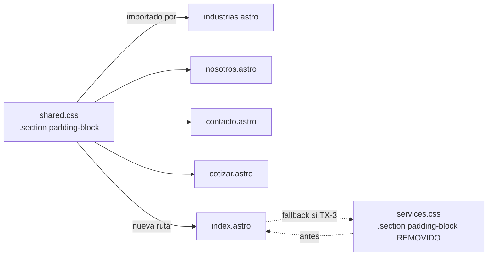

# Design — fix-ux-multipage-bugs

## Resumen ejecutivo

Diseño técnico de los fixes para 10 bugs UX/UI distribuidos en 4 páginas internas (`/industrias`, `/nosotros`, `/contacto`, `/cotizar`) más favicon global. La estrategia es **mínimo quirúrgico por bug**, agrupando dos refactors transversales: (a) mover `.section { padding-block }` a `shared.css` (resuelve B3/B4/B5 con una línea), y (b) auditoría sistemática de `astro:page-load` en scripts de páginas internas (resuelve B1/B7 y previene regresiones). El bug funcional más complejo (B8 folio/email) requiere modificar `/api/cotizacion.ts` para generar folio server-side y devolverlo en la respuesta; el envío de email ya funciona (`worker-mailer` + Cloudflare Workers), solo se documenta la dependencia SMTP. Se crea **un único ADR nuevo** (0004) para el folio server-generated por su impacto arquitectónico a futuro (trazabilidad, persistencia opcional).

## Decisiones técnicas por spec

### D-1 | sections/internal-pages-vertical-rhythm (B3, B4, B5)

**Decisión**: Mover la regla `.section { padding-block: var(--section-pad); }` desde `src/styles/sections/services.css` (L1-3) a `src/styles/pages/shared.css`. La regla se coloca cerca del inicio del archivo, antes de las definiciones específicas de páginas internas, para que actúe como base global de spacing.

- **Aproximación**:
  - Añadir `.section { padding-block: var(--section-pad); }` en `shared.css` (sección de "layout base").
  - Eliminar la misma regla de `sections/services.css` para evitar doble declaración.
  - `index.astro` continúa importando `sections.css` → `sections/services.css`, pero ahora también importa `shared.css` (verificar; si no lo hace, mantener la regla también en `services.css` como fallback DRY-laxo, o añadir el import explícito de `shared.css` en `index.astro`).
  - **Plan A (preferido)**: añadir la regla solo en `shared.css` y verificar que `index.astro` importe `shared.css`. Si no lo importa, añadir `@import "./pages/shared.css"` en `sections.css` o el import directo en `index.astro`.
  - **Plan B (fallback)**: mantener la regla duplicada (en `shared.css` y `services.css`) si la cascada de `index.astro` no admite el import sin regresiones visuales.
- **Modificadores**: las clases `.section--surface` y `.section--alt` solo modifican background; no se tocan.
- **Archivos a modificar**:
  - `log-atm-web-astro/src/styles/pages/shared.css` (añadir la regla)
  - `log-atm-web-astro/src/styles/sections/services.css` (remover la regla, si no rompe `/index`)
  - `log-atm-web-astro/src/pages/index.astro` (verificar import de `shared.css`; añadir si falta)
- **Alternativas descartadas**:
  - Mover a `global.css` fuera de `@layer`: aumenta superficie y puede colisionar con Tailwind v4 base.
  - Duplicar en cada página interna: viola DRY.
- **Output expected**: 1-2 archivos modificados (CSS), sin nuevos archivos.

---

### D-2 | internal-page-heroes/hero-title-contrast (B2)

**Decisión**: Forzar `color: #fff` (o equivalente con token `var(--color-text-inverse)`) en `.page-hero__title` con suficiente especificidad para sobrevivir a la cascada de Tailwind v4 `@layer components` (Plan A del proposal).

- **Aproximación (Plan A)**:
  - En `src/styles/pages/shared.css`, asegurar que la regla `.page-hero__title { color: #fff; }` existe y vive **fuera de cualquier `@layer`** (reglas unlayered ganan a las layered).
  - Si la regla ya existe pero no se aplica, aumentar especificidad con selector concatenado: `.page-hero .page-hero__title { color: #fff; }` o usar token `var(--color-text-inverse)`.
  - Si la regla en `global.css` dentro de `@layer components` declara `.page-hero__inner { color: var(--color-text-inverse) }` pero NO el title, la herencia debería propagarse — verificar en browser.
- **Plan B (fallback solo si verify falla)**: sacar la definición de `.page-hero__title` de `@layer components` en `global.css` y dejarla unlayered. Documentar en verify por qué se hizo.
- **Archivos a modificar**:
  - `log-atm-web-astro/src/styles/pages/shared.css` (asegurar regla unlayered con color blanco)
  - `log-atm-web-astro/src/styles/global.css` (solo Plan B: sacar de `@layer components`)
- **Verificación**: inspector del browser sobre `h1.page-hero__title` debe mostrar `color: #ffffff` con regla unlayered de `shared.css` ganando.
- **Alternativas descartadas**:
  - `!important`: aceptable como último recurso pero degrada mantenibilidad; preferir especificidad.
  - Inline style en el markup: viola separación de responsabilidades.
- **Output expected**: 1 archivo CSS modificado (Plan A) o 2 (Plan B).

---

### D-3 | interactive-component-transitions/industries-selector-interaction (B1)

**Decisión**: Envolver el script `define:vars` de `industrias.astro` y la inicialización de `initIndDirectory()` dentro de un handler `document.addEventListener('astro:page-load', ...)` para asegurar re-registro de listeners tras View Transitions. Auditar que `window.__indDirectoryOnRender` se asigne **antes** de que `initIndDirectory` lo consuma (orden de scripts).

- **Aproximación**:
  - En `src/pages/industrias.astro`, envolver el bloque de script principal en:
    ```ts
    document.addEventListener('astro:page-load', () => {
      // Asignar window.__indDirectoryOnRender ANTES de initIndDirectory
      window.__indDirectoryOnRender = (idx) => { /* update caption */ };
      initIndDirectory(/* config */);
    });
    ```
  - Si la asignación de `window.__indDirectoryOnRender` está en un `<script define:vars>` separado, garantizar que el orden de scripts en el markup coloque ese bloque ANTES del script de init (HTML execution order).
  - Detener autorotación: añadir `mouseenter` + `mouseleave` o `focusin` + `focusout` para pausar/reanudar (ya parcialmente cubierto por `initIndDirectory`; auditar).
- **Archivos a modificar**:
  - `log-atm-web-astro/src/pages/industrias.astro` (script init)
  - `log-atm-web-astro/src/scripts/gsap-ind-directory.ts` (solo si requiere ajuste defensivo para `window.__indDirectoryOnRender === undefined`)
- **Alternativas descartadas**:
  - Migrar a isla React con state: refactor mayor, fuera de scope.
- **Output expected**: 1-2 archivos modificados.

---

### D-4 | interactive-component-transitions/wizard-step-modality-selection (B7)

**Decisión**: Envolver el script principal del wizard de `cotizar.astro` en `astro:page-load`. Resetear el flag `isAnimating` a `false` al inicializar para limpiar estado colgado tras navegaciones interrumpidas. Garantizar que listeners de mode-tiles y de `#btn-next` se re-registran en cada `astro:page-load`.

- **Aproximación**:
  - En `src/pages/cotizar.astro`, envolver el script `define:vars` y el segundo `<script>` (que importa `gsap-stepper.ts`) dentro de:
    ```ts
    document.addEventListener('astro:page-load', () => {
      // Reset flag colgado
      if (window.__stepperState) window.__stepperState.isAnimating = false;
      // Re-bind listeners de mode-tiles, btn-next, btn-prev
      // Initial render del paso 0
      renderStep(state.step);
    });
    ```
  - Considerar que un `astro:page-load` puede dispararse varias veces; usar idempotencia: si ya hay listeners, removerlos antes de re-bind (o usar `controller.abort()` con `AbortController` por carga).
  - Tipar/exponer `window.__stepperState` si el flag vive en módulo externo (`gsap-stepper.ts`), para que el reset funcione.
- **Archivos a modificar**:
  - `log-atm-web-astro/src/pages/cotizar.astro` (wrap en `astro:page-load`, reset flag, idempotencia)
  - `log-atm-web-astro/src/scripts/gsap-stepper.ts` (exponer reset/cleanup si necesario)
- **Alternativas descartadas**:
  - Refactor a store reactivo (Zustand, Nanostores): fuera de scope.
  - `transition:persist` en el script tag: no resuelve el reset del flag.
- **Output expected**: 1-2 archivos modificados.

---

### D-5 | forms-email/quote-folio-server-generated (B8 — folio)

**Decisión**: La API `POST /api/cotizacion` genera el folio server-side antes del intento de envío de email, lo incluye en `mail` (para que aparezca en el cuerpo del correo) y lo retorna en el JSON de respuesta `{ ok: true, folio: "LA-XXXX" }`. El cliente (script del wizard en `cotizar.astro`) lee `folio` del response y lo pinta en `#success-id` del paso success. Se elimina toda generación de folio en cliente (`Date.now()` etc.).

- **Aproximación**:
  - **Server (`src/pages/api/cotizacion.ts`)**:
    - Generar folio justo después de validación, antes de `buildCotizacion4Email`:
      ```ts
      const folio = generateFolio();
      // dentro de buildCotizacion4Email pasar folio para incluirlo en el HTML/text del email
      const mail = buildCotizacion4Email(data, { ...meta, folio });
      await sendMail(resolveMailEnv(), mail);
      return json(200, { ok: true, folio });
      ```
    - `generateFolio()` definida en `src/lib/folio.ts` (nuevo módulo) o en una función helper inline:
      ```ts
      export function generateFolio(): string {
        const ts = Date.now().toString(36).toUpperCase();         // ~7-8 chars
        const rand = Math.floor(Math.random() * 1296).toString(36).toUpperCase().padStart(2, '0'); // 2-3 chars
        return `LA-${ts}${rand}`;
      }
      ```
    - **Entropía**: `Date.now()` (ms) + `Math.random() * 36^2` ≈ 36 bits efectivos. Suficiente para anti-colisión razonable en envíos simultáneos (Scenario 2 de la spec). Para reforzar, usar `crypto.randomUUID().slice(0, 8)` si está disponible en runtime Workers (lo está: `crypto.getRandomValues` y `crypto.randomUUID` son estándar). **Recomendación**: usar `crypto.randomUUID()` para 4 chars hex:
      ```ts
      export function generateFolio(): string {
        const ts = Date.now().toString(36).toUpperCase();
        const rand = crypto.randomUUID().split('-')[0].toUpperCase(); // 8 hex chars
        return `LA-${ts}${rand}`;
      }
      ```
  - **Cliente (`src/pages/cotizar.astro`)**:
    - En `submitQuote()`: leer `folio` del response JSON:
      ```ts
      const res = await r.json();
      if (r.ok && res.ok && res.folio) {
        state.folio = res.folio;
        showSuccess();
      } else {
        // Mostrar error en UI; NO mostrar success con folio inventado
      }
      ```
    - En `showSuccess()`: usar `state.folio` (proveniente del server) en lugar de `'LA-' + String(Date.now()).slice(-6)`.
    - Eliminar TODA referencia a `Date.now()` o generación local de folio en el script de wizard.
  - **Plantilla email (`src/lib/email-templates.ts`)**: incluir folio en el cuerpo HTML/texto del correo enviado, para trazabilidad en el inbox del equipo.
- **Backward-compat de la API**: response añade campo `folio`; clientes externos que ignoren campos extras no se ven afectados. Si el cliente espera `folio` y no llega, mostrar error (Scenario 3 de la spec).
- **Archivos a modificar/crear**:
  - `log-atm-web-astro/src/pages/api/cotizacion.ts` (generar + retornar folio)
  - `log-atm-web-astro/src/lib/email-templates.ts` (incluir folio en email)
  - `log-atm-web-astro/src/pages/cotizar.astro` (consumir folio del response)
  - `log-atm-web-astro/src/lib/folio.ts` (**nuevo** — helper aislado, testeable)
- **ADR**: ver `0004-folio-server-generated.md`.
- **Alternativas descartadas**:
  - Persistencia en BD (Cloudflare D1, KV): out-of-scope; no hay capa de persistencia.
  - UUID v4 completo: 36 chars con guiones; folio queda menos legible al usuario final.
  - Folio puramente secuencial: requiere persistencia (contador atómico).
- **Output expected**: 1 archivo nuevo + 3 modificados.

---

### D-6 | forms-email/quote-email-delivery (B8 — SMTP/envío)

**Decisión**: Reutilizar el mailer existente `src/lib/mailer.ts` (que ya usa `worker-mailer` sobre Cloudflare Workers). No hay refactor del transport. Documentar variables requeridas en `.dev.vars.example` (ya existe; verificar completitud). Para verify en entorno sin credenciales reales, usar **Ethereal Email** como fallback SMTP — `worker-mailer` soporta SMTP estándar (puerto 587 STARTTLS o 465 secure), Ethereal expone `smtp.ethereal.email:587`.

- **Aproximación**:
  - **No modificar `mailer.ts`** salvo si verify revela un bug en el transport — el módulo ya está completo y verificado en el change `forms-email-sending`.
  - **Verificar `.dev.vars.example`**: ya contiene `SMTP_HOST`, `SMTP_PORT`, `SMTP_SECURE`, `SMTP_USER`, `SMTP_PASS`, `MAIL_TO`. Añadir `MAIL_FROM` si la API lo usa (revisar `mailer.ts` L52: actualmente `from` se compone de `{ name: "Formulario Web", email: user }`; `MAIL_FROM` no se usa explícitamente — se puede dejar opcional).
  - **Verify path (sin credenciales reales)**:
    - Crear cuenta Ethereal manualmente o programáticamente (one-shot script `scripts/ethereal-create.mjs` opcional).
    - Configurar `.dev.vars` con `SMTP_HOST=smtp.ethereal.email`, `SMTP_PORT=587`, `SMTP_SECURE=false`, credenciales generadas.
    - Ejecutar `astro dev` o `wrangler pages dev`, enviar cotización de prueba, verificar bandeja Ethereal.
  - **Manejo de errores en cliente**: el wizard actualmente puede ignorar el 500. Tras D-5, el flujo debe ser:
    ```ts
    if (r.ok && res.ok) { showSuccess(); }
    else { showError(res.error || 'unknown', res.fields); }
    ```
    `showError()` muestra mensaje en la UI (ya existe en el wizard; verificar binding).
- **Archivos a modificar**:
  - `log-atm-web-astro/.dev.vars.example` (verificar; añadir comentario sobre Ethereal como fallback para QA)
  - `log-atm-web-astro/src/pages/cotizar.astro` (manejo robusto de error en `submitQuote`)
- **Alternativas descartadas**:
  - Migrar a nodemailer: requiere abandonar Cloudflare Workers o usar un proxy. Fuera de scope.
  - Cloudflare Email Workers: requiere DNS + zona configurada en CF; fuera de scope.
- **Output expected**: 0-1 archivos modificados (docs) + 1 ajuste en cliente (compartido con D-5).

---

### D-7 | forms-email/wizard-responsive-mobile (B9)

**Decisión**: Añadir media queries en `src/styles/pages/cotizar.css` para viewports `≤ 480px` y `≤ 720px`. El stepper colapsa a un formato compacto (bullets numerados sin nombres) en `≤ 720px` (ya parcialmente implementado por `.stepper__name { display: none }`); en `≤ 480px` se reduce el gap del grid y se asegura `min-width: 0` en las columnas para evitar overflow. El `.quote-card` reduce su `padding` en mobile chico.

- **Aproximación**:
  - **Stepper en `≤ 480px`**:
    ```css
    @media (max-width: 480px) {
      .stepper__track {
        grid-template-columns: repeat(4, minmax(0, 1fr));
        gap: var(--space-1);
      }
      .stepper__bullet { width: 28px; height: 28px; font-size: 0.875rem; }
      .stepper__name { display: none; }
    }
    ```
  - **Quote-card en `≤ 480px`**:
    ```css
    @media (max-width: 480px) {
      .quote-card { padding: var(--space-3); }
    }
    ```
  - **Touch targets**: garantizar `min-height: 44px` y `min-width: 44px` para `.mode-tile`, `#btn-next`, `#btn-prev`, inputs de texto. Verificar con DevTools mobile.
  - **Overflow**: añadir `overflow-x: hidden` o `min-width: 0` en contenedores que puedan desbordar.
- **Archivos a modificar**:
  - `log-atm-web-astro/src/styles/pages/cotizar.css` (añadir media queries `≤ 480px`)
  - `log-atm-web-astro/src/pages/cotizar.astro` (solo si requiere ajuste de markup — ej. atributos `inputmode` para inputs numéricos)
- **Alternativas descartadas**:
  - Stepper como sticky horizontal con scroll: introduce UX no estándar.
  - Reemplazar stepper por progress bar lineal: degrada la información de pasos.
- **Output expected**: 1-2 archivos modificados.

---

### D-8 | components/contacto-channels/whatsapp-icon (B6)

**Decisión**: Crear un componente Astro `src/components/icons/WhatsAppIcon.astro` (nuevo directorio `icons/`) con el inline SVG del logo oficial de WhatsApp. Reemplazar el `<Icon name="lucide:message-circle" />` actual en `contacto.astro` (L138-L146, bloque `.channel--wa`) por `<WhatsAppIcon width={22} height={22} aria-label="WhatsApp" />`. No se instala ninguna dependencia nueva (cumple AC de la spec).

- **Aproximación**:
  - **SVG fuente**: usar el path oficial del logo de WhatsApp (disponible en Wikimedia Commons o `simple-icons.org` — copiar el path SVG, no la dependencia). Path simplificado de 24x24:
    ```html
    <svg viewBox="0 0 24 24" xmlns="http://www.w3.org/2000/svg" role="img" aria-label="WhatsApp">
      <path d="M.057 24l1.687-6.163c-1.041-1.804-1.588-3.849-1.587-5.946.003-6.556 5.338-11.891 11.893-11.891 3.181.001 6.167 1.24 8.413 3.488 2.245 2.248 3.481 5.236 3.48 8.414-.003 6.557-5.338 11.892-11.893 11.892-1.99-.001-3.951-.5-5.688-1.448L.057 24zm6.597-3.807c1.676.995 3.276 1.591 5.392 1.592 5.448 0 9.886-4.434 9.889-9.885.002-5.462-4.415-9.89-9.881-9.892-5.452 0-9.887 4.434-9.889 9.884-.001 2.225.651 3.891 1.746 5.634l-.999 3.648 3.742-.981zm11.387-5.464c-.074-.124-.272-.198-.57-.347-.297-.149-1.758-.868-2.031-.967-.272-.099-.47-.149-.669.149-.198.297-.768.967-.941 1.165-.173.198-.347.223-.644.074-.297-.149-1.255-.462-2.39-1.475-.883-.788-1.48-1.761-1.653-2.059-.173-.297-.018-.458.13-.606.134-.133.297-.347.446-.521.151-.172.2-.296.3-.495.099-.198.05-.372-.025-.521-.075-.148-.669-1.611-.916-2.206-.242-.579-.487-.501-.669-.51l-.57-.01c-.198 0-.52.074-.792.372s-1.04 1.016-1.04 2.479 1.065 2.876 1.213 3.074c.149.198 2.095 3.2 5.076 4.487.709.306 1.263.489 1.694.626.712.226 1.36.194 1.872.118.571-.085 1.758-.719 2.006-1.413.248-.695.248-1.29.173-1.414z"/>
    </svg>
    ```
  - **Componente Astro** (`src/components/icons/WhatsAppIcon.astro`):
    ```astro
    ---
    interface Props { width?: number; height?: number; class?: string; ariaLabel?: string; }
    const { width = 24, height = 24, class: cls = "", ariaLabel = "WhatsApp" } = Astro.props;
    ---
    <svg viewBox="0 0 24 24" width={width} height={height} class={cls}
         xmlns="http://www.w3.org/2000/svg" role="img" aria-label={ariaLabel}>
      <path fill="currentColor" d="..." />
    </svg>
    ```
  - **Color**: el `path` usa `fill="currentColor"` para heredar del contenedor; si el design system requiere verde de marca (`#25D366`), pasar `color: #25D366` en el `.channel--wa .channel__icon`.
  - **Reemplazo en `contacto.astro`**:
    ```astro
    ---
    import WhatsAppIcon from '../components/icons/WhatsAppIcon.astro';
    ---
    <span class="channel__icon">
      <WhatsAppIcon width={22} height={22} ariaLabel="WhatsApp" />
    </span>
    ```
- **Archivos a crear**:
  - `log-atm-web-astro/src/components/icons/WhatsAppIcon.astro`
- **Archivos a modificar**:
  - `log-atm-web-astro/src/pages/contacto.astro` (L138-L146: import + uso)
- **Alternativas descartadas**:
  - Instalar `@iconify-json/simple-icons`: viola AC "no se instala ninguna dependencia nueva".
  - SVG inline directo en `contacto.astro`: viola DRY si se necesita reutilizar.
- **Output expected**: 1 archivo nuevo + 1 modificado.

---

### D-9 | branding/favicon-logo-atm (B10)

**Decisión**: Generar `public/favicon.svg` (versión simplificada del símbolo del logo Log ATM) y `public/favicon.ico` (32x32) mediante un script Node one-shot `scripts/generate-favicons.mjs` que usa `sharp` (ya instalado, v0.34.5). El script lee `public/logo.svg` como fuente y produce ambos formatos. El `BaseLayout.astro` ya referencia ambos archivos (L175-L176), **no requiere modificación**.

- **Aproximación**:
  - **Script `scripts/generate-favicons.mjs`** (ESM, Node-only, no Workers):
    ```js
    import sharp from 'sharp';
    import { readFile, writeFile, copyFile } from 'fs/promises';
    import { join } from 'path';

    const ROOT = process.cwd();
    const SRC_SVG = join(ROOT, 'public/logo.svg');
    const OUT_SVG = join(ROOT, 'public/favicon.svg');
    const OUT_ICO = join(ROOT, 'public/favicon.ico');

    async function main() {
      // 1. favicon.svg: copia directa o versión simplificada del logo
      //    Si el logo completo no es legible a 16x16, crear una versión "símbolo solo"
      //    manualmente en public/favicon-source.svg y usarla aquí.
      await copyFile(SRC_SVG, OUT_SVG);

      // 2. favicon.ico (32x32 PNG dentro de contenedor ICO).
      //    sharp puede exportar PNG; ICO requiere wrapper. Solución: generar PNG 32x32
      //    y renombrar a .ico (la mayoría de navegadores aceptan PNG en .ico desde 2010).
      //    Alternativa robusta: usar `to-ico` npm pkg (eval si vale el dep extra).
      await sharp(SRC_SVG)
        .resize(32, 32, { fit: 'contain', background: { r: 0, g: 0, b: 0, alpha: 0 } })
        .png()
        .toFile(OUT_ICO);

      console.log('[favicons] generated:', OUT_SVG, OUT_ICO);
    }
    main().catch(e => { console.error(e); process.exit(1); });
    ```
  - **Trade-off ICO**: `sharp` no produce formato ICO nativo. Dos opciones:
    - **A (recomendada)**: PNG renombrado a `.ico` — soportado por Chrome/Firefox/Safari/Edge modernos. Funciona en >95% de navegadores actuales.
    - **B**: añadir `npm i -D to-ico` (dep dev de 80KB) para wrapping ICO real. Reservar para si A falla en algún navegador objetivo.
  - **Script registrado en `package.json`**:
    ```json
    "scripts": {
      "favicons": "node scripts/generate-favicons.mjs"
    }
    ```
    NO añadir a `prebuild` (es one-shot manual; el output se commitea al repo).
  - **Versión simplificada del SVG**: si `logo.svg` completo (logotipo + texto) no es legible a 16x16, crear una versión "símbolo solo" del logo en `public/favicon-source.svg` y usarla como fuente en el script. **Decisión pragmática**: probar primero con `logo.svg` directo; si verify revela ilegibilidad, crear `favicon-source.svg` manualmente.
  - **BaseLayout.astro**: ya tiene los `<link>` correctos en L175-L176 — no se toca.
- **Archivos a crear**:
  - `log-atm-web-astro/scripts/generate-favicons.mjs`
  - `log-atm-web-astro/public/favicon.svg` (reemplazo del default Astro — output del script)
  - `log-atm-web-astro/public/favicon.ico` (reemplazo del default — output del script)
  - **Opcional**: `log-atm-web-astro/public/favicon-source.svg` (símbolo simplificado, solo si verify lo requiere)
- **Archivos a modificar**:
  - `log-atm-web-astro/package.json` (añadir script `favicons`)
- **Alternativas descartadas**:
  - Generar como parte del build (`astro:build:start` hook): innecesario; favicon cambia raramente.
  - Convertir manualmente con ImageMagick: añade dependencia externa no-Node.
- **Output expected**: 3-4 archivos nuevos + 1 modificado.

---

## Decisiones transversales

### TX-1 | Patrón obligatorio: `astro:page-load` para scripts inline

Todas las páginas con scripts inline que registren listeners DOM DEBEN envolver la inicialización en `document.addEventListener('astro:page-load', ...)`. Esto se aplica a:

- `src/pages/industrias.astro` (D-3)
- `src/pages/cotizar.astro` (D-4)
- (Auditar en `apply`) `src/pages/nosotros.astro`, `src/pages/contacto.astro`, `src/pages/servicios.astro` — verificar si hay scripts inline que necesiten el mismo wrap.

Patrón canónico:

```ts
<script>
  document.addEventListener('astro:page-load', () => {
    // 1. (Opcional) cleanup de estado residual de navegación anterior
    // 2. Asignación de globals (window.__x = ...)
    // 3. Registro de listeners (con AbortController para idempotencia si re-binding)
    // 4. Initial render / first tick
  });
</script>
```

**AbortController para idempotencia** (recomendado para listeners que se podrían registrar múltiples veces):

```ts
const controller = new AbortController();
document.addEventListener('astro:before-swap', () => controller.abort(), { once: true });
modeTiles.forEach(t => t.addEventListener('click', handler, { signal: controller.signal }));
```

### TX-2 | Convenciones de breakpoints

- **Mobile-first** salvo donde la regla base ya es desktop (caso histórico del proyecto).
- **Breakpoints estándar**: `sm: 640px`, `md: 768px`, `lg: 1024px` (Tailwind v4 defaults).
- **Breakpoint mobile chico** (sub-`sm`): `max-width: 480px` para wizard.
- **Touch targets**: mínimo 44x44 px (WCAG 2.2 AA — Target Size).

### TX-3 | Refactor de `.section { padding-block }` (D-1) — riesgo de regresión en `/index`

`index.astro` actualmente recibe la regla via cadena de imports: `index.astro → sections.css → sections/services.css`. Tras D-1, la regla se mueve a `shared.css`. Si `index.astro` no importa `shared.css`, perderá el padding-block de `.section`. Mitigación:

1. Verificar imports de `index.astro`.
2. Si NO importa `shared.css`, opciones:
   - Añadir `import "../styles/pages/shared.css";` en `index.astro`.
   - O **mantener** la regla en `services.css` (deja la duplicación con `shared.css`; trade-off DRY-laxo aceptable porque `services.css` puede tener otras razones de existencia).
3. Verify visual en `/`, `/industrias`, `/nosotros`, `/contacto`, `/cotizar` debe confirmar paridad.

### TX-4 | Tipado de globals expuestos a `window`

Para `window.__indDirectoryOnRender` (D-3) y `window.__stepperState` (D-4), añadir augmentación de tipos en `src/types/globals.d.ts` (crear si no existe) para silenciar errores TS:

```ts
declare global {
  interface Window {
    __indDirectoryOnRender?: (idx: number) => void;
    __stepperState?: { isAnimating: boolean; step: number };
  }
}
export {};
```

---

## ADRs

### ADR nuevo propuesto

#### `0004-folio-server-generated.md` — Folio de cotización generado server-side sin persistencia

Justificación: la decisión de generar folio en servidor (vs. cliente vs. BD) tiene impacto futuro:

- Sienta el patrón para otros formularios con folio (contacto, cotización rápida).
- Define el contrato de respuesta `{ ok, folio }` que clientes externos podrían consumir.
- Documenta la decisión de NO usar BD (relevante si en el futuro se necesita persistencia o búsqueda por folio).
- Documenta el formato `LA-{base36}{hex8}` y su entropía esperada.

Ver archivo creado: `$MEMORY_ROOT/adrs/0004-folio-server-generated.md`.

### ADRs existentes referenciados

- `0001-image-optimization-astro-assets.md`: no aplica directamente — no tocamos imágenes en este change.
- `0002-i18n-routing-pages-lang-folder.md`: no aplica — todas las páginas tocadas están en `src/pages/*.astro` (es default, sin prefijo); no se modifican rutas `[lang]/`.
- `0003-i18n-key-validation-build-hook.md`: no aplica — no se añaden claves i18n.

### ADRs NO creados (conscientemente)

- **ADR para `astro:page-load` wrap**: es un patrón documentado en Astro docs y ya practicado en el codebase (TX-1). No requiere ADR.
- **ADR para favicon build pipeline**: el script es one-shot, output commiteado al repo, no parte del build automatizado. Sin impacto arquitectónico futuro.
- **ADR para inline SVG vs. icon library**: la decisión ya está fijada en la spec (`no nuevas deps`) y proposal (D2). ADR sería redundante.

---

## Output Expected (resumen consolidado)

### Archivos a crear

| Path | Propósito | Spec |
|------|-----------|------|
| `log-atm-web-astro/src/lib/folio.ts` | Helper `generateFolio()` server-side | D-5 |
| `log-atm-web-astro/src/components/icons/WhatsAppIcon.astro` | Inline SVG componente | D-8 |
| `log-atm-web-astro/scripts/generate-favicons.mjs` | Script Node one-shot con `sharp` | D-9 |
| `log-atm-web-astro/public/favicon.svg` | Output del script — reemplazo default Astro | D-9 |
| `log-atm-web-astro/public/favicon.ico` | Output del script — 32x32 | D-9 |
| `log-atm-web-astro/src/types/globals.d.ts` | (Si no existe) augmentación `Window` | TX-4 |
| `$MEMORY_ROOT/adrs/0004-folio-server-generated.md` | ADR | D-5 |

### Archivos a modificar

| Path | Cambio | Specs |
|------|--------|-------|
| `log-atm-web-astro/src/styles/pages/shared.css` | Añadir `.section { padding-block }`; asegurar `.page-hero__title { color: #fff }` unlayered | D-1, D-2 |
| `log-atm-web-astro/src/styles/sections/services.css` | Remover `.section { padding-block }` (si TX-3 lo permite) | D-1 |
| `log-atm-web-astro/src/styles/pages/cotizar.css` | Añadir media queries `≤ 480px` para stepper y quote-card | D-7 |
| `log-atm-web-astro/src/styles/global.css` | (Solo Plan B de D-2 si verify falla) sacar `.page-hero__title` de `@layer components` | D-2 |
| `log-atm-web-astro/src/pages/index.astro` | (Solo si TX-3 lo requiere) añadir import `shared.css` | D-1 |
| `log-atm-web-astro/src/pages/industrias.astro` | Wrap script en `astro:page-load`; orden de globals | D-3 |
| `log-atm-web-astro/src/pages/cotizar.astro` | Wrap script en `astro:page-load`; reset `isAnimating`; consumir `folio` del response; manejo de error | D-4, D-5, D-6 |
| `log-atm-web-astro/src/pages/api/cotizacion.ts` | Generar folio server-side + retornarlo en JSON | D-5 |
| `log-atm-web-astro/src/lib/email-templates.ts` | Incluir folio en cuerpo del email | D-5 |
| `log-atm-web-astro/src/pages/contacto.astro` | Reemplazar `<Icon lucide:message-circle>` por `<WhatsAppIcon>` | D-8 |
| `log-atm-web-astro/src/scripts/gsap-ind-directory.ts` | (Defensivo) chequeo de `window.__indDirectoryOnRender` antes de uso | D-3 |
| `log-atm-web-astro/src/scripts/gsap-stepper.ts` | (Si requerido) exponer reset/cleanup del flag `isAnimating` | D-4 |
| `log-atm-web-astro/package.json` | Añadir `"favicons": "node scripts/generate-favicons.mjs"` | D-9 |
| `log-atm-web-astro/.dev.vars.example` | Documentar Ethereal como fallback para QA (comentario) | D-6 |

### Archivos NO tocados (referencia)

- `log-atm-web-astro/src/lib/mailer.ts` — funcional, no requiere cambios.
- `log-atm-web-astro/src/layouts/BaseLayout.astro` — `<link>` favicon ya correcto.
- `log-atm-web-astro/src/lib/validate.ts` — sin cambios.
- `log-atm-web-astro/src/lib/constants.ts` — sin cambios.

---

## Diagramas

### Flujo cotización (B7 + B8) — happy path

```mermaid
sequenceDiagram
    autonumber
    participant U as Usuario
    participant W as Wizard (cliente)
    participant A as POST /api/cotizacion (Astro / CF Workers)
    participant F as folio.ts
    participant T as email-templates.ts
    participant M as worker-mailer (SMTP)

    U->>W: Carga /cotizar (astro:page-load)
    W->>W: Init listeners; reset isAnimating=false
    U->>W: Click en mode-tile
    W->>W: state.mode = "..."; btn-next enabled
    U->>W: Avanza pasos 2 → 4 (form data)
    U->>W: Submit en paso final
    W->>A: POST { name, email, modality, origin, dest, ... }
    A->>A: Validar payload
    A->>F: generateFolio()
    F-->>A: "LA-{base36}{hex8}"
    A->>T: buildCotizacion4Email(data, { folio, ... })
    T-->>A: { subject, html, text }
    A->>M: sendMail(env, mail)
    M-->>A: ok
    A-->>W: 200 { ok: true, folio: "LA-..." }
    W->>W: state.folio = res.folio
    W->>U: showSuccess() con folio del server
```

### Flujo cotización — error path

```mermaid
sequenceDiagram
    autonumber
    participant U as Usuario
    participant W as Wizard
    participant A as POST /api/cotizacion
    participant M as worker-mailer

    U->>W: Submit
    W->>A: POST { ... }
    A->>A: Validar payload
    alt Validación falla
        A-->>W: 400 { ok: false, error: "validation", fields }
        W->>U: showError(); resaltar fields
    else SMTP falla
        A->>M: sendMail()
        M-->>A: throw
        A-->>W: 500 { ok: false, error: "server" }
        W->>U: showError("error de envío, intenta más tarde")
    end
    Note over W: NO se muestra success con folio inventado
```

### Cascada CSS — `.section { padding-block }` (D-1)



---

## Verificación local (preflight para sdd-apply)

Antes de implementar, asegurar:

1. **Dependencias instaladas**:
   ```bash
   cd .sdd/worktrees/fix-ux-multipage-bugs/log-atm-web-astro
   npm install
   ```
2. **`.dev.vars`** copiado desde `.dev.vars.example` con valores válidos:
   - Para QA sin SMTP real: configurar Ethereal (`smtp.ethereal.email:587`, generar credenciales en https://ethereal.email/create).
   - Para producción local: usar credenciales reales de `mail.logatm.com` (consultar al equipo si están disponibles).
3. **`astro dev`** corriendo en `http://localhost:4321` para verificación visual en browser.
4. **DevTools mobile preview** (Chrome) en 375px y 480px para verificar D-7.

---

## Riesgos identificados

| ID | Riesgo | Probabilidad | Mitigación |
|----|--------|--------------|------------|
| R-D1 | Mover `.section` rompe spacing de `/index` (TX-3) | Media | Verify visual de `/index` post-apply; fallback: mantener duplicada |
| R-D2 | Plan A de B2 no resuelve cascada Tailwind v4 | Media | Plan B (sacar de `@layer`) documentado y testeable en verify |
| R-D3 | `astro:page-load` se dispara varias veces y duplica listeners | Baja | AbortController + cleanup (TX-1) |
| R-D5 | `crypto.randomUUID()` no disponible en runtime objetivo | Muy baja | Workers + Node 22 lo soportan; fallback `Math.random()` |
| R-D6 | Ethereal SMTP bloqueado por CF Workers outbound | Baja | Ethereal usa puertos estándar (587); CF Workers permite TCP saliente vía sockets API (`worker-mailer` lo abstrae) |
| R-D8 | Path del SVG WhatsApp inexacto (escalado) | Baja | Verificar visualmente en `/contacto`; tomar SVG de fuente oficial (Wikimedia) |
| R-D9 | `.ico` PNG-renamed no aceptado por algún navegador objetivo | Baja | Plan B con `to-ico` documentado en D-9 |
| R-D9b | Logo completo no legible a 16x16 favicon | Media | Crear `favicon-source.svg` simplificado solo si verify lo confirma |

---

## Resumen de impacto

- **Archivos a crear**: 7 (incluyendo 1 ADR)
- **Archivos a modificar**: ~13
- **Líneas de código estimadas**: ~300 (la mayoría en `cotizar.astro` para wizard handling)
- **Tests automatizados a añadir**: 0 (no hay infra de tests; verify manual)
- **Dependencias nuevas**: 0 (todo con `sharp`, `worker-mailer`, `crypto` ya disponibles)
- **Breaking changes en API**: 0 (response añade campo, backward-compat)
- **Migraciones**: 0
