# Design: optimize-images-webp

> domain: refactoring · fast_path: full · base de código verificada en `.sdd/worktrees/optimize-images-webp/log-atm-web-astro/`
> ADR base: [[0001-image-optimization-astro-assets]] (vigente, se extiende — no se supersede)
> ADR nuevo: [[0006-picture-multiformat-content-images]]

## Resumen verificado contra código real

Hallazgos de la lectura del código (no inferencias):

- **27 imágenes raster** en `public/images/` (no 28): `services/*.jpeg` (11), `industries/*.jpeg` (12), `process/*.jpeg` (4). Verificado con `find public/images -type f`.
- **27 campos `img:`** en `src/lib/constants.ts`, distribuidos en 3 consts: `SERVICES` (11), `INDUSTRIES` (12), `HOW_WE_WORK` (4). No hay `img:` en `PROCESS_STEPS` (esos son texto). Cada `img:` es un string `'/images/.../*.jpeg'`.
- **Las páginas `[lang]/*.astro` son wrappers finos**: `import RootPage from '../servicios.astro'` + `<RootPage lang={Astro.params.lang} />`. No declaran `` propias. Migrar las páginas canónicas y las secciones compartidas cubre automáticamente es/en/pt. **No se toca ningún archivo bajo `src/pages/[lang]/`.**
- **Las subrutas `servicios/carga-aerea.astro` y `servicios/carga-maritima.astro` no tienen ``** ni referencias a `/images/`. Fuera de alcance.
- **Superficie real de `` de contenido** (8 ocurrencias en 7 archivos):
  | Archivo | Línea | Fuente del src | Rol |
  |---|---|---|---|
  | `src/components/sections/HeroSection.astro` | 19 | hardcoded `/images/services/svc-maritima.jpeg` | Hero LCP |
  | `src/components/sections/IndustriesSection.astro` | 40 | `ind.img` (de `INDUSTRIES`) | grid home |
  | `src/components/sections/ServicesSection.astro` | 48 | `s.img` (de `SERVICES`) | bento home |
  | `src/components/sections/WhyVideoSection.astro` | 33 | `poster="/images/services/svc-maritima.jpeg"` | poster `<video>` |
  | `src/pages/servicios.astro` | 83 | `s.img` | grid catálogo |
  | `src/pages/servicios.astro` | 115 | `s.img` | detalle |
  | `src/pages/nosotros.astro` | 131 | `s.img` (de `HOW_WE_WORK`) | cómo trabajamos |
  | `src/pages/industrias.astro` | 69 | `spotlight.img` (`industries[0]`) | spotlight |
  | `src/pages/industrias.astro` | 105 | `it.img` | directory slides |
- **``** en `Navbar.astro` (33, 72), `Footer.astro` (18), `WhyVideoSection.astro` (56): EXCLUIDO por la propuesta (PNG liviano 26 KB). No se migra.
- **Astro 6.3.1**, **sharp 0.34.5** (resueltos en `package-lock.json`). `output: 'static'` + adapter Cloudflare → optimización en build-time con Sharp, emite estáticos, sin coste runtime ni interferencia del adapter.
- **No existe `astro:assets` en uso hoy** salvo `src/lib/industryImages.ts` (mapa `INDUSTRY_IMAGES`), que es **código muerto** (cero consumidores, verificado por grep). `src/assets/logo.svg` también es código muerto (cero consumidores).
- **CSS de los contenedores de imagen**: todos los `*__media img` usan `width:100%; height:100%; object-fit:cover` y el contenedor define el tamaño (vía `inset:0` con padre posicionado, o `aspect-ratio`). Ningún selector usa el combinador hijo directo `>` sobre el `img` (verificado en `hero.css`, `services.css`, `industries.css`, `shared.css`). Esto es crítico: `<Picture>` envuelve el `` en `<picture>`, y los selectores `.xxx__media img` siguen casando porque `img` es descendiente. **No hay regresión de selectores CSS.**

---

## Decisiones Técnicas

### D1: Reemplazar strings `img:` en `constants.ts` por imports estáticos de `ImageMetadata`

**Contexto**: `<Picture>`/`<Image>` de Astro requieren un `ImageMetadata` (resultado de un `import` estático), no un string de path. `astro:assets` no soporta `src` dinámico desde un string en `output: 'static'`. Los datos de negocio (`SERVICES`, `INDUSTRIES`, `HOW_WE_WORK`) viven en `constants.ts` con `img: '/images/...'`.

**Decisión**: cambiar el tipo del campo `img` de `string` a `ImageMetadata`, poblándolo con imports estáticos top-level del propio `constants.ts`. Se mantiene el campo `img` con el mismo nombre y la misma posición en cada objeto, de modo que **todos los consumidores (`ind.img`, `s.img`, `spotlight.img`, `it.img`) siguen funcionando sin cambios en su acceso** — solo cambia el tipo que reciben (de string a `ImageMetadata`), que es exactamente lo que `<Picture src={...}>` espera.

**Patrón concreto** (en la cabecera de `src/lib/constants.ts`):

```ts
// Imports estáticos para astro:assets (build-time, Sharp). Ver ADR-0006.
import svcAerea from '../assets/images/services/svc-aerea.jpeg';
import svcMaritima from '../assets/images/services/svc-maritima.jpeg';
// ... 11 services
import indMineria from '../assets/images/industries/ind-mineria.jpeg';
// ... 12 industries
import how01 from '../assets/images/process/how-01-ejecutivo.jpeg';
// ... 4 process
```

Luego en cada const, `img: '/images/services/svc-aerea.jpeg'` → `img: svcAerea`, etc. El mapeo string→variable es 1:1 por nombre de archivo (los nombres ya son únicos y descriptivos).

**Justificación**: mantiene `constants.ts` como única fuente de verdad de los datos de negocio (principio del propio archivo: "Nunca duplicar estos valores en componentes"). Evita crear mapas auxiliares separados por key (como `industryImages.ts`) que añaden indirección key→asset propensa a errores. Los imports directos en el objeto eliminan el riesgo de "key no coincide" porque no hay key intermedia: el import resuelve o el build falla.

**Alternativas descartadas**:
- *Mapa auxiliar `imageMap.ts` con keys* (estilo `INDUSTRY_IMAGES`): añade una capa key→asset y obliga a cada consumidor a hacer lookup. Es justamente el patrón muerto que este cambio elimina; reintroducirlo contradice la limpieza.
- *Mantener strings + `<picture>` manual*: descartado en la propuesta (Approach B) — no usa `astro:assets`, no resuelve resize/CLS.
- *`import.meta.glob`*: soporta carga dinámica pero los assets entran como promesas/módulos y complica el tipado de `constants.ts` (que es data plana `as const`); over-engineering para 27 assets fijos (YAGNI).

### D2: Componente `<Picture>` con formatos `['avif','webp']` y fallback JPEG

**Contexto**: el objetivo es negociar AVIF/WebP con fallback automático y dimensiones intrínsecas para CLS=0.

**Decisión**: usar `<Picture src={...} formats={['avif','webp']} alt="..." />`. `fallbackFormat` se deja en su default (Astro infiere `.jpg` porque las fuentes son `.jpeg`), por lo que **no es necesario declarar `fallbackFormat="jpeg"` explícitamente** — el default ya produce el `` JPEG correcto. Se declara explícito solo si se quiere autodocumentar; el diseño lo deja implícito (KISS), salvo el Hero donde lo declaramos explícito por claridad de la pieza crítica.

Astro inyecta automáticamente `width`/`height` (de la metadata Sharp) en el `` interno → reserva de espacio → CLS=0. Genera:
```html
<picture>
  <source srcset="/_astro/...hash.avif" type="image/avif" />
  <source srcset="/_astro/...hash.webp" type="image/webp" />
  
</picture>
```

**Justificación**: `<Picture>` (no `<Image format="avif">`) garantiza fallback para navegadores sin AVIF/WebP sin lógica manual. Cobertura AVIF ≥96% / WebP ≥97% en 2026; el fallback cubre el resto sin riesgo.

**Alternativas descartadas**:
- *`<Image>`* (un solo formato): no negocia múltiples formatos; AVIF directo sin fallback rompería navegadores antiguos. ADR-0001 usó `<Image>` para un caso acotado; este cambio prefiere `<Picture>` para el catálogo completo (ver ADR-0006).
- *Declarar `densities`/`widths`+`sizes` en todas las cards*: los contenedores son de tamaño fijo por CSS (cards de grid), no fluidos a viewport completo. Generar srcset responsive multiplicaría variantes sin beneficio claro para cards pequeñas. Se aplica `widths`+`sizes` **solo** al Hero y al spotlight (imágenes grandes/anchas). Ver D4.

### D3: Hero LCP con `priority`

**Contexto**: `HeroSection.astro:19` es la imagen LCP (`svc-maritima.jpeg`, 937 KB). Hoy usa `` sin `loading`/`decoding`.

**Decisión**: usar el atributo `priority` de `<Picture>`. Astro 6 setea automáticamente `loading="eager"`, `decoding="sync"` y `fetchpriority="high"` en el `` interno cuando se pasa `priority`. Esto reemplaza el `fetchpriority="high"` manual con la combinación óptima completa.

```astro
<Picture src={heroImg} formats={['avif','webp']} fallbackFormat="jpeg" priority alt="" />
```

`heroImg` se importa en el frontmatter de `HeroSection.astro` (no vive en `constants.ts` porque es un asset hardcoded de la sección):
```ts
import heroImg from '../../assets/images/services/svc-maritima.jpeg';
```

**Nota importante**: `svc-maritima.jpeg` se usa en **dos lugares** — Hero (`HeroSection`) y poster del video (`WhyVideoSection`). Ambos importan el mismo asset físico desde `src/assets/images/services/svc-maritima.jpeg`. Astro deduplica por hash de contenido en build, así que no hay duplicación de output.

**Justificación**: `priority` es el helper canónico de Astro para above-the-fold; un único atributo aplica la tríada correcta y evita el anti-patrón de `loading="lazy"` accidental en el LCP. `alt=""` se mantiene (imagen decorativa, el `<div>` padre tiene `aria-hidden="true"`).

**Alternativas descartadas**:
- *`loading="eager" decoding="async" fetchpriority="high"` manual*: equivalente pero verboso y propenso a olvidos; `priority` lo encapsula.

### D4: `widths` + `sizes` solo en Hero y spotlight

**Contexto**: las cards de grid (services/industries/howwork) tienen contenedores de tamaño acotado por CSS; el Hero ocupa el viewport completo y el spotlight de `/industrias` es una imagen ancha grande.

**Decisión**:
- **Hero**: `widths={[768, 1280, 1920, heroImg.width]}` + `sizes="100vw"`.
- **Spotlight** (`industrias.astro:69`): `widths={[480, 768, 1024]}` + `sizes="(max-width: 768px) 100vw, 50vw"` (verificar el ancho real del panel en `industries.css`; si es ~50% en desktop, este `sizes` aplica).
- **Cards de grid** (services, industries home/directory, howwork): sin `widths`/`sizes`. Astro emite el `` al tamaño intrínseco optimizado en AVIF/WebP. Si el análisis de tamaño de card sugiere un downscale fijo, aplicar `width`/`height` explícitos al valor renderizado (p. ej. cards mini), pero por defecto KISS: dejar que Sharp comprima sin srcset.

**Justificación**: srcset responsive aporta valor real solo en imágenes fluidas grandes (Hero/spotlight). Para cards pequeñas el coste (más variantes en build) supera el beneficio. Evita over-engineering (YAGNI) manteniendo el máximo impacto LCP donde importa.

**Alternativas descartadas**:
- *srcset en todas las imágenes*: multiplica el output de build por número de breakpoints sin mejora perceptible en cards de grid.

### D5: Poster del video vía `getImage()`

**Contexto**: `WhyVideoSection.astro:33` usa `<video poster="/images/services/svc-maritima.jpeg">`. El atributo `poster` acepta una sola URL, no `<picture>`.

**Decisión**: en el frontmatter de `WhyVideoSection.astro`, generar una variante WebP única con `getImage()` y usar su `.src`:

```astro
---
import { getImage } from 'astro:assets';
import posterSrc from '../../assets/images/services/svc-maritima.jpeg';
const poster = await getImage({ src: posterSrc, format: 'webp', width: 1280 });
---
<video class="why__video-el" poster={poster.src} ...>
```

**Justificación**: `getImage()` es el API canónico de Astro para obtener una URL optimizada fuera de HTML declarativo. WebP (no AVIF) para el poster porque el poster solo se muestra antes de que el video cargue/reproduzca y WebP tiene cobertura algo mayor; impacto marginal pero conservador. `width: 1280` evita servir el JPEG full-size como poster.

**Alternativas descartadas**:
- *Dejar el poster apuntando a `public/`*: el archivo se mueve fuera de `public/`, rompería la URL. Además no se optimizaría.
- *AVIF para el poster*: algunos navegadores aún no decodifican AVIF como poster de `<video>` de forma consistente; WebP es la opción segura.

### D6: Bloque `image:` en `astro.config.mjs`

**Contexto**: hoy no hay bloque `image:`; se usa el servicio Sharp por defecto sin override de calidad/formatos.

**Decisión**: añadir el bloque `image:` con el servicio Sharp explícito y calidad por formato:

```js
image: {
  // Servicio Sharp explícito (ya en deps). Ver ADR-0006.
  service: {
    entrypoint: 'astro/assets/services/sharp',
    config: {
      // calidad por formato — balance peso/fidelidad
      // (Astro pasa estas opciones a Sharp por formato)
    },
  },
},
```

**Nota de precisión sobre la API**: la calidad por defecto en Astro se controla principalmente vía el prop `quality` por componente, no vía un campo global `formats`/`quality` en `image:` (ese campo global no existe en la config de Astro 6 del modo no-experimental). Por tanto:
- **El bloque `image:` se usa para fijar el servicio Sharp y opciones de Sharp** (p. ej. `webp: { effort, alphaQuality }`, `jpeg: { mozjpeg: true }`).
- **La calidad por imagen** (webp 80 / avif 70 de la propuesta) se aplica con el prop `quality` en `<Picture quality={80}>` o, para diferenciar por formato, no hay un único atributo — se usa el preset de calidad numérico que aplica a las variantes generadas. Decisión: **fijar `quality={80}` por defecto en los `<Picture>`** (un solo valor numérico cubre el caso común; Astro lo aplica al re-encode). Si se requiere AVIF más agresivo, se evalúa en verify; no se sobre-diseña ahora (YAGNI).

Versión concreta recomendada del bloque (mínima y válida):
```js
image: {
  service: {
    entrypoint: 'astro/assets/services/sharp',
    config: {
      jpeg: { mozjpeg: true },
      webp: { effort: 4 },
    },
  },
},
```

**Justificación**: declarar el servicio Sharp explícito documenta la dependencia y permite tunear opciones de codec. `quality` por componente es el control real de peso en Astro 6; mantenerlo simple (un valor) cumple el objetivo de reducción de peso sin micro-optimización prematura.

**Alternativas descartadas**:
- *Campo global `image.formats`/`image.quality`*: no existe como API estable en Astro 6 (no-experimental); usarlo sería inventar config. La negociación de formatos se hace en `<Picture formats={...}>` por componente.

### D7: Estructura de carpetas destino

**Decisión**: mover los 27 JPEG preservando los 3 subgrupos:
```
src/assets/images/
  services/    (11 *.jpeg — mantienen nombre svc-*.jpeg)
  industries/  (12 *.jpeg — mantienen nombre ind-*.jpeg)
  process/     (4 *.jpeg — mantienen nombre how-*.jpeg)
```
Se conservan los nombres de archivo exactos para que el mapeo string→import sea 1:1 y trivial de verificar.

**Justificación**: espejo de la estructura actual de `public/images/`, minimiza la superficie de error en los imports. `src/assets/images/` (no `src/assets/` plano) evita colisión con el `src/assets/industries/` muerto que se elimina y deja un layout limpio.

### D8: Eliminación de código muerto

**Decisión**: eliminar en este mismo cambio:
- `src/assets/industries/*.jpg` (14 archivos) — duplicados sin consumidor.
- `src/lib/industryImages.ts` — exporta `INDUSTRY_IMAGES`, cero consumidores (verificado por grep).
- `src/assets/logo.svg` — cero consumidores (verificado por grep).

**Justificación**: los 14 jpg viejos en `src/assets/industries/` serían procesados por `astro:assets` en cada build aunque nadie los use (Astro procesa todo `src/assets` referenciado; al no referenciarse no se emiten, pero permanecen como peso de repo y confunden el inventario). Eliminarlos cierra la deuda identificada en exploration. Confirmar con grep final antes de borrar (defensa en profundidad).

---

## Arquitectura

```mermaid
flowchart TD
    subgraph src_assets["src/assets/images/ (nuevo)"]
        A1["services/*.jpeg (11)"]
        A2["industries/*.jpeg (12)"]
        A3["process/*.jpeg (4)"]
    end

    subgraph constants["src/lib/constants.ts"]
        C1["import estatico -> ImageMetadata"]
        C2["SERVICES[].img : ImageMetadata"]
        C3["INDUSTRIES[].img : ImageMetadata"]
        C4["HOW_WE_WORK[].img : ImageMetadata"]
    end

    subgraph render["Componentes y paginas canonicas"]
        R1["HeroSection: Picture priority + heroImg local"]
        R2["ServicesSection / servicios.astro: Picture src=s.img"]
        R3["IndustriesSection / industrias.astro: Picture src=ind.img"]
        R4["nosotros.astro: Picture src=s.img (HOW_WE_WORK)"]
        R5["WhyVideoSection: getImage() -> poster.src"]
    end

    subgraph lang["src/pages/[lang]/*.astro"]
        L1["wrappers: import RootPage + RootPage lang=..."]
    end

    A1 --> C1
    A2 --> C1
    A3 --> C1
    A1 --> R1
    A1 --> R5
    C1 --> C2 & C3 & C4
    C2 --> R2
    C3 --> R3
    C4 --> R4
    R2 & R3 & R4 -.reutilizados por.-> L1

    subgraph build["astro build (output: static)"]
        B1["Sharp: genera AVIF + WebP + JPEG fallback con hash"]
        B2["width/height intrinsecos -> CLS 0"]
    end

    R1 & R2 & R3 & R4 & R5 --> B1
    B1 --> B2

    subgraph dead["Codigo muerto - ELIMINAR"]
        D1["src/assets/industries/*.jpg (14)"]
        D2["src/lib/industryImages.ts"]
        D3["src/assets/logo.svg"]
    end
```



**Flujo de negociación de formato en runtime**: el navegador recibe `<picture>` con `<source type="image/avif">` → `<source type="image/webp">` → `` JPEG. Elige el primer formato soportado. Sin JS, sin coste runtime (todo build-time).

---

## Output Expected

**Mover (git mv recomendado para preservar historial):**
- `public/images/services/*.jpeg` (11) → `src/assets/images/services/`
- `public/images/industries/*.jpeg` (12) → `src/assets/images/industries/`
- `public/images/process/*.jpeg` (4) → `src/assets/images/process/`

**Modificar:**
- `src/lib/constants.ts` — añadir 27 imports estáticos en cabecera; cambiar tipo de `img` de string a `ImageMetadata` en `SERVICES`, `INDUSTRIES`, `HOW_WE_WORK`; reemplazar los 27 valores string por la variable importada correspondiente. (D1)
- `astro.config.mjs` — añadir bloque `image:` con servicio Sharp explícito. (D6)
- `src/components/sections/HeroSection.astro` — import `heroImg`; reemplazar `` por `<Picture priority>`. (D3)
- `src/components/sections/ServicesSection.astro` — import `{ Picture }`; `` → `<Picture src={s.img} formats={['avif','webp']}>`. (D2)
- `src/components/sections/IndustriesSection.astro` — idem con `ind.img`. (D2)
- `src/components/sections/WhyVideoSection.astro` — import `{ getImage }` + asset; generar `poster` con `getImage()`; `poster={poster.src}`. NO tocar `/logo.png`. (D5)
- `src/pages/servicios.astro` — import `{ Picture }`; migrar `` líneas 83 y 115. (D2)
- `src/pages/nosotros.astro` — import `{ Picture }`; migrar `` línea 131. (D2)
- `src/pages/industrias.astro` — import `{ Picture }`; migrar `` líneas 69 (spotlight, con widths/sizes — D4) y 105 (directory slides). (D2)

**Eliminar:** (D8)
- `src/assets/industries/*.jpg` (14 archivos)
- `src/lib/industryImages.ts`
- `src/assets/logo.svg`

**NO tocar:**
- `src/pages/[lang]/**` (wrappers; cubiertos vía RootPage)
- `src/pages/servicios/carga-aerea.astro`, `carga-maritima.astro` (sin imágenes)
- `` en Navbar/Footer/WhyVideoSection (excluido)
- `public/favicon.*`, `public/og-default.svg`, `public/logo*.svg`, `public/logo.png`, `public/videos/*`
- CSS de los `*__media` (los selectores `img` descendientes siguen casando con `<picture> img`)

## Contratos de Componentes

**Cambio de tipo en `constants.ts`** (contrato consumido por todas las secciones/páginas):
```ts
// Antes
img: string                      // '/images/services/svc-aerea.jpeg'
// Después
img: ImageMetadata               // import svcAerea from '../assets/images/services/svc-aerea.jpeg'
```
`ImageMetadata` es el tipo global de Astro (`{ src, width, height, format }`). Disponible sin import explícito en `.astro`; en `constants.ts` (`.ts`) está disponible vía los tipos de Astro del proyecto (mismo patrón ya usado por `industryImages.ts:21` que lo tipa sin import). Los `as const` de los arrays deben revisarse: `ImageMetadata` es un objeto, no un literal — si `as const` provoca un tipo demasiado estrecho/error, retipar el objeto del elemento o quitar `as const` del array afectado manteniendo el resto inmutable. (Riesgo R3.)

**Firma de uso de `<Picture>`** (caso card estándar):
```astro
<Picture src={s.img} formats={['avif', 'webp']} alt={s.title} quality={80} />
```
**Firma Hero**:
```astro
<Picture src={heroImg} formats={['avif','webp']} fallbackFormat="jpeg" priority alt="" widths={[768,1280,1920,heroImg.width]} sizes="100vw" />
```
**Firma poster**:
```ts
const poster = await getImage({ src: posterSrc, format: 'webp', width: 1280 });
// uso: poster={poster.src}
```

## Estrategia de Testing

Sin tests unitarios nuevos (es refactor de assets/markup; la lógica de negocio no cambia). Verificación en `sdd-verify`:

1. **Build como test de integridad de imports**: `npm run build` debe pasar. Astro falla el build ante cualquier import de imagen inválido → cubre el riesgo "mapeo string→asset incompleto" automáticamente (las 27 entradas deben resolver).
2. **i18n validator**: el build ya corre `validate-i18n.ts` (hook); debe seguir verde (este cambio no toca traducciones).
3. **Output de build**: verificar que `dist/_astro/` contiene variantes `.avif` y `.webp` con hash y que el HTML generado de `index.html`, `servicios/index.html`, `industrias/index.html`, `nosotros/index.html` (y sus equivalentes `en/`, `pt/`) contiene `<picture><source type="image/avif">...`.
4. **Hero LCP**: confirmar que el `` del hero tiene `fetchpriority="high"` y `loading="eager"` (inyectados por `priority`).
5. **No quedan referencias rotas**: grep de `/images/` en `dist/` no debe encontrar rutas a `public/images/` (ya movidas). Grep de `INDUSTRY_IMAGES`, `industryImages`, `assets/logo.svg` en `src/` debe dar vacío (código muerto eliminado).
6. **Paridad visual / CLS**: revisión manual o Playwright (si disponible) de home, /servicios, /industrias, /nosotros en es/en/pt — verificar que las cards renderizan con el mismo encuadre (`object-fit:cover` intacto) y CLS≈0. Confirmar poster del video visible antes de reproducir.
7. **Peso**: comparar peso de imágenes home antes/después (objetivo de la propuesta: ~5–8 MB → ~0.8–1.5 MB).

---

## Orden de Implementación Seguro

Secuencia que mantiene el repo en estado consistente y deja el build como red de seguridad al final:

1. **Mover assets** `public/images/{services,industries,process}/*.jpeg` → `src/assets/images/{...}/` (git mv). *Tras este paso el sitio está temporalmente roto (rutas `/images/` ya no existen) — es intencional y se resuelve en los pasos siguientes; no construir entre 1 y 5.*
2. **`constants.ts`**: añadir los 27 imports y reemplazar los strings por las variables. Cambiar el tipo `img` a `ImageMetadata` y resolver `as const` (R3).
3. **Secciones home**: HeroSection (D3), ServicesSection (D2), IndustriesSection (D2), WhyVideoSection poster (D5).
4. **Páginas canónicas**: servicios.astro (×2), industrias.astro (×2, spotlight con widths/sizes), nosotros.astro (×1).
5. **`astro.config.mjs`**: bloque `image:` (D6).
6. **`npm run build`** — primer build de validación. Debe pasar (valida los 27 imports + i18n).
7. **Eliminar código muerto** (D8) tras confirmar build verde: re-grep de consumidores (defensa), luego borrar `src/assets/industries/`, `src/lib/industryImages.ts`, `src/assets/logo.svg`.
8. **`npm run build`** final + verificación de output (sección Testing).

> Rationale del orden: tocar `constants.ts` (paso 2) antes que los componentes (3–4) evita que los componentes referencien un tipo aún inexistente. El build (6) se ejecuta solo cuando todos los `` de contenido ya migraron, para que el fallo (si hay) sea atribuible. La limpieza (7) va al final para no perder un asset por error antes de validar.

## ADRs

- **Referenciado (vigente)**: [[0001-image-optimization-astro-assets]] — establece astro:assets + Sharp + `src/assets/` + imports estáticos como estándar. Este diseño **honra y extiende** esa decisión; no la supersede.
- **Nuevo**: [[0006-picture-multiformat-content-images]] — generaliza el estándar de ADR-0001 desde un feature acotado (industrias) a **todas las imágenes de contenido del sitio**, adoptando `<Picture>` (negociación multi-formato AVIF+WebP+fallback) sobre `<Image>`, el atributo `priority` para LCP, `getImage()` para casos no-HTML (poster de video), y `constants.ts` como portador de `ImageMetadata`. Decisión de impacto transversal (afecta el patrón de toda imagen futura) → amerita ADR.

## Riesgos Identificados

- **R1 — `as const` + `ImageMetadata`**: los arrays `SERVICES`/`INDUSTRIES` usan `as const`. Asignar un objeto `ImageMetadata` a un campo dentro de `as const` puede generar un tipo problemático o requerir ajuste. Mitigación: si el build TS falla, retipar el elemento o relajar `as const` del array afectado. (Cubierto por build en paso 6.)
- **R2 — Selector CSS con `<picture>` wrapper**: verificado que ningún selector usa `>` directo sobre `img`; bajo riesgo. Mitigación: revisión visual en verify.
- **R3 — `quality`/`formats` API**: la calidad por-formato global no existe en config Astro 6; se aplica `quality` por componente. Mitigación: usar `quality={80}` en `<Picture>`; tunear en verify si el peso AVIF no satisface.
- **R4 — Poster AVIF incompatible**: mitigado usando WebP en `getImage` para el poster.
- **R5 — Conteo 27 vs 28**: la propuesta dice 28; el código tiene 27. Se procede con 27 (verificado). No hay asset huérfano.
