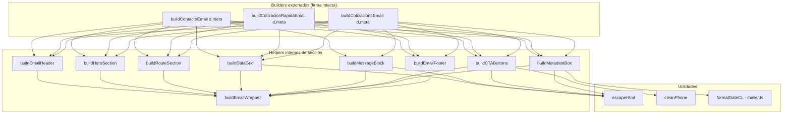

# Design — redesign-email-templates-v2

> Fase: sdd-design · Tier: heavy · Modelo: opus
> Domain: feature · Fast path: full
> Fecha: 2026-05-26
> Scope de código: **1 archivo** — `log-atm-web-astro/src/lib/email-templates.ts`
> Referencia visual 1:1: `/home/kapridoo/projects/log-atm-finally/project/correo-rediseno.html` (sección email-safe L52–215)

---

## 0. Objetivo

Reescribir el HTML/CSS generado por `email-templates.ts` para que las 3 plantillas de
correo coincidan 1:1 con la referencia, **sin cambiar firmas exportadas, contratos de
datos, lógica de envío, folio ni validación**. Preservar la versión `text` plana.

Decisiones fijadas (clarifications.md, no reabrir): logo textual · ruta de contacto =
caja visual con texto libre · degradación graceful Outlook · CTAs condicionales ·
pills azul/verde/ámbar. Arquitectura y logo formalizados en **ADR-0005**.

ADRs aplicables:
- **[[adrs/0005-email-section-helpers-textual-logo]]** — arquitectura de helpers + logo textual + degradación Outlook (creado en esta fase).
- **[[adrs/0004-folio-server-generated]]** — folio server-side; se muestra en la caja de metadatos de cotización 4 pasos (sin cambios en su generación).

---

## 1. Decisiones técnicas

### 1.1 Estrategia general (Approach B — ADR-0005 D1)

Un solo archivo. Helpers internos puros (cada uno retorna `string` HTML) + un
compositor `buildEmailWrapper`. Los 3 builders exportados conservan su firma y
componen su correo invocando los helpers que aplican.



Cotización rápida **no** invoca `buildMessageBlock` (no tiene campo de mensaje).

### 1.2 Helpers de sección — firmas TS

Todos los helpers son `function` internas (no exportadas). Tipos compartidos:

```ts
type BadgeColor = "blue" | "green" | "amber";

type Meta = { ip: string; userAgent: string; formType: string; folio?: string };

// Fila de la grilla de datos. `kind` controla el render del valor.
type GridRow = {
  label: string;
  value: string | undefined | null;
  kind?: "text" | "email" | "tel" | "pill"; // default "text"
};

// Caja de ruta: par origen→destino, o texto libre (contacto).
type RouteInput =
  | { mode: "pair"; origin?: string | null; dest?: string | null }
  | { mode: "free"; text?: string | null };
```

| Helper | Firma | Retorno | Notas |
|--------|-------|---------|-------|
| `escapeHtml` | `(s: string) => string` | HTML-safe | **Se conserva tal cual** del código actual |
| `cleanPhone` | `(phone: string) => string` | dígitos (+ `+` inicial opcional) | ver §1.6 |
| `buildEmailHeader` | `(badge: { color: BadgeColor; label: string }) => string` | `<tr>...</tr>` header | logo textual + badge; color según formulario |
| `buildHeroSection` | `(args: { kicker: string; title: string; subtitle: string }) => string` | `<tr>...</tr>` hero | `title` y `subtitle` ya vienen escapados/compuestos por el builder (pueden contener `<span>` y `<strong>` controlados) |
| `buildRouteSection` | `(route: RouteInput) => string` | `<tr>...</tr>` o `""` | retorna `""` si no hay dato → sección omitida |
| `buildDataGrid` | `(args: { label: string; rows: GridRow[] }) => string` | `<tr>...</tr>` | filtra filas con valor vacío; reemplaza `renderRows` |
| `buildMessageBlock` | `(args: { label: string; message?: string \| null }) => string` | `<tr>...</tr>` o `""` | retorna `""` si `message` vacío |
| `buildCTAButtons` | `(args: { email?: string \| null; phone?: string \| null; mailSubject: string; waText: string }) => string` | `<tr>...</tr>` o `""` | retorna `""` si no hay email ni teléfono |
| `buildMetadataBox` | `(meta: Meta) => string` | `<tr>...</tr>` | siempre presente; folio como primera fila solo si `meta.folio` |
| `buildEmailFooter` | `() => string` | `<tr>...</tr>` | estático |
| `buildEmailWrapper` | `(sections: string) => string` | documento HTML completo | tabla outer + inner; envuelve `sections` |

Convención: cada helper de sección retorna una fila `<tr><td>...</td></tr>` de la
tabla `inner`. `buildEmailWrapper` concatena las filas dentro de la tabla de
`max-width:600px`. Las secciones opcionales que no aplican retornan `""` y se
concatenan sin dejar hueco (no se emite `<tr>` vacío).

### 1.3 Composición de `buildEmailWrapper`

```ts
function buildEmailWrapper(sections: string): string {
  return `<!doctype html><html lang="es"><head><meta charset="UTF-8">` +
    `<meta name="viewport" content="width=device-width,initial-scale=1">` +
    `</head><body style="margin:0;padding:0;">` +
    `<table role="presentation" cellpadding="0" cellspacing="0" border="0" width="100%" ` +
      `style="background:#f8f7f6;font-family:'Inter',Arial,sans-serif;color:#211f1c;">` +
    `<tr><td align="center" style="padding:32px 16px;">` +
    `<table role="presentation" cellpadding="0" cellspacing="0" border="0" width="100%" ` +
      `style="max-width:600px;background:#ffffff;border-radius:20px;overflow:hidden;` +
      `box-shadow:0 4px 16px 0 rgba(74,123,181,.12);">` +
    sections +
    `</table></td></tr></table></body></html>`;
}
```

Cada builder construye `sections` concatenando en orden los helpers que aplican.

### 1.4 Mapeo de campos dinámicos → secciones por builder

#### `buildContactoEmail(d, meta)` — badge **azul** "● Nuevo mensaje"

| Sección | Fuente | Render |
|---------|--------|--------|
| Header | — | badge azul, label `● Nuevo mensaje` |
| Hero | `d.name`, `d.company`, `d.service` | kicker `━━━ Nuevo contacto`; title `{name}` + (si `company`) ` · <span brand>{company}</span>`; subtitle: ver §1.5 |
| Route | `d.route` (texto libre) → `{ mode: "free", text: d.route }` | caja azul con texto libre; **omitida si vacío** |
| DataGrid | label `Datos del contacto`; rows: Nombre (`d.name`), Empresa (`d.company`), Email (`d.email`, kind email), Teléfono (`d.phone`, kind tel), Servicio (`d.service`, kind pill) | filas vacías omitidas |
| Message | label `Mensaje del cliente`; `d.message` | **omitida si vacío** |
| CTA | `email=d.email`, `phone=d.phone` | email siempre presente (requerido); WhatsApp si hay teléfono |
| Metadata | `meta` (sin folio) | sin fila Folio |
| Footer | — | estático |

#### `buildCotizacionRapidaEmail(d, meta)` — badge **verde** "● Nuevo lead"

| Sección | Fuente | Render |
|---------|--------|--------|
| Header | — | badge verde, label `● Nuevo lead` |
| Hero | `d.mode`, `d.origin`, `d.destination` | kicker `━━━ Cotización rápida`; title `{mode || "Cotización rápida"}`; subtitle: ver §1.5 |
| Route | `d.origin`+`d.destination` → `{ mode:"pair", origin:d.origin, dest:d.destination }` | par origen→destino; **omitida si ambos vacíos** |
| DataGrid | label `Datos del lead`; rows: Modalidad (`d.mode`, kind pill), Volumen (`d.volume`), Email (`d.email`, kind email), Teléfono (`d.phone`, kind tel), Canal preferido (`d.preference`) | origin/destination ya van en la caja de ruta, no se repiten en grid |
| Message | — | **no aplica** (no se invoca el helper) |
| CTA | `email=d.email`, `phone=d.phone` | ambos condicionales (email puede faltar: validación es email OR phone) |
| Metadata | `meta` (sin folio) | sin fila Folio |
| Footer | — | estático |

#### `buildCotizacion4Email(d, meta)` — badge **ámbar** "● Cotización completa"

| Sección | Fuente | Render |
|---------|--------|--------|
| Header | — | badge ámbar, label `● Cotización completa` |
| Hero | `d.name`, `d.company`, `d.modality`, `d.origin`, `d.dest` | kicker `━━━ Solicitud de cotización`; title `{name}` + (si `company`) ` · <span brand>{company}</span>`; subtitle: ver §1.5 |
| Route | `d.origin`+`d.dest` → `{ mode:"pair", origin:d.origin, dest:d.dest }` | par origen→destino; **omitida si ambos vacíos** |
| DataGrid | label `Detalle de la cotización`; rows: Modalidad (`d.modality`, kind pill), Incoterm (`d.incoterm`), Fecha estimada (`d.date`), Tipo de carga (`d.cargoType`), Volumen (m³) (`d.volume`), Peso (kg) (`d.weight`), N° contenedores (`d.containerCount`), Tipo contenedor (`d.containerType`), Servicios adicionales (`servicesStr`), Nombre (`d.name`), Empresa (`d.company`), Email (`d.email`, kind email), Teléfono (`d.phone`, kind tel) | `volume`/`weight`/`containerCount` numéricos → `String()`; `services` array → `join(", ")` (conserva lógica actual) |
| Message | label `Notas del cliente`; `d.notes` | **omitida si vacío** |
| CTA | `email=d.email`, `phone=d.phone` | email siempre presente (requerido); WhatsApp si hay teléfono |
| Metadata | `meta` (con folio) | fila **Folio** primera si `meta.folio` (prefijo `LA-` ya viene incluido) |
| Footer | — | estático |

> Nota: el dato que llega a los builders viene de `clean()` en los endpoints, que
> produce `string` posiblemente vacío (`""`) o el valor. El filtrado de "vacío" en
> todos los helpers usa `v == null || String(v).trim() === ""` (misma semántica que
> el `renderRows` actual).

### 1.5 Subtítulos del hero (descripción contextual)

Texto compuesto por el builder, con partes dinámicas escapadas. Si la parte
dinámica falta, se usa fallback neutro (sin dejar la frase incompleta):

- **Contacto**: `Nuevo mensaje desde el formulario de contacto` + (si `service`)
  ` sobre <strong>{service}</strong>` + (si `route`) ` para la ruta {route}`.
- **Cotización rápida**: `Solicita una cotización` + (si `mode`)
  ` <strong>{mode}</strong>` + (si origin/dest) ` en la ruta {origin} → {destination}`.
- **Cotización 4 pasos**: `Solicita una propuesta para ` + `<strong>{modality || "su carga"}</strong>` + (si origin/dest) ` en la ruta {origin} → {dest}` + `.`

Los `<strong>` y `<span>` son markup controlado por el builder; los **valores**
interpolados pasan por `escapeHtml`.

### 1.6 Sanitización y enlaces

- **`escapeHtml(s)`**: se conserva exactamente (escapa `& < > " '`). Se aplica a
  todo valor dinámico de usuario antes de insertarlo en HTML (labels, valores de
  grid, hero, ruta, mensaje, metadatos IP/UA).
- **`cleanPhone(phone)`**: elimina todo carácter no numérico salvo un `+` inicial.
  Implementación:
  ```ts
  function cleanPhone(phone: string): string {
    const trimmed = phone.trim();
    const plus = trimmed.startsWith("+") ? "+" : "";
    return plus + trimmed.replace(/[^\d]/g, "");
  }
  ```
  Ej.: `"+56 9 1234-5678"` → `"+56912345678"`; `"(56) 912345678"` → `"56912345678"`.
- **`mailto:`** (botón Responder por email): `mailto:{escapeHtml(email)}?subject={encodeURIComponent(mailSubject)}`. `mailSubject` = `Re: {subject del correo}` por builder (ej. `Re: [Web · Contacto] Juan — ...`). El email también se usa crudo en `encodeURIComponent`-no aplica; va directo en `mailto:` y escapado en el `href`.
- **`tel:`** (fila Teléfono del grid): `tel:{cleanPhone(phone)}`.
- **`wa.me`** (botón WhatsApp): `https://wa.me/{cleanPhone(phone).replace(/^\+/, "")}?text={encodeURIComponent(waText)}`. `wa.me` requiere el número **sin `+`**, solo dígitos con código país. `waText` = mensaje de contexto por builder (ej. `Hola, vi tu solicitud en logatm.com`).
- **Fecha CL**: `formatDateCL()` importado de `./mailer` (sin cambios). Se usa en la fila `Recibido` de la caja de metadatos. Formato actual: `es-CL`, `America/Santiago`, `dateStyle: medium`, `timeStyle: medium`.

### 1.7 Versión `text` plana

Cada builder genera `text` en paralelo al HTML (no derivado del HTML; construido de
los mismos datos, sin etiquetas). Estructura sugerida por builder:

```
{Título del formulario}

{Hero subtitle en texto plano}

— Ruta —           (omitir bloque si no aplica)
{origin} → {dest}   |  {route libre}

— Datos —
Nombre: ...
Empresa: ...
Email: ...
Teléfono: ...
Servicio/Modalidad: ...
...(solo filas con valor)

— Mensaje —        (omitir si vacío)
{message/notes}

— Metadatos —
Folio: ...          (solo cotización 4 con folio)
Formulario: {meta.formType}
Recibido: {formatDateCL()}
IP: {meta.ip}
User-Agent: {meta.userAgent}
```

Se preserva la garantía de la spec `email-section-structure` (versión texto con
todos los datos legibles, sin HTML). Un helper interno opcional
`buildPlainText(args)` puede centralizar esta construcción para DRY, pero no es
obligatorio; lo esencial es que cada builder retorne `text` completo.

---

## 2. Especificación visual detallada (1:1 con la referencia)

### 2.1 Tokens de color (hex exactos, de `correo-rediseno.html`)

| Token | Valor | Uso |
|-------|-------|-----|
| Header gradiente | `#112236` → `#1c3554` (135°) | fondo header (`background:#112236;background-image:linear-gradient(135deg,#112236 0%,#1c3554 100%)`) |
| Footer fondo | `#0a1624` | fondo footer |
| Brand azul | `#4A7BB5` | nombre empresa, links, flecha ruta, borde mensaje, botón email, "A" del logo |
| Texto principal | `#211f1c` | h1, valores fuertes |
| Texto cuerpo/secundario | `#544f4a` | párrafos hero, metadatos valor |
| Texto muted | `#6e6963` | labels de grid; `#898580` labels de metadata/SLA |
| Cuerpo del correo | `#ffffff` | fondo tabla inner |
| Fondo general | `#f8f7f6` | fondo tabla outer; fondo caja mensaje; fondo caja metadata |
| Separador grid | `#e1dedb` | `border-bottom` filas de grid; borde caja metadata |
| Caja ruta | `#eef4fb` | fondo caja de ruta |
| Ruta — label | `#3b6497` | "Origen"/"Destino" mono |
| Ruta — valor | `#112236` | nombres origen/destino |
| Pill servicio (grid) | bg `#d7e4f4`, texto `#2b4e78` | pill modalidad/servicio |
| Botón WhatsApp | `#25D366` | fondo botón WhatsApp |
| Footer texto | `#aec7e5` (cuerpo), `#658fc3` (muted), `#ffffff` (nombre) | — |
| Header tagline | `#aec7e5` | tagline mono bajo "LOG ATM" |

**Badges por formulario (header):**

| Formulario | bg | borde | texto | label |
|------------|----|-------|-------|-------|
| Contacto (azul) | `rgba(74,123,181,.18)` | `1px solid rgba(135,170,229,.6)` | `#9cc0ec` | `● Nuevo mensaje` |
| Cotización rápida (verde) | `rgba(62,185,120,.18)` | `1px solid rgba(135,211,176,.6)` | `#87d3b0` | `● Nuevo lead` |
| Cotización 4 (ámbar) | `rgba(245,180,80,.18)` | `1px solid rgba(245,200,130,.6)` | `#f0c074` | `● Cotización completa` |

> El verde es el valor exacto de la referencia. Azul y ámbar se derivan del mismo
> patrón `rgba(brand,.18)` + borde claro + texto pastel, alineados a la paleta del
> proyecto (`#4A7BB5` brand). El kicker del hero usa verde `#339965` en la referencia;
> mantenerlo verde en los 3 es aceptable (es un acento mono), o alinearlo al color del
> badge — **decisión de implementación menor; preferir verde `#339965` uniforme para
> simplicidad salvo que se prefiera coherencia con el badge**.

### 2.2 Tipografías (stacks con fallback)

| Rol | Stack | Pesos | Fallback Outlook |
|-----|-------|-------|------------------|
| Display | `'Outfit', Arial, sans-serif` | 700/800/900 | Arial |
| Cuerpo | `'Inter', Arial, sans-serif` | 400/500 | Arial |
| Mono (labels/código/tagline) | `'JetBrains Mono', 'SF Mono', monospace` | 600 | Courier New |

Sin `@font-face` (Outlook no lo soporta; degradación a Arial/Courier es aceptable).

### 2.3 Estructura y spacing por sección (tablas + paddings exactos)

Tabla **outer**: `width:100%`, `background:#f8f7f6`, `<td align="center" padding:32px 16px>`.
Tabla **inner**: `max-width:600px`, `background:#ffffff`, `border-radius:20px`,
`overflow:hidden`, `box-shadow:0 4px 16px 0 rgba(74,123,181,.12)`.

| Sección | `<td>` padding | Detalles clave |
|---------|----------------|----------------|
| Header | `32px 32px 28px` | gradiente azul. Tabla 100%: izq = logo (div 40×40 `#ffffff` `border-radius:10px`, "A" `#4A7BB5` Outfit 900 18px + "LOG ATM" Outfit 800 18px `#ffffff` + tagline mono 10px `letter-spacing:.16em` uppercase `#aec7e5`), der = badge (`align="right"`, pill `padding:6px 12px` `border-radius:9999px`) |
| Hero | `32px 32px 8px` | kicker mono 11px `letter-spacing:.14em` uppercase 600; h1 Outfit 800 26px `line-height:1.15` `letter-spacing:-.02em` `#211f1c` `margin:0 0 8px`; p Inter 15px `line-height:1.55` `#544f4a` |
| Route | `24px 32px 8px` | caja `#eef4fb` `border-radius:14px`, td interno `padding:20px 24px`. Tabla 3 col (origen / flecha `width:60px` centro / destino `align=right`). Labels mono 10px `#3b6497`; valores Outfit 700 18px `#112236`. Flecha `→` `#4A7BB5` 24px. **Modo free (contacto)**: una sola celda con el texto libre como valor Outfit 700 18px `#112236` (label "Ruta") |
| DataGrid | `24px 32px 8px` | label de sección mono 11px `letter-spacing:.14em` uppercase 600 `#6e6963` `margin-bottom:14px`. Tabla 100% Inter 15px. Cada fila: `<td>` label `width:140px` `padding:14px 0` `border-bottom:1px solid #e1dedb` (label dentro: mono 11px uppercase `#6e6963`); `<td>` valor `padding:14px 0` `border-bottom:...` `font-weight:500`. **Última fila sin `border-bottom`.** Email → `<a mailto:>` `#4A7BB5` `text-decoration:none`. Teléfono → `<a tel:>` igual. Pill → `<span>` bg `#d7e4f4` texto `#2b4e78` mono 12px 600 `padding:4px 10px` `border-radius:9999px` |
| Message | `8px 32px 24px` | label mono 11px uppercase 600 `#6e6963` `margin-bottom:10px`. Bloque bg `#f8f7f6` `border-left:3px solid #4A7BB5` `padding:18px 22px` Inter 15px `line-height:1.6` `#37332f` `border-radius:0 12px 12px 0`. Texto con comillas envolventes opcional |
| CTA | `8px 32px 28px` | tabla 2 col `width:50%`. Botón email: `<a>` bg `#4A7BB5` `#ffffff` Outfit 700 15px `text-align:center` `padding:14px 20px` `border-radius:9999px` `display:block`, td `padding-right:8px`. Botón WhatsApp: bg `#25D366`, td `padding-left:8px`. **Si solo un botón presente → ese ocupa width:100% (un solo `<td>`)**. SLA: p mono 11px `#898580` `text-align:center` `margin:14px 0 0` `letter-spacing:.04em`: `SLA cliente · responder antes de 24 h hábiles` |
| Metadata | `0 32px 24px` | caja bg `#f8f7f6` `border:1px solid #e1dedb` `border-radius:12px` `padding:16px 20px`. Título mono 10px `letter-spacing:.14em` uppercase `#898580` `margin-bottom:8px`: `Metadatos técnicos`. Tabla mono 11px `#544f4a` `line-height:1.7`. Filas `<td width:90px color:#898580>` label + `<td>` valor. Folio: valor `<strong color:#211f1c>`. User-Agent: `<td vertical-align:top>` |
| Footer | `24px 32px` | bg `#0a1624`. Tabla 2 col: izq = "LOG ATM" Outfit 700 15px `#ffffff` + tagline mono 10px `letter-spacing:.12em` uppercase `#658fc3` (`Logística a tu medida`); der `align=right` dirección 12px `#658fc3` (`Av. Pdte Kennedy 5600, Of. 507` / `Vitacura · Santiago · Chile`). Aviso: div `border-top:1px solid rgba(255,255,255,.08)` `margin-top:18px` `padding-top:14px` mono 10px `#658fc3` `text-align:center`: `Este correo se generó automáticamente desde logatm.com · No respondas a esta dirección` |

---

## 3. Diferenciación por formulario (resumen)

| Plantilla | Badge | Kicker hero | Route | Message | DataGrid (campos) | Folio |
|-----------|-------|-------------|-------|---------|-------------------|-------|
| `buildContactoEmail` | Azul `● Nuevo mensaje` | `Nuevo contacto` | **texto libre** `d.route` (caja, omitir si vacío) | `d.message` | Nombre, Empresa, Email, Teléfono, Servicio(pill) | No |
| `buildCotizacionRapidaEmail` | Verde `● Nuevo lead` | `Cotización rápida` | par `d.origin → d.destination` | **sin sección** | Modalidad(pill), Volumen, Email, Teléfono, Canal preferido | No |
| `buildCotizacion4Email` | Ámbar `● Cotización completa` | `Solicitud de cotización` | par `d.origin → d.dest` | `d.notes` | Modalidad(pill), Incoterm, Fecha, Tipo carga, Volumen, Peso, N° contenedores, Tipo contenedor, Servicios, Nombre, Empresa, Email, Teléfono | **Sí** (en metadata) |

Reglas clave:
- Ruta de contacto = **caja visual mostrando el texto libre** (`mode:"free"`), no se
  inventa par origen/destino. Si `route` vacío → sección omitida (spec
  `email-form-differentiation` AC + Scenario 2/3).
- Folio solo en `buildCotizacion4Email`, como **primera fila** de la caja de
  metadatos, con prefijo `LA-` (el folio ya llega con el prefijo desde
  `generateFolio()` — ADR-0004; no se reconstruye).
- Cotización rápida no invoca `buildMessageBlock`.
- Modalidad/servicio se renderiza como **pill** (kind `"pill"`) en el grid.

---

## 4. Compatibilidad email-client (ADR-0005 D3)

- **Layout 100% tablas** `role="presentation"`, `cellpadding=0 cellspacing=0 border=0`. Sin flexbox/grid.
- **CSS 100% inline** (sin `<style>` en `<head>`; Gmail lo descarta para muchos clientes).
- **Fuentes** con fallback Arial/Courier (Outlook ignora `@font-face`).
- **`border-radius` / `box-shadow` / `overflow:hidden`**: solo en wrapper externo y cajas decorativas; en Outlook Win degradan a esquinas rectas/sin sombra. Aceptado (clarifications 3). **Sin hacks VML/MSO.**
- **Logo textual** (ADR-0005 D2): sin ``; robusto ante bloqueo de imágenes.
- **`max-width:600px`** estándar de industria; legible en móvil sin scroll horizontal.
- **`<meta viewport>`** en `<head>` para móvil.
- **Sin dark mode media query** (fondos header/footer ya oscuros; cuerpo claro legible). Aceptado por exploration §6.
- **`wa.me` sin `+`** (solo dígitos); `tel:`/`mailto:` con valores escapados y `encodeURIComponent` en query.

---

## 5. Output Expected

### 5.1 Archivos a modificar

| Archivo | Acción |
|---------|--------|
| `log-atm-web-astro/src/lib/email-templates.ts` | **Reescritura completa** del HTML/CSS generado. Conservar `import { formatDateCL } from "./mailer"`, `escapeHtml`, tipo `Meta`, y las 3 firmas exportadas con sus tipos `d` exactos y sus tipos de retorno (`{ subject, html, text, replyTo }` / `replyTo?`). Reemplazar `renderRows`→`buildDataGrid` y `wrap`→`buildEmailWrapper`. Añadir helpers de §1.2 y `cleanPhone`. Preservar la lógica de `servicesStr` (array→join) y de coerción numérica `volume`/`weight`/`containerCount`. Preservar los patrones de `subject` exactos (incl. `folioSuffix`). |

**0 cambios** en (confirmado leyendo el código):
- `src/pages/api/contacto.ts`, `src/pages/api/cotizacion-rapida.ts`, `src/pages/api/cotizacion.ts` — solo importan los builders y pasan `data`/`meta` idénticos.
- `src/lib/mailer.ts` — `sendMail`/`formatDateCL`/`clientIP` sin cambios; recibe `{ subject, html, text, replyTo? }`.
- `src/lib/folio.ts` — generación de folio sin cambios (ADR-0004).
- `src/lib/validate.ts` — validación/honeypot/`hasHeaderInjection` sin cambios.

### 5.2 Contrato de cada export (no cambia)

```ts
export function buildContactoEmail(
  d: { name: string; company?: string; email: string; phone?: string;
       service?: string; route?: string; message?: string },
  meta: Meta,
): { subject: string; html: string; text: string; replyTo: string };

export function buildCotizacionRapidaEmail(
  d: { mode?: string; origin?: string; destination?: string; volume?: string;
       email?: string; phone?: string; preference?: string },
  meta: Meta,
): { subject: string; html: string; text: string; replyTo?: string };

export function buildCotizacion4Email(
  d: { name: string; company?: string; email: string; phone?: string; notes?: string;
       modality?: string; origin?: string; dest?: string; incoterm?: string; date?: string;
       cargoType?: string; volume?: string | number; weight?: string | number;
       containerCount?: string | number; containerType?: string;
       services?: string[] | string },
  meta: Meta,
): { subject: string; html: string; text: string; replyTo: string };
```

Patrones de `subject` (preservar literalmente):
- Contacto: `[Web · Contacto] {name} — {service || "sin servicio"}`
- Rápida: `[Web · Cotización rápida] {mode || "—"} · {origin || "—"} → {destination || "—"}`
- 4 pasos: `[Web · Cotización 4 pasos] {name} — {modality || "—"} · {origin || "—"} → {dest || "—"}{ — Folio {meta.folio}}`

### 5.3 Verificación esperada (para sdd-verify)

- TS strict compila sin errores.
- Las 3 funciones retornan `{ subject, html, text, replyTo }` con los mismos tipos.
- HTML renderiza las secciones en orden y omite las opcionales vacías.
- Pills azul/verde/ámbar correctos por builder.
- CTAs condicionales: sin email→sin botón email; sin teléfono→sin botón WhatsApp; sin ninguno→sin sección CTA.
- `wa.me` sin caracteres no numéricos (salvo dígitos del código país); sin `+`.
- Folio `LA-...` como primera fila de metadata solo en cotización 4.
- Ruta de contacto = texto libre en caja; omitida si vacío.
- `text` plano contiene todos los datos sin etiquetas HTML.

---

## 6. Riesgos residuales

1. **Outlook Win**: sin redondeo/sombra (degradación aceptada — ADR-0005 D3).
2. **`cleanPhone` con prefijos no estándar**: si el usuario escribe `0056...` o sin código país, `wa.me` puede fallar al abrir chat. Fuera de scope sanear números mal formados; se preserva lo ingresado limpio de no-dígitos.
3. **Hero subtitle con campos faltantes**: se usan fallbacks neutros (§1.5) para no dejar frases incompletas.
4. **Color del kicker hero**: decisión menor (verde uniforme `#339965` recomendado); no bloquea la implementación.
