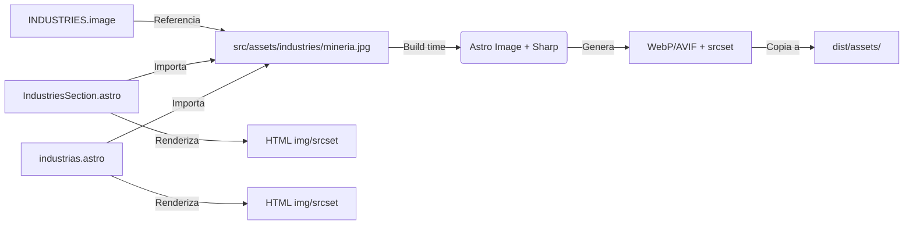

# Design: redesign-experiencia-sector

## Decisiones Técnicas

### DT-1: Ubicación y formato de imágenes de industrias

**Contexto**: Las 14 imágenes fotográficas deben integrarse en el sitio de forma optimizada, sin regresiones de performance (LCP, CLS) y manteniendo compatibilidad con el stack Astro + Sharp existente.

**Decisión**: 
- Las imágenes fuente se alojan en `src/assets/industries/`.
- Se consume mediante el componente `<Image>` nativo de Astro (`astro:assets`).
- Astro + Sharp generarán automáticamente variantes WebP y AVIF en build time.
- El atributo `src` en los datos apunta al módulo de imagen importado (referencia relativa desde `src/assets/industries/`).

**Justificación**:
- Astro `<Image>` integra Sharp de forma transparente, generando formatos modernos y srcset responsive sin configuración adicional.
- Al estar en `src/assets/`, las imágenes son procesadas en build time, no en runtime, lo que reduce carga del servidor y mejora cacheabilidad.
- El proyecto ya tiene `sharp` como dependencia y Astro 6.x tiene soporte nativo para `astro:assets` sin configuración extra.

**Alternativas descartadas**:
- `public/industries/`: Las imágenes se servirían estáticas sin optimización. Requeriría pipeline manual de compresión (Sharp CLI o similar) y no generaría srcset responsive. Descartado porque el proyecto ya tiene la infraestructura de Astro Image lista para usar.
- CDN externo: Añadiría complejidad de gestión de URLs, versionado y dependencia de red. No justificado para 14 imágenes estáticas de un sitio corporativo.

---

### DT-2: Extensión del modelo de datos INDUSTRIES

**Contexto**: El array `INDUSTRIES` en `src/lib/constants.ts` es la fuente única de verdad para la sección de industrias en home. La página `/industrias` tiene su propio array inline con datos expandidos (descripción, especialidades).

**Decisión**:
- Extender la interfaz `IndustryItem` en `src/lib/types.ts` con campos opcionales `image?: string` y `alt?: string`.
- Extender `INDUSTRIES` en `src/lib/constants.ts` con `image` (path relativo a `src/assets/industries/`) y `alt` (texto descriptivo).
- Mantener el campo `icon` existente para backward compatibility y como fallback semántico.
- Para la página `/industrias`, agregar `image` y `alt` al array inline local (no refactorizar la estructura de datos expandida en este cambio para limitar scope).

**Justificación**:
- Mantener `icon` preserva compatibilidad con cualquier otro consumidor de `INDUSTRIES` (footer, potenciales páginas futuras) y proporciona un fallback visual si la imagen no carga.
- Agregar campos opcionales (`?`) permite una migración gradual: si una industria no tiene imagen aún, sigue funcionando con el icono.
- No refactorizar el array de `/industrias` a un modelo unificado mantiene el cambio enfocado; la unificación de datos es deuda técnica identificada pero fuera del scope de este redesign.

**Alternativas descartadas**:
- Reemplazar `icon` por `image`: Rompería backward compatibility y eliminaría el fallback visual. Descartado.
- Crear un nuevo array `INDUSTRIES_WITH_IMAGES`: Duplicaría la fuente de verdad y aumentaría el riesgo de inconsistencias. Descartado.
- Unificar arrays de home y página /industrias: Requeriría refactorizar toda la estructura de datos y la página /industrias, expandiendo el scope más allá del redesign visual. Descartado por YAGNI.

---

### DT-3: Patrón de imagen en tarjeta (Header Image)

**Contexto**: Las specs requieren mostrar la imagen en la parte superior de la tarjeta (header image pattern), manteniendo el texto sobre fondo sólido separado.

**Decisión**:
- **Home (`IndustriesSection`)**: La imagen ocupa el ancho completo de la tarjeta en la parte superior, con `aspect-ratio: 16/10` (~140px de alto), `object-fit: cover`, y bordes redondeados superiores que coinciden con la tarjeta (`var(--radius-lg)`). El contenido textual (nombre, subtítulo) se mantiene en el cuerpo de la tarjeta con fondo sólido `var(--color-surface)`.
- **Página `/industrias`**: La imagen ocupa el ancho completo en la parte superior de la tarjeta expandida, con `aspect-ratio: 16/9` (~180px de alto) y `object-fit: cover`. Bordes redondeados superiores. El contenido textual (nombre, descripción, especialidades) permanece sobre fondo sólido debajo.
- En ambos casos, la imagen NO tiene overlay de texto; el texto siempre está en el cuerpo de la tarjeta para garantizar legibilidad y contraste.

**Justificación**:
- El patrón header image es el más común y escalable para grids de tarjetas. Separa claramente la capa visual (foto) de la capa informativa (texto), eliminando problemas de contraste y legibilidad.
- Aspect ratios distintos entre home (16:10) y página (16:9) reflejan la diferencia de densidad de información: home prioriza mostrar más tarjetas en viewport; /industrias prioriza impacto visual de cada sector.
- `object-fit: cover` evita distorsiones y mantiene consistencia visual aunque las fotos tengan dimensiones originales diferentes.

**Alternativas descartadas**:
- Imagen de fondo con texto superpuesto (Background Image): Requeriría overlays oscuros o degradados para garantizar contraste de texto, complicando el diseño existente y violando el principio de mantener texto sobre fondo sólido. Descartado.
- Thumbnail lateral (izquierda/derecha): Funciona mal en móvil (apilamiento vertical) y reduce el espacio para la foto. Descartado.
- Aspect-ratio fijo en px en lugar de relación: No sería responsive. Descartado.

---

### DT-4: Estrategia de carga y performance de imágenes

**Contexto**: 14 imágenes fotográficas pueden impactar significativamente LCP y CLS si no se optimizan correctamente.

**Decisión**:
- Usar Astro `<Image>` con atributos:
  - `width` y `height` explícitos basados en el aspect-ratio y el ancho máximo de la tarjeta (home: 320w, página: 480w).
  - `loading="lazy"` para todas las imágenes (la sección de industrias típicamente está below-the-fold en home).
  - `decoding="async"` para no bloquear el main thread.
- Astro `<Image>` generará srcset con densidades 1x y 2x automáticamente.
- Las imágenes se convertirán a WebP y AVIF en build time; el navegador elegirá el formato soportado.
- Reservar espacio en el DOM con un contenedor que tenga `aspect-ratio` definido en CSS, previniendo CLS incluso antes de que la imagen cargue.

**Justificación**:
- Astro Image abstrae toda la complejidad de generación de formatos modernos y srcset. Es la herramienta nativa del framework.
- Lazy loading nativo del navegador (`loading="lazy"`) es suficiente para este caso; no se necesita Intersection Observer manual.
- CLS se previene con la combinación de dimensiones explícitas en `<Image>` + contenedor CSS con aspect-ratio fijo.

**Alternativas descartadas**:
- Intersection Observer manual: Añadiría JavaScript innecesario; el lazy loading nativo tiene soporte >90% y Astro Image lo gestiona. Descartado.
- Preload de imágenes above-the-fold: La sección de industrias está tipicamente below-the-fold en la home (hay Hero, Stats, Services, Why antes). Preload sería contraproducente para LCP. Descartado.
- Picture element manual con source types: Astro `<Image>` ya genera esto automáticamente. Descartado.

---

### DT-5: Accesibilidad de imágenes

**Contexto**: Las imágenes fotográficas deben ser accesibles para usuarios con lectores de pantalla y cumplir WCAG 2.2 AA.

**Decisión**:
- Cada imagen tendrá un texto alternativo descriptivo almacenado en el campo `alt` del array de datos.
- El `alt` describirá el contenido de la foto (ej: "Camión de carga en faena minera, mostrando transporte de equipamiento pesado"), no el nombre genérico de la industria.
- No se usará `role="presentation"` ni `alt=""` porque las imágenes aportan información semántica relevante (contexto visual del sector).
- Las animaciones hover se respetarán con `@media (prefers-reduced-motion: reduce)` (ya implementado parcialmente en `industries.css`, se extenderá si es necesario).

**Justificación**:
- WCAG 1.1.1 requiere texto alternativo para imágenes informativas. Estas fotos ilustran el sector, por lo son informativas, no decorativas.
- Almacenar `alt` en los datos centraliza la gestión y facilita futuras traducciones o ajustes.

**Alternativas descartadas**:
- `alt` hardcodeado en el componente: Dificulta mantenimiento y no escala. Descartado.
- `aria-label` en contenedor + `alt=""`: Más complejo y menos robusto que `alt` directo en la imagen. Descartado.

---

### DT-6: Estrategia de estilos CSS

**Contexto**: Las tarjetas de industria tienen estilos en `src/styles/sections/industries.css`. El proyecto usa Tailwind v4 pero mantiene CSS modules para secciones complejas.

**Decisión**:
- Extender `src/styles/sections/industries.css` con las clases necesarias para el header image, manteniendo el enfoque actual de CSS module.
- No introducir clases de Tailwind utility en los componentes Astro para esta sección, para mantener consistencia con el patrón existente.
- Las nuevas clases seguirán la convención BEM ya establecida (`.ind-card__image`, `.industry-card__image`).
- Usar CSS custom properties para los aspect-ratios y alturas de imagen, facilitando ajustes responsive.

**Justificación**:
- El proyecto ya usa CSS modules para secciones (`industries.css`, `services.css`, etc.) y mantiene Tailwind para utilidades globales y layout base. Romper este patrón introduciría inconsistencia.
- BEM está establecido en la codebase y es predecible.
- CSS custom properties permiten ajustar los valores en media queries sin duplicar selectores.

**Alternativas descartadas**:
- Reescribir con Tailwind utilities: Rompería la consistencia del archivo `industries.css` y haría más difícil leer los estilos de tarjeta en un solo lugar. Descartado.
- CSS-in-JS o scoped styles en Astro: El proyecto no usa estas tecnologías; añadirías una nueva dependencia conceptual. Descartado.

---

## Arquitectura

El flujo de datos de imágenes sigue el pipeline estándar de Astro Assets:



En build time, Astro procesa las imágenes de `src/assets/industries/`, genera formatos optimizados y las coloca en `dist/_astro/`. Los componentes referencian las imágenes por su path relativo en `src/assets/`, y Astro resuelve la URL final optimizada.

## Output Expected

Archivos a crear:

- `src/assets/industries/` — Directorio para las 14 imágenes fuente (formato JPG/PNG, serán optimizadas por Astro).

Archivos a modificar:

- `src/lib/types.ts` — Extender `IndustryItem` con `image?: string` y `alt?: string`.
- `src/lib/constants.ts` — Agregar `image` y `alt` a cada item de `INDUSTRIES` (14 industrias).
- `src/components/sections/IndustriesSection.astro` — Reemplazar el bloque de icono por un header image usando `<Image>` de `astro:assets`; mantener nombre, subtítulo y efectos hover.
- `src/pages/industrias.astro` — Agregar header image a cada tarjeta expandida usando `<Image>`; mantener descripción y especialidades.
- `src/styles/sections/industries.css` — Agregar estilos para `.ind-card__image` (header image en home) y ajustar layout de tarjeta si es necesario.

Nota: El campo `icon` se mantiene en los datos pero deja de renderizarse visualmente en las tarjetas. Se conserva para:
1. Backward compatibility con otros posibles consumidores de `INDUSTRIES`.
2. Fallback semántico si una imagen falla en cargar (opcional, no requerido en este diseño).

## Contratos de Componentes

### Tipo IndustryItem (extendido)

```typescript
export interface IndustryItem {
  icon: string;        // Lucide icon name (preservado)
  name: string;        // Nombre de la industria
  sub: string;         // Subtítulo corto (home)
  color: string;       // Color identitario (hex)
  image?: string;      // Path relativo a src/assets/industries/
  alt?: string;        // Texto alternativo descriptivo
}
```

### Astro Image API

```astro
---
import { Image } from 'astro:assets';
import industryImage from '../assets/industries/mineria.jpg';
---

<Image 
  src={industryImage} 
  alt="Camión de carga en faena minera" 
  width={320} 
  height={200} 
  loading="lazy" 
  decoding="async"
/>
```

Nota: Cuando las imágenes se importan dinámicamente desde un array, se requiere un patrón de importación estática o un mapa de imports. El diseño recomienda importar las imágenes en `constants.ts` o en un módulo auxiliar y exportar los objetos de imagen resueltos.

**Patrón recomendado para imports dinámicos en Astro**:

```typescript
// src/lib/industryImages.ts
import mineria from '../assets/industries/mineria.jpg';
import retail from '../assets/industries/retail.jpg';
// ... etc

export const INDUSTRY_IMAGES: Record<string, ImageMetadata> = {
  mineria,
  retail,
  // ...
};
```

Esto permite que Astro resuelva las imágenes en build time y aplique optimizaciones.

## Estrategia de Testing

- **Verificación visual**: Confirmar que las 14 tarjetas renderizan imagen + texto correctamente en home y /industrias.
- **Performance**: Validar con Lighthouse que no hay regresión en LCP ni CLS (esperado: CLS = 0, LCP sin impacto negativo).
- **Responsive**: Verificar breakpoints 639px y 479px; confirmar que las imágenes mantienen aspect-ratio sin deformarse.
- **Accessibility**: Validar con axe-core que todas las imágenes tienen `alt` no vacío.
- **Prefers-reduced-motion**: Confirmar que hover transitions se desactivan cuando el usuario lo solicita.

## Referencias a ADRs

- [[0001-image-optimization-astro-assets]] — Decisión de usar Astro Assets + Sharp para optimización de imágenes de industrias.
