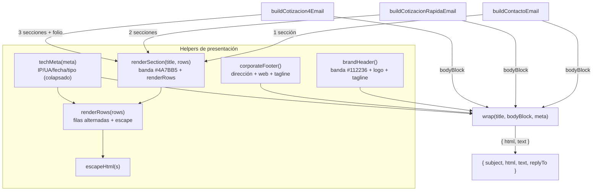

# Design: redesign-form-email-templates

> Generado: 2026-05-26 | Fase: sdd-design | Modelo: opus
> Specs: [[forms-email/email-brand-identity]], [[forms-email/email-visual-hierarchy]]
> ADR referenciado: [[0004-folio-server-generated]] (folio preservado, no alterado)

---

## Resumen

El rediseño se contiene **íntegramente en `src/lib/email-templates.ts`**. La estructura actual (`escapeHtml` → `renderRows` → `wrap` → 3 funciones `build*`) es sólida y se conserva como esqueleto. Se reescriben `wrap()` y `renderRows()`, se añaden helpers de presentación (`renderSection`, `brandHeader`, `corporateFooter`, `techMeta`), y se mantienen sin cambios las firmas públicas de las 3 funciones `build*`, sus payloads, sus subjects, sus `replyTo` y la preservación del folio. Layout 100% table-based con CSS inline para compatibilidad Gmail/Outlook. Sin dependencias nuevas, sin tocar `mailer.ts` ni los endpoints.

**Las firmas públicas exportadas no cambian** — `buildContactoEmail`, `buildCotizacionRapidaEmail`, `buildCotizacion4Email` mantienen sus parámetros `(d, meta)` y su tipo de retorno `{ subject, html, text, replyTo }`. Esto garantiza cero impacto en los endpoints que las invocan.

---

## Decisiones Técnicas

### Decisión 1: Paleta de marca hardcodeada en hex (sin CSS vars, sin `<style>`)

**Contexto**: Los clientes de correo (Gmail, Outlook) eliminan `<style>` externos/embebidos y no soportan CSS custom properties (`var(--x)`). Todo color debe ir inline en `style="..."` con valor hex literal.

**Decisión**: Definir un objeto constante `C` (color tokens) al tope del módulo con los hex de la exploración, y consumirlo via template-literal interpolation en cada `style`. Esto da una sola fuente de verdad dentro del archivo sin depender de CSS vars en el render final (el valor se interpola en build a un hex literal en el string).

```ts
const C = {
  headerBg: "#112236",   // banda header (primary-900)
  sectionBg: "#4A7BB5",  // banda encabezado de sección (primary-500)
  rowAlt: "#eef4fb",     // fila par (primary-50)
  rowBase: "#ffffff",    // fila impar
  pageBg: "#f8f7f6",     // fondo de página (neutral-50)
  text: "#211f1c",       // texto principal (neutral-900)
  textMuted: "#6e6963",  // texto secundario / metadatos (neutral-600)
  border: "#e1dedb",     // bordes y divisores (neutral-200)
  onDark: "#ffffff",     // texto sobre banda oscura
  taglineOnDark: "#a9c2e0", // tagline tenue sobre header azul marino
} as const;
```

**Justificación**: Es el patrón de email HTML universalmente compatible. Mantener los tokens en un objeto evita repetir literales y facilita ajustes, sin introducir CSS vars que los clientes ignorarían.

**Alternativas descartadas**: CSS vars o `<style>` con clases — descartado porque Gmail los elimina y Outlook los ignora; el diseño se rompería.

---

### Decisión 2: Nueva firma de `wrap()` con header/footer reutilizables y cuerpo pre-renderizado

**Contexto**: Los 3 emails deben compartir el MISMO header de marca y el MISMO footer corporativo (spec email-brand-identity, requisito de consistencia). El cuerpo varía: Contacto y Cotización rápida usan una sección plana; Cotización 4 pasos usa 3 secciones agrupadas.

**Decisión**: `wrap()` deja de recibir `rowsBlock` (una sola tabla) y pasa a recibir el **HTML/text del cuerpo ya compuesto** por el llamador (una o varias secciones). Firma nueva:

```ts
function wrap(
  title: string,
  bodyBlock: { html: string; text: string },
  meta: Meta,
): { html: string; text: string }
```

`wrap()` ensambla, en este orden, dentro de una tabla externa centrada (`max-width:680px`):
1. `brandHeader()` — banda `#112236` con logo + wordmark fallback + tagline.
2. Título del email sobre fondo claro (h1 de marca).
3. `bodyBlock.html` — secciones provistas por el llamador.
4. `corporateFooter()` — dirección, web, tagline.
5. `techMeta(meta)` — metadatos técnicos colapsados visualmente (texto pequeño gris).

La firma de `wrap` cambia de forma **interna** al módulo (no es exportada), por lo que no afecta contratos externos. Cada `build*` compone su `bodyBlock` antes de llamar a `wrap`.

**Justificación**: Separa la responsabilidad "shell de marca" (constante) de la "composición de secciones" (variable por formulario). Respeta SRP y DRY: header/footer se definen una vez. El cuerpo se compone con `renderSection`, reutilizable por los 3.

**Alternativas descartadas**:
- Pasar `Row[]` plano a `wrap` y que `wrap` decida secciones — descartado: acopla `wrap` al conocimiento de cada formulario; no escala a la agrupación de cotización 4 pasos.
- `wrapCotizacion()` separado (sugerido en exploración) — descartado a favor de un único `wrap` + composición externa; evita duplicar header/footer en dos wrappers.

---

### Decisión 3: `renderSection(title, rows)` como unidad de composición; `renderRows` gana fondo alternado

**Contexto**: La spec email-visual-hierarchy exige secciones con encabezado sobre banda `#4A7BB5` y filas alternadas `#ffffff`/`#eef4fb`. Contacto y Cotización rápida usan jerarquía de sección "con menor número de grupos".

**Decisión**: Dos helpers:

```ts
// Renderiza UNA sección: banda de encabezado + tabla de filas alternadas.
function renderSection(
  title: string,
  rows: Row[],
): { html: string; text: string }
```

- Filtra filas vacías (misma regla que hoy: `v != null && String(v).trim() !== ""`).
- Si tras filtrar la sección queda sin filas → retorna `{ html: "", text: "" }` (omite la sección completa, incluido su encabezado). Regla de omisión definida abajo.
- Encabezado: una fila `<tr>` con `<td>` de fondo `#4A7BB5`, texto blanco, peso 700, `colspan=2`.
- Cuerpo: delega en `renderRows(rows)` que ahora aplica fondo alternado.

```ts
// renderRows ahora alterna fondo por índice de fila VISIBLE.
function renderRows(rows: Row[]): { html: string; text: string }
```

- Mantiene el filtrado de vacíos.
- Cada `<tr>` recibe `background:#ffffff` (índice par) o `background:#eef4fb` (índice impar) — alternancia calculada sobre el índice de la fila *visible* (no la original) para que la alternancia sea continua tras omitir vacíos.
- Conserva `escapeHtml()` en label y value (sin cambios en la defensa XSS).
- Conserva `white-space:pre-wrap` en el value (preserva saltos de línea en notas/mensaje).
- Las celdas usan atributos de tabla (`<table>`, `<td>`) además del CSS inline, de modo que en clientes sin soporte de fondo la estructura sigue legible (fallback de la spec, requisito "atributos HTML de tabla como respaldo").

**Regla de omisión de campos opcionales** (definición canónica para sdd-apply):
> Una fila se omite si su valor es `null`, `undefined`, o string vacío/solo-espacios tras `String(value).trim()`. Esta es exactamente la regla `renderRows` actual (`visible = rows.filter(([, v]) => v != null && String(v).trim() !== "")`) y se preserva. Una sección sin filas visibles se omite por completo (no se emite su banda de encabezado).

**Justificación**: `renderSection` envuelve `renderRows` (composición sobre herencia). La alternancia por índice visible cumple el AC de filas alternadas sin "saltos" visuales cuando hay campos opcionales vacíos. Omitir secciones vacías evita encabezados huérfanos (p.ej. Cotización rápida sin datos de carga).

**Alternativas descartadas**:
- Alternancia por índice original (incluyendo vacíos) — descartado: produciría dos filas consecutivas del mismo color tras omitir una fila intermedia, rompiendo la legibilidad que la spec busca.
- Encabezado de sección como `<h3>` fuera de la tabla — descartado: Outlook maneja mejor la banda de color como `<td>` dentro de tabla; un `<div>`/`<h3>` con `background` es menos fiable.

---

### Decisión 4: Header de marca con logo `` + wordmark de texto de respaldo

**Contexto**: La spec exige banda `#112236` con logo + tagline, y fallback de texto legible cuando la imagen se bloquea (Gmail/Outlook bloquean imágenes externas por defecto).

**Decisión**: `brandHeader()` renderiza una tabla de una fila sobre fondo `#112236`:

```html

```

- El `src` se construye desde `SITE.url` importado de `constants.ts`: `` `${SITE.url}/logo.png` `` → `https://logatm.com/logo.png`. No hardcodear el dominio; usar la constante.
- `alt="LOG ATM"` provee el wordmark textual cuando la imagen no carga (la mayoría de clientes muestran el `alt` en el hueco).
- Debajo (o al costado), el tagline `"LOGÍSTICA A TU MEDIDA"` en texto blanco tenue (`#a9c2e0`), letter-spacing amplio, tamaño pequeño — SIEMPRE presente como texto (no depende de imagen). Esto garantiza identidad incluso sin logo.
- El nombre "LOG ATM" como texto bold acompaña visualmente (refuerzo del fallback): aunque el logo cargue, un wordmark de texto adyacente asegura legibilidad de marca en el peor caso.

**Justificación**: Combina la mejor presentación (imagen) con degradación graceful (alt + texto). El tagline en texto cumple el requisito de marca sin depender del asset externo. Usar `SITE.url` respeta DRY y la regla del proyecto ("nunca duplicar constantes").

Nota: se considera `logo-white.svg` para la banda oscura, pero **SVG no es compatible con Gmail** (lo stripea); por eso el `src` apunta a `logo.png` (raster, compatible). El contraste del `logo.png` (azul) sobre `#112236` es aceptable; si el logo azul no contrasta bien sobre el azul marino, el wordmark de texto blanco adyacente garantiza la lectura de marca. sdd-apply puede validar visualmente; si el contraste del PNG azul sobre marino es insuficiente, priorizar el wordmark de texto blanco como elemento principal y el logo como complemento.

**Alternativas descartadas**:
- SVG inline / `logo-white.svg` como `` — Gmail elimina SVG; no fiable.
- Logo en base64 data-URI — Gmail/Outlook bloquean o truncan data-URIs grandes en ``; no fiable.
- Solo wordmark de texto (sin imagen) — cumpliría el fallback pero pierde el impacto visual del logo cuando las imágenes sí cargan.

---

### Decisión 5: Footer corporativo + metadatos técnicos separados visualmente

**Contexto**: La spec email-brand-identity exige (a) footer corporativo con dirección, web y tagline, y (b) metadatos técnicos (IP, UA, fecha CL, tipo de form) en el pie. Ambos deben estar presentes en los 3 emails.

**Decisión**: Dos helpers distintos, renderizados al final por `wrap`:

- `corporateFooter()` — bloque centrado, texto gris (`#6e6963`), con:
  - Dirección: `SITE.address` (`Av. Pdte Kennedy 5600, Of. 507, Vitacura, Santiago, Chile`).
  - Web: link a `SITE.url` (`https://logatm.com`) con texto `logatm.com`.
  - Tagline: `"LOGÍSTICA A TU MEDIDA"`.
  - Todos los valores provienen de `constants.ts` (`SITE.address`, `SITE.url`), no hardcodeados.
- `techMeta(meta)` — bloque colapsado visualmente (fuente ~11px, gris tenue, separado por un divisor `border-top:1px solid #e1dedb`), renderiza las filas técnicas: `Formulario` (`meta.formType`), `Recibido` (`formatDateCL()`), `IP` (`meta.ip`), `User-Agent` (`meta.userAgent`). Reutiliza `renderRows` o una mini-tabla sin banda de sección (los metadatos NO llevan encabezado de banda azul — son secundarios por jerarquía).

**Justificación**: Separa la identidad de marca (footer corporativo prominente) de la telemetría (metadatos discretos). Cumple ambos requisitos de la spec manteniendo la jerarquía visual (lo técnico no compite con lo comercial). `formatDateCL()` ya existe en `mailer.ts` y se sigue importando.

**Alternativas descartadas**:
- Metadatos con banda de sección `#4A7BB5` como las secciones de negocio — descartado: elevaría visualmente datos técnicos por encima de su importancia real; la spec los ubica "en el pie".

---

### Decisión 6: Preservación de folio, escapeHtml, datos completos y reply-To

**Contexto**: Specs vigentes ([[quote-folio-server-generated]] vía ADR [[0004-folio-server-generated]], [[quote-email-delivery]], `forms-email/spec`) imponen invariantes que el rediseño NO puede romper.

**Decisión** (invariantes a preservar literalmente):
- **Folio**: la fila `["Folio", meta.folio]` se mantiene cuando `meta.folio` existe, ubicada como **primera fila de la sección "Detalle de envío"** de la cotización 4 pasos, dentro del esquema de colores alternados (cumple AC de email-visual-hierarchy). El folio sigue en el subject sin cambios. No se altera la lógica de ADR-0004.
- **escapeHtml()**: TODA etiqueta y TODO valor de usuario pasa por `escapeHtml()` en `renderRows` (sin cambios). Los títulos de sección y de email también se escapan.
- **Datos completos**: ningún campo del payload se omite por diseño; solo se omiten filas con valor vacío (regla de omisión de Decisión 3). Todos los campos no vacíos de los 4 pasos aparecen (cumple "ningún campo de usuario puede omitirse").
- **reply-To**: sin cambios — las funciones `build*` siguen retornando `replyTo: d.email`. Pertenece al contrato, no al HTML.

**Justificación**: El cambio es puramente presentacional; estos invariantes son contractuales y verificables en sdd-verify.

---

## Mapeo de las 3 funciones `build*` a secciones

Los nombres de campo provienen del **código real** (`email-templates.ts`), no de los ejemplos de la spec. La spec menciona "largo/ancho/alto, temperatura especial, aduana" que **no existen** en el payload; prevalece el código.

### `buildContactoEmail(d, meta)` — 1 sección de negocio

`d`: `name` (req), `company?`, `email` (req), `phone?`, `service?`, `route?`, `message?`

| Sección | Filas |
|---|---|
| **Datos de contacto** | Nombre (`name`), Empresa (`company`), Email (`email`), Teléfono (`phone`), Servicio (`service`), Ruta (`route`), Mensaje (`message`) |

- Título email: `"Nuevo contacto desde el sitio"` (sin cambios).
- Subject / replyTo: sin cambios.
- Una sola sección (la spec admite "menor número de grupos" para Contacto). El email-visual-hierarchy AC solo exige que use la misma jerarquía visual (banda + filas alternadas), no múltiples secciones.

### `buildCotizacionRapidaEmail(d, meta)` — 2 secciones de negocio

`d`: `mode?`, `origin?`, `destination?`, `volume?`, `email?`, `phone?`, `preference?`

| Sección | Filas |
|---|---|
| **Detalle de envío** | Modalidad (`mode`), Origen (`origin`), Destino (`destination`), Volumen (`volume`) |
| **Contacto** | Email (`email`), Teléfono (`phone`), Canal preferido (`preference`) |

- Título email: `"Cotización rápida (60 seg)"` (sin cambios).
- Subject / replyTo: sin cambios.
- Dos secciones reflejan la jerarquía con menos grupos que la cotización 4 pasos.

### `buildCotizacion4Email(d, meta)` — 3 secciones de negocio

`d`: `name` (req), `company?`, `email` (req), `phone?`, `notes?`, `modality?`, `origin?`, `dest?`, `incoterm?`, `date?`, `cargoType?`, `volume?`, `weight?`, `containerCount?`, `containerType?`, `services?` (`string[] | string`)

| Sección | Filas (label → campo) |
|---|---|
| **Detalle de envío** | Folio (`meta.folio`, solo si existe — primera fila), Modalidad (`modality`), Origen (`origin`), Destino (`dest`), Incoterm (`incoterm`), Fecha estimada (`date`) |
| **Información de carga** | Tipo de carga (`cargoType`), Volumen (m³) (`volume`), Peso (kg) (`weight`), N° contenedores (`containerCount`), Tipo contenedor (`containerType`), Servicios adicionales (`servicesStr`) |
| **Contacto** | Nombre (`name`), Empresa (`company`), Email (`email`), Teléfono (`phone`), Notas (`notes`) |

- `servicesStr`: misma normalización actual (`Array.isArray ? join(", ") : typeof string ? string : ""`).
- `volume`/`weight`/`containerCount`: misma coerción a string que hoy (`x != null ? String(x) : ""`).
- Título email: `"Cotización (4 pasos)"` (sin cambios).
- Subject (con `Folio` suffix) / replyTo: sin cambios.
- La agrupación coincide con la spec (Detalle de envío / Información de carga / Contacto); el folio va en "Detalle de envío" respetando colores alternados.

> Nota de mapeo spec↔código: la spec ubica "tipo de mercancía, dimensiones, peso, bultos, temperatura, aduana" en "Información de carga". El payload real solo tiene `cargoType, volume, weight, containerCount, containerType, services` — se mapean a esa misma sección. Los campos inexistentes (dimensiones, temperatura, aduana) no se inventan.

---

## Output Expected

Archivo único a modificar:

- `log-atm-web-astro/src/lib/email-templates.ts` — rediseño completo del HTML manteniendo firmas públicas.

### Funciones nuevas / modificadas

| Función | Estado | Cambio |
|---|---|---|
| `escapeHtml(s)` | **Sin cambios** | Defensa XSS preservada literalmente. |
| `Row` (type) | Sin cambios | `[label, value]`. |
| `Meta` (type) | Sin cambios | `{ ip, userAgent, formType, folio? }`. |
| `C` (const) | **Nuevo** | Tokens de color hex de marca (Decisión 1). |
| `renderRows(rows)` | **Modificado** | Añade fondo alternado por índice de fila visible; conserva filtrado de vacíos y `escapeHtml`; mantiene atributos de tabla como fallback. |
| `renderSection(title, rows)` | **Nuevo** | Banda de encabezado `#4A7BB5` + `renderRows`; omite la sección si no hay filas visibles. |
| `brandHeader()` | **Nuevo** | Banda `#112236` con `` logo (`${SITE.url}/logo.png`) + alt + wordmark/tagline de texto. |
| `corporateFooter()` | **Nuevo** | Dirección (`SITE.address`), web (`SITE.url`), tagline — texto gris. |
| `techMeta(meta)` | **Nuevo** | Metadatos técnicos colapsados (Formulario, Recibido `formatDateCL()`, IP, User-Agent). |
| `wrap(title, bodyBlock, meta)` | **Modificado** | Nueva firma: recibe cuerpo pre-compuesto; ensambla header + título + body + footer + metadatos en tabla externa centrada. |
| `buildContactoEmail(d, meta)` | **Modificado (interno)** | Firma pública intacta; compone 1 sección con `renderSection` y la pasa a `wrap`. |
| `buildCotizacionRapidaEmail(d, meta)` | **Modificado (interno)** | Firma pública intacta; compone 2 secciones (Detalle de envío / Contacto). |
| `buildCotizacion4Email(d, meta)` | **Modificado (interno)** | Firma pública intacta; compone 3 secciones (Detalle de envío con folio / Información de carga / Contacto). |

### Imports

- Conservar `import { formatDateCL } from "./mailer";`.
- Añadir `import { SITE } from "./constants";` para `SITE.url`, `SITE.address`, `SITE.name`.

### Sin cambios (fuera de scope)

- `src/lib/mailer.ts` — transporte; `sendMail`, `formatDateCL`, `clientIP` intactos.
- `src/pages/api/contacto.ts`, `cotizacion-rapida.ts`, `cotizacion.ts` — endpoints; contratos intactos (consumen las mismas firmas `build*`).

---

## Composición de funciones (diagrama)



---

## Contratos de Componentes

Firmas internas del módulo tras el rediseño:

```ts
type Row = [label: string, value: string | undefined | null];
type Meta = { ip: string; userAgent: string; formType: string; folio?: string };

function escapeHtml(s: string): string;                  // sin cambios
function renderRows(rows: Row[]): { html: string; text: string };          // modificado
function renderSection(title: string, rows: Row[]): { html: string; text: string };  // nuevo
function brandHeader(): string;                          // nuevo (HTML)
function corporateFooter(): string;                      // nuevo (HTML)
function techMeta(meta: Meta): { html: string; text: string };             // nuevo
function wrap(title: string, bodyBlock: { html: string; text: string }, meta: Meta): { html: string; text: string };  // firma modificada
```

Firmas públicas exportadas (**INTACTAS**):

```ts
export function buildContactoEmail(d, meta): { subject: string; html: string; text: string; replyTo: string };
export function buildCotizacionRapidaEmail(d, meta): { subject: string; html: string; text: string; replyTo?: string };
export function buildCotizacion4Email(d, meta): { subject: string; html: string; text: string; replyTo: string };
```

---

## Compatibilidad y degradación graceful

- **Layout table-based**: la tabla externa (`max-width:680px`, centrada con `margin:0 auto` + `align="center"`), las secciones y las filas usan `<table>` con `border-collapse:collapse` y CSS inline. Sin flexbox, sin grid, sin `<style>`, sin CSS vars. Compatible con Gmail web/app, Apple Mail, iOS Mail y Outlook (Word HTML).
- **Outlook (Word HTML)**:
  - Ignora `border-radius` en el contenedor → las esquinas se ven cuadradas. **Degradación puramente estética**; la jerarquía y los colores de banda se preservan. Aceptado en `proposal.risks`.
  - Ignora gradientes/sombras → no se usan gradientes para estructura; los fondos son colores sólidos planos, que Outlook sí respeta.
  - `width="..."` en atributo de tabla además del CSS para que Outlook dimensione correctamente.
- **Imágenes bloqueadas** (Gmail/Outlook por defecto): el logo `` no carga → el `alt="LOG ATM"` y el **wordmark/tagline de texto** del header preservan la identidad sin la imagen (Decisión 4). Cumple el scenario "Cliente de correo no carga la imagen del logotipo".
- **Fallback de tabla (clientes sin soporte CSS de fondo)**: las secciones y filas se construyen con elementos `<table>/<tr>/<td>` reales; aunque el cliente ignore los `background` inline, la estructura tabular (label | value, agrupada por sección) sigue siendo legible. Cumple el requisito "atributos HTML de tabla como respaldo" y el scenario "Cliente de correo con soporte limitado de estilos".
- **Versión text/plain**: cada helper produce también su rama `text` (líneas `label: value`, secciones separadas por encabezado en mayúsculas/guiones). Se conserva la salida `text` para clientes sin HTML y para deliverability.
- **XSS**: `escapeHtml()` se aplica a todo valor/label de usuario; sin regresión.

---

## Estrategia de Testing

El módulo no tiene tests unitarios actualmente y el cambio es presentacional. La verificación (sdd-verify) se centra en invariantes contractuales y en los AC de las specs:

1. **Compilación TypeScript**: `npm run build` / `astro check` pasa sin errores de tipo (las firmas públicas no cambian → endpoints siguen compilando).
2. **Invariantes preservados** (revisión de código + render de muestra):
   - `escapeHtml()` se aplica a todo valor de usuario en `renderRows` (grep: ninguna interpolación de `v`/`k` sin escapar).
   - La fila `Folio` aparece cuando `meta.folio` existe (cotización 4 pasos), dentro de "Detalle de envío".
   - Footer técnico presente (IP, UA, fecha CL, formType) en los 3 emails.
   - Header de marca (`#112236` + logo + tagline) idéntico en los 3 emails.
   - Ningún campo no vacío del payload se omite.
3. **Render de muestra** (opcional, recomendado): generar el HTML de cada `build*` con datos de ejemplo (incluyendo un valor con `<`, `>`, `"` para verificar escape) y abrirlo en navegador; revisar bandas, alternancia de filas y fallback de logo (deshabilitando imágenes).
4. **AC de specs**: validar cada acceptance criterion de email-brand-identity y email-visual-hierarchy contra el HTML generado.

---

## ADRs

No se crea ADR nuevo: todas las decisiones son de **presentación** (paleta, layout, composición de helpers), no arquitectónicas. Se **referencia** [[0004-folio-server-generated]] porque el rediseño preserva — sin alterar — la fila de folio que esa decisión introdujo.
